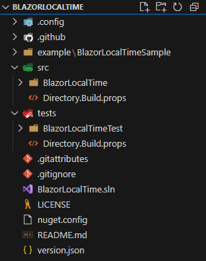
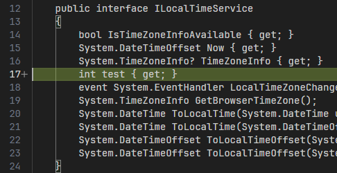
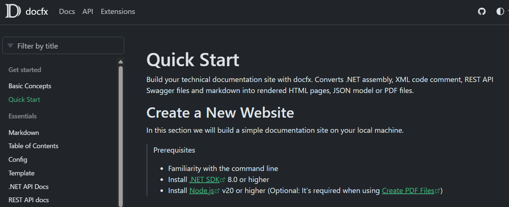
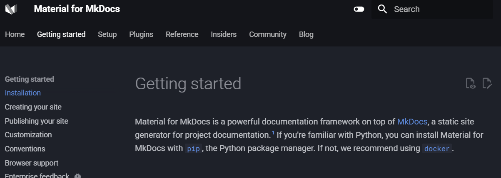
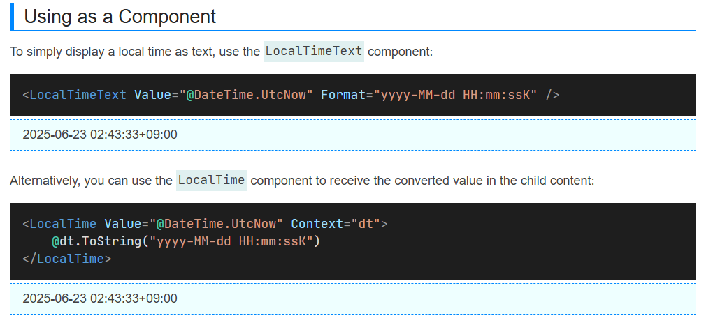

最近NuGetに公開するパッケージを作成したので、その際のTipsをまとめます。
当該パッケージは[こちらの記事](https://zenn.dev/arika/articles/20250622-blazor-localtime)で紹介しています。

## ディレクトリ構成
正直個人の自由ではあるのですが、自分は以下のようなディレクトリ構成にしています。

* `.config` - dotnet toolsの設定ファイル
* `.github` - GitHub Actionsの設定ファイルを格納
* `docs` - パッケージのドキュメントを格納
  * ↓はexampleがドキュメントも兼ねているので作ってないです。
* `examples` - パッケージの使用例を格納
  * Blazor WASMでアプリケーションを作成して、GitHub Pagesにデプロイしています。
* `src` - 公開するパッケージのプロジェクト + 共通設定(`Directory.Build.props`)
* `tests` - パッケージのテストプロジェクト + 共通設定(`Directory.Build.props`)



このような構成にするメリットとして、`Directory.Build.props`でまとめて共通設定を書けるのが嬉しいポイントです。
例えば `using Xunit;` とかの共通usingディレクティブを `Directory.Build.props` に書いておくとか、共通利用のライブラリを一括で定義しておくとか、そういうことができます。

## ソースコード
### Directory.Build.props
パッケージ共通設定です。

主に以下の内容を定義しています。
1. パッケージ基本設定
2. 共通ライブラリの定義
3. テストプロジェクトに `internal` 項目を公開
4. NuGetパッケージにREADMEファイルを埋め込む


2.の共通ライブラリですが、自分は主に以下の3つをよく使います。
- [Nerdbank.GitVersioning](https://github.com/dotnet/Nerdbank.GitVersioning)
  - Gitのコミット履歴からバージョン情報を自動生成するライブラリ 
  - バージョン番号を手動で更新する必要がなくなるので便利
  - `dotnet`レポジトリの中にいるので、安定感◎
- [PolySharp](https://github.com/Sergio0694/PolySharp)
  - 古い環境(.NET Standard 2.0など)でも最新のC#言語機能を使えるようにするライブラリ
  - 対応機能がすでに実装されている場合、その機能をそのまま提供するだけ
  - Source Generatorを使っているので、実行時のパフォーマンスに影響しない
- [SonarAnalyzer.CSharp](https://www.nuget.org/packages/sonaranalyzer.csharp/)
  - C#のコード品質を向上させるための静的解析ツール
  - ポカミス防止のためにとりあえず埋め込んである 
  - ライセンス形態がいまいち不明確なので、気にする人は要注意


また、3.の `internal` 公開設定は、`InternalsVisibleTo` 属性を使うことで、テストプロジェクトから `internal` 項目にアクセスできるようにするための設定です。
これにより、テストプロジェクトからパッケージの内部実装をより簡単にテストできるようになります。
詳細は[こちらの記事](https://qiita.com/bearbutler/items/43e0099f6655ca9b246c)を参照してください。


より詳しくは、下のコメントを参照してください。

```xml
<Project>
  <!-- 基本設定をここに書いておく -->
  <PropertyGroup>
    <!-- 対象SDK。これは各プロジェクト側に書いていいかも -->
    <TargetFrameworks>net6.0;net7.0;net8.0;net9.0</TargetFrameworks>
    <!-- 使用言語バージョン。当然最新 -->
    <LangVersion>latest</LangVersion>
    <!-- nullableを有効化。最初から書いてあるのであんまり恩恵はない -->
    <Nullable>enable</Nullable>
    <!-- パッケージのバージョンをpackage.jsonに固定する -->
    <RestorePackagesWithLockFile>true</RestorePackagesWithLockFile>
    <!-- パッケージの説明文。入れないと警告が出てくるので、ちゃんと書く -->
    <PackageDescription>BlazorLocalTime provides functionality to convert DateTime to the user's local time zone in Blazor applications.</PackageDescription>
    <!-- プロジェクトURL。GitHub Pagesのリンクにしとけば良さげ -->
    <PackageProjectUrl>https://arika0093.github.io/BlazorLocalTime</PackageProjectUrl>
    <!-- レポジトリ。GitHubのURLでOK -->
    <RepositoryUrl>https://github.com/arika0093/BlazorLocalTime</RepositoryUrl>
    <!-- ライセンス。こっちにもちゃんと明記しておく -->
    <PackageLicenseExpression>Apache-2.0</PackageLicenseExpression>
    <!-- READMEを埋め込んでおく。 NuGet側に説明を埋め込める -->
    <PackageReadmeFile>README.md</PackageReadmeFile>
    <!-- APIドキュメントを生成するかどうか。ちゃんと公開しましょう -->
    <GenerateDocumentationFile>true</GenerateDocumentationFile>
  </PropertyGroup>

  <!-- 全てのプロジェクトで使うパッケージをここで一括定義 -->
  <ItemGroup>
    <!-- Nerdbank.GitVersioning -->
    <PackageReference Include="Nerdbank.GitVersioning" Version="3.*" Condition="!Exists('packages.config')" >
      <PrivateAssets>all</PrivateAssets>
      <IncludeAssets>runtime; build; native; contentfiles; analyzers; buildtransitive</IncludeAssets>
    </PackageReference>
    <!-- PolySharp -->
    <PackageReference Include="PolySharp" Version="1.*" Condition="!Exists('packages.config')">
      <PrivateAssets>all</PrivateAssets>
      <IncludeAssets>runtime; build; native; contentfiles; analyzers; buildtransitive</IncludeAssets>
    </PackageReference>
    <!-- SonarAnalyzer.CSharp -->
    <PackageReference Include="SonarAnalyzer.CSharp" Version="10.*" Condition="!Exists('packages.config')" >
      <PrivateAssets>all</PrivateAssets>
      <IncludeAssets>runtime; build; native; contentfiles; analyzers; buildtransitive</IncludeAssets>
    </PackageReference>
  </ItemGroup>

  <!-- テストプロジェクトに internal 項目を公開する -->
  <!-- これも各プロジェクト側に書いていいかも -->
  <ItemGroup>
    <AssemblyAttribute Include="System.Runtime.CompilerServices.InternalsVisibleTo">
      <_Parameter1>BlazorLocalTimeTest</_Parameter1>
    </AssemblyAttribute>
  </ItemGroup>

  <!-- NuGetパッケージにREADMEを埋め込むために必要 -->
  <ItemGroup>
    <None Include="../../README.md" Pack="true" PackagePath="\" />
  </ItemGroup>
</Project>
```


### 特定のTargetFrameworkでのみライブラリを読み込む
例えば Microsoftが提供しているライブラリ(`Microsoft.Extensions.DependencyInjection`など)は SDKごとに異なるバージョンが存在します。
また、`TimeProvider` のように、特定のバージョン以下でのみ必要なライブラリもあります。

::: message
`TimeProvider` は .NET 8.0以降では標準で提供されていますが、.NET 6.0や7.0では別途パッケージをインストールする必要があります。
:::


そのような場合は `.csproj`（または `Directory.Build.props`）に以下のような条件を追加することで、特定のTargetFrameworkに対応したライブラリを読み込むことができます。

```xml
<ItemGroup Condition="'$(TargetFramework)' == 'net6.0'">
  <PackageReference Include="Microsoft.Bcl.TimeProvider" Version="*" />
  <PackageReference Include="Microsoft.Extensions.DependencyInjection.Abstractions" Version="6.*" />
</ItemGroup>
<ItemGroup Condition="'$(TargetFramework)' == 'net7.0'">
  <PackageReference Include="Microsoft.Bcl.TimeProvider" Version="*" />
  <PackageReference Include="Microsoft.Extensions.DependencyInjection.Abstractions" Version="7.*" />
</ItemGroup>
<ItemGroup Condition="'$(TargetFramework)' == 'net8.0'">
  <PackageReference Include="Microsoft.Extensions.DependencyInjection.Abstractions" Version="8.*" />
</ItemGroup>
<ItemGroup Condition="'$(TargetFramework)' == 'net9.0'">
  <PackageReference Include="Microsoft.Extensions.DependencyInjection.Abstractions" Version="9.*" />
</ItemGroup>
```

## テスト
### Directory.Build.props
テストプロジェクトの共通設定です。

こっちは単純で、必要なパッケージの共通定義+共通usingを定義しています。

```xml
<Project>
  <PropertyGroup>
    <LangVersion>latest</LangVersion>
    <Nullable>enable</Nullable>
    <IsPackable>false</IsPackable>
  </PropertyGroup>
  <ItemGroup>
    <PackageReference Include="Shouldly" Version="4.*" />
    <PackageReference Include="Microsoft.NET.Test.Sdk" Version="17.13.*" />
    <PackageReference Include="xunit" Version="2.*" />
    <PackageReference Include="xunit.runner.visualstudio" Version="2.*">
      <IncludeAssets>runtime; build; native; contentfiles; analyzers; buildtransitive</IncludeAssets>
      <PrivateAssets>all</PrivateAssets>
    </PackageReference>
  </ItemGroup>
  <ItemGroup>
    <Using>Xunit</Using>
    <Using>Shouldly</Using>
  </ItemGroup>
</Project>
```

### Shouldly
`Shouldly` はテストコードをより書きやすくするために使用しています。
詳細は[Shouldlyのドキュメント](https://docs.shouldly.org/)を参照してください。

:::message
[FluentAssertions](https://fluentassertions.com/)も同様の機能を提供していますが、あちらはVer8以降で商用利用には有償ライセンスが必要になったので、使用には注意が必要です。
:::

### PublicApiGenerator
[PublicApiGenerator](https://github.com/PublicApiGenerator/PublicApiGenerator) を使用して、公開APIの変更を検出するためのテストを追加することをお勧めします。
これにより、パッケージのAPIが変更された場合に、テストで自動的に検出できるようになります。
うっかりミスでAPIを変更しないためにも、これを追加しておくと安心です。

```csharp
using System.Runtime.InteropServices;
using PublicApiGenerator;
using Shouldly;
using Xunit;

public class PublicApiCheckTest
{
    [Fact]
    public void Run()
    {
        var publicApi = typeof(LibraryClass).Assembly.GeneratePublicApi();
        publicApi.ShouldMatchApproved(c =>
        {
            // Approvalsフォルダ以下に公開APIのファイルを出力する
            c.SubFolder("Approvals");
            // ファイル末尾にランタイムのバージョンを付与する
            // これを入れないと、同じAPIでもランタイムのバージョンが異なるとテストが失敗してしまう
            c.WithDiscriminator(GetDotnetVersion());
        });
        // 出力ファイル名: PublicApiCheckTest.Run.net8.approved.txt
    }

    // .NET 8 -> net8
    // .NET 7 -> net7, ...
    private string GetDotnetVersion()
    {
        var version = Environment.Version;
        var majorVersion = version.Major;
        return $"net{majorVersion}";
    }
}
```

このテストを実行すると、初回は必ず失敗して `Approvals` フォルダに `*.recieved.txt` と `*.approved.txt` が生成されます。
`recieved` ファイルは実際に生成された公開APIの内容で、`approved` ファイルは承認済の公開APIの内容です。
`recieved` ファイルの内容が正しいことを確認したら、`approved` ファイルに上書きする（=承認）ことでテストを通過させます。

試しに適当なプロパティを生やしてテストを実行すると、以下のようなdiffが得られてテストが失敗します。



## ドキュメントの生成/公開
### docfx
.NETの場合は [docfx](https://dotnet.github.io/docfx/) を使ってドキュメントを生成するのが一般的です。
公式のドキュメントが充実しているので基本的にはそこを見ればよいです。
ライブラリに欠かせないAPIドキュメントを吐き出してくれるので非常に有用です。
また、ドキュメントに従うことでGitHub Pagesに公開することも簡単にできます。

ただし注意点として、`docfx init`をそのままルートディレクトリで実行すると、ドキュメント関連ファイルがトップレベルに生成されてしまいます。
そのため、docsフォルダに`cd`した後に実行することをお勧めします。

[具体例(docfxのドキュメント)](https://dotnet.github.io/docfx/)


### mkdocs-material
もう一つの選択肢として、[mkdocs-material](https://squidfunk.github.io/mkdocs-material/) を使う方法もあります。
こっちはPython製なので色々手間が増えますが、その分多機能、多言語対応なども簡単にできます。
あと参考資料がWeb上にたくさん転がっています。

[具体例(mkdocs-materialのドキュメント)](https://squidfunk.github.io/mkdocs-material/getting-started/)


## サンプルページの生成/公開
公開するものの種類にもよりますが、実際に動く現物があると使用感が伝わりやすいです。
というわけで、Blazor WebAssemblyで簡単なアプリケーションを作成して、GitHub Pagesにデプロイするという手もあります。
作り方は割愛しますが、意外と簡単に書けるのでおすすめ。

[具体例(BlazorLocalTimeのドキュメント)](https://arika0093.github.io/BlazorLocalTime/)


### PublishSPAforGitHubPages.Build
Blazor WebAssemblyのアプリケーションをGitHub Pagesにデプロイするための便利ツールです。
これを突っ込んでビルドするだけで、GitHub Pagesにデプロイできます。素敵！
詳細は[こちらの解説記事](https://qiita.com/jsakamoto/items/0be0005d9b30acbfe1e4)が詳しいです。

:::message
前述のドキュメント公開と両立するのが難しいという欠点があります。
やれなくはないでしょうが…そこまでは自分はやっていません。
:::

## バージョン管理
### Nerdbank.GitVersioning
[Nerdbank.GitVersioning](https://github.com/dotnet/Nerdbank.GitVersioning) はパッケージのバージョンをGitのコミット履歴から自動生成するためのライブラリです。
これを使うことで、毎回手動でバージョン番号を更新する必要がなくなります。

### version.json
ルートディレクトリに `version.json` というファイルを設置します。
自分は以下のような内容にしています。

```jsonc
{
  // スキーマ。つけておくことを推奨
  "$schema": "https://raw.githubusercontent.com/dotnet/Nerdbank.GitVersioning/main/src/NerdBank.GitVersioning/version.schema.json",
  // 最初は0.1-alpha.0から始める
  // {height} はコミット履歴の高さ
  "version": "0.1-alpha.{height}",
  // バージョンは0から始めたいので-1する
  "versionHeightOffset": -1,
  // src/以下のファイルが変更された場合にバージョンを更新する
  "pathFilters": [
    "src/"
  ],  
  // ここのブランチでビルドした場合はPublicRelease扱いにする
  "publicReleaseRefSpec": [
    "^refs/heads/main",
    "^refs/heads/release/v\\d+(?:\\.\\d+)?$"
  ],
  // リリースするときのブランチ名
  "release": {
    "branchName": "release/v{version}"
  },

  "nuGetPackageVersion": {
    "semVer": 2.0
  },
  "cloudBuild": {
    "buildNumber": {
      "enabled": true
    }
  }
}
```

## パッケージのデプロイ
お待たせしました。
