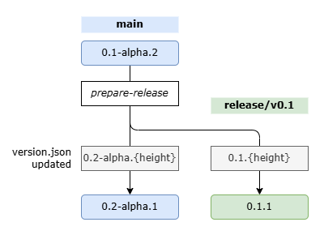

NuGetパッケージやアプリケーションのバージョン管理、手作業でやると普通に面倒ですよね。 
そこで、[Nerdbank.GitVersioning](https://github.com/dotnet/Nerdbank.GitVersioning)を使用したバージョン管理の自動化について解説します。

[先人による解説記事](https://zenn.dev/numani/articles/2b573c862e3bb9)も合わせてご覧ください。

## Nerdbank.GitVersioning
端的に言うと、Gitのコミット履歴を元にバージョン番号を自動生成してくれるツールです。
NuGetパッケージ専用というわけでもなく、極論全ての.NETプロジェクトで使用できます。
また、上記GitHubレポジトリが`dotnet/Nerdbank.GitVersioning`であることからもわかるように、dotnet公式のツールです。

そういう事情もあるので割とデファクトスタンダードなはず……
ですが、日本語の記事が上記のものしか見つからなかったので改めて解説します。
（あと、[公式ドキュメント](https://dotnet.github.io/Nerdbank.GitVersioning/docs/getting-started.html)もそんなに親切ではないです）

## セットアップ
まずはCLIツールを導入します。

```bash
dotnet tool install -g nbgv
```

次に、管理対象のプロジェクトに`Nerdbank.GitVersioning`を追加します。

```bash
dotnet add package Nerdbank.GitVersioning
```

複数プロジェクトがある場合は、`Directory.Build.props`に以下のように書いておくと、すべてのプロジェクトで有効になります。

```xml
<Project>
  <ItemGroup>
    <PackageReference Include="Nerdbank.GitVersioning" Version="3.*" Condition="!Exists('packages.config')" >
      <PrivateAssets>all</PrivateAssets>
      <IncludeAssets>runtime; build; native; contentfiles; analyzers; buildtransitive</IncludeAssets>
    </PackageReference>
  </ItemGroup>
</Project>
```

最後にプロジェクトのルートディレクトリに`version.json`というファイルを作成します。

## version.json
単純なjsonファイルです。自分は今のところ以下のような内容で運用しています。

```js
{
  // スキーマ。つけておくことを推奨
  "$schema": "https://raw.githubusercontent.com/dotnet/Nerdbank.GitVersioning/main/src/NerdBank.GitVersioning/version.schema.json",
  // 最初は0.1-alpha.1から始める
  // {height} はコミット履歴の高さ
  "version": "0.1-alpha.{height}",
  // src/ 以下のファイルが変更された場合にバージョンを更新する
  // ここは実際のソースコードのパスに合わせて変更すること
  "pathFilters": [
    "src/"
  ],  
  // ここのブランチでビルドした場合はPublicRelease扱いにする
  // (バージョン末尾にコミットハッシュを付けない)
  "publicReleaseRefSpec": [
    "^refs/heads/main",
    "^refs/heads/release/v\\d+(?:\\.\\d+)?$"
  ],
  // リリースするときのブランチ名
  // 例えば `release/v1.0` のようなブランチが出来上がる
  "release": {
    "branchName": "release/v{version}"
  },
  // SemVer 2.0の形式でバージョンを出力する
  "nuGetPackageVersion": {
    "semVer": 2.0
  },
  // よくわからない…… 多分CI/CDで使う
  "cloudBuild": {
    "buildNumber": {
      "enabled": true
    }
  }
}
```

主要な部分について解説します。

### version

```js
"version": "0.1-alpha.{height}"
```

バージョン番号のテンプレートです。`{height}`はGitのコミット履歴の高さを表します。
例えば `0.1-alpha.{height}` と指定した場合、最初のコミット時点では `0.1-alpha.1` となり、次のコミットでは `0.1-alpha.2` となります。
この状態で後述の`prepare-release`コマンドを実行すると、今度はバージョン番号が `0.2-alpha.1` になります。
というような形で、バージョンを自動的に進めてくれるというわけです。

### pathFilters

```js
"pathFilters": [
  "src/"
  // version.jsonだけを除外する場合
  // ":!version.json",
]
```

このプロパティは、バージョンを更新する対象のファイルを指定します。
上記では `src/`以下のファイルが変更された場合にバージョンを更新するように指定しています。
これにより、ドキュメントや設定ファイルの変更ではバージョンが更新されないようになります。

もし特定ディレクトリに絞り込まない場合でも、`version.json`自体はバージョン更新の対象外にしたほうが良いです。
理由は後述。

### publicReleaseRefSpec

```js
"publicReleaseRefSpec": [
  "^refs/heads/main",
  "^refs/heads/release/v\\d+(?:\\.\\d+)?$"
]
```

そのままビルドすると、バージョン番号は `0.1-alpha.1+8378bd9a46`のように、コミットハッシュが付与されます。
（各開発ブランチでのことを考えると、同じバージョンNoでも異なる内容になる）
ただ、リリース対象のブランチ（例えば `main` や `release/v1.0`）でビルドした場合は、コミットハッシュを付与しないようにしたいです。
そのための設定が `publicReleaseRefSpec` です。

正規表現で指定できるので、releaseブランチなど動的に生成されるブランチ名も指定できます。

```js
// release/v1.0 や release/v1.1 など
"^refs/heads/release/v\\d+(?:\\.\\d+)?$"
```

### release/branchName

```js
"release": {
  "branchName": "release/v{version}"
}
```

リリースブランチの名前を指定します。見たまんまですね。
自分は`release`の下に生やしたいのでこのような設定にしてます。
ここを変更する際は、上記の`publicReleaseRefSpec`の変更をお忘れなく。

## プログラム内でのバージョン取得
Nerdbank.GitVersioningは、ビルド時にバージョン情報を自動的に生成します。
`ThisAssembly`クラスを自動生成してくれるので、そこから各種情報を取得できます。

例えば、自分が作成している`BlazorLocalTime`というパッケージの出力は以下のようになっています。

```csharp
internal static partial class ThisAssembly {
    internal const string AssemblyConfiguration = "Debug";
    internal const string AssemblyFileVersion = "1.1";
    internal const string AssemblyInformationalVersion = "1.1.0-alpha.13+1938044917";
    internal const string AssemblyName = "BlazorLocalTime";
    internal const string AssemblyTitle = "BlazorLocalTime";
    internal const string AssemblyVersion = "1.1.0.0";
    internal static readonly global::System.DateTime GitCommitAuthorDate = new global::System.DateTime(638862085700000000L, global::System.DateTimeKind.Utc);
    internal static readonly global::System.DateTime GitCommitDate = new global::System.DateTime(638862089820000000L, global::System.DateTimeKind.Utc);
    internal const string GitCommitId = "19380449172beecd6c25c229e8df9a07ed310cbe";
    internal const bool IsPrerelease = true;
    internal const bool IsPublicRelease = true;
    internal const string RootNamespace = "BlazorLocalTime";
}
```

見ての通り、なぜか `1.1.0-alpha.13` 相当のものがないので、文字列操作で取得する必要があります。
```csharp
var v = ThisAssembly.AssemblyInformationalVersionion.Split('+')[0];
// "1.1.0-alpha.13"
```

## リリースを作成する
インストールした`nbgv`コマンドを使用して、以下のコマンドを実行します。

```bash
nbgv prepare-release
```

すると、ブランチが以下のように枝分かれしたうえで、`version.json`がそれぞれで更新されます。[^ve]

[^ve]: ここでは `version.json`を`pathFilters`の除外に指定していないケースで説明しています。



何をやっているかというと、現在のブランチの内容をそのまま`release/v0.1`のようなブランチに切り出し、`version.json`のバージョン番号を更新しているわけです。
この時点で`version.json`更新のコミットが自動生成されるため、この状態でビルドするとバージョン番号が `0.1.1` となります。
そのため、0始まりとしたい場合は`version.json`が対象外になるように指定しておくと良いです。[^no]

[^no]: `src/`などのフォルダを指定しているなら、`version.json`は対象外になっているはず。

なお、いきなり`0.1.1`に移行せずに`rc`などの別バージョン名を挟みたい場合は以下のようにします。

```bash
nbgv prepare-release rc
# -> release/v0.1-rc.1
```

## CI/CDでの使用
バージョン番号を自動生成したら、せっかくなのでリリースまで自動化したいと思うはずです。
その手順も解説していきます。

### GitHub Actionsでバージョン情報を取得
[`dotnet/nbgv@master`](https://github.com/dotnet/nbgv)を使うことで、上記バージョン番号をGitHub Actionsの中で取得できます。

```yaml
- uses: dotnet/nbgv@master
  id: nbgv
- name: Get version
  run: echo "${{ steps.nbgv.outputs.SemVer2 }}"
  # -> 0.1.1
```

### GitHub Releaseの作成
`softprops/action-gh-release`を使用して、GitHub Releaseを作成します。
いくつか注意点があります。

#### `fetch-depth`を0にする
GitHub Actionsでリポジトリをチェックアウトする際、デフォルトでは最新のコミットのみを取得します。
`Nerdbank.GitVersioning`はコミット履歴を元にバージョン番号を生成するため、全てのコミット履歴を取得する必要があります。
そのため、`actions/checkout@v4`の`fetch-depth`を0に設定します。

```yaml
- name: Checkout repository
  uses: actions/checkout@v4
  with:
    fetch-depth: 0
```

#### `prerelease`オプションを指定
`nbgv`の出力にハイフンが含まれている場合(`0.1-alpha.1`など)はプレリリース扱いにしたいと思うので、以下のように設定してあげます。

```yaml
prerelease: ${{ contains(steps.nbgv.outputs.SemVer2, '-') }}
```

#### `target_commitish`を指定
明示的に指定しない場合、`main`ブランチの最新コミットにタグ付けされます。
今回は`release/v0.1`のようなブランチでリリースを作成したいので、明示的にコミットハッシュを指定する必要があります。

```yaml
target_commitish: ${{ github.ref }}
```

#### Actionsの権限設定
GitHub Releaseを作成するためには、Actionsに`contents: write`の権限を与える必要があります。
```yaml
permissions:
  contents: write
```

#### 完成形
上記を踏まえて、NuGetパッケージをGitHub Releaseに公開するGitHub Actionsの設定ファイルは以下のようになります。

```yaml
name: Release Package to GitHub

on:
  workflow_dispatch:
  # mainブランチまたはrelease/*ブランチにpushされたときに実行する
  push:
    branches:
      - main
      - release/*

permissions:
  contents: write
  
jobs:
  release-github:
    runs-on: ubuntu-latest
    steps:
      # コードをチェックアウトする
      - name: Checkout repository
        uses: actions/checkout@v4
        with:
          # Nerdbank.GitVersioningのために全履歴を取得する必要がある
          fetch-depth: 0

      # .NET SDKをセットアップする
      - name: Setup .NET
        uses: actions/setup-dotnet@v4
        with:
          dotnet-version: "9.x"

      # バージョン番号を拾う
      - uses: dotnet/nbgv@master
        id: nbgv

      # 普通にビルドして、NuGetパッケージを生成する
      - name: Restore dependencies
        run: dotnet restore --locked-mode
      - name: Build
        run: dotnet build --no-restore -c Release
      - name: Generate Nuget Package
        run: dotnet pack --no-build -c Release --output ./artifacts

      # GitHub Releaseを作成して、上記で生成したNuGetパッケージをアップロードする
      - name: Create Release
        id: create_release
        uses: softprops/action-gh-release@v1
        with:
          name: ${{ steps.nbgv.outputs.SemVer2 }}
          tag_name: ${{ steps.nbgv.outputs.SemVer2 }}
          target_commitish: ${{ github.ref }}
          generate_release_notes: true
          files: ./artifacts/*.nupkg
          prerelease: ${{ contains(steps.nbgv.outputs.SemVer2, '-') }}
        env:
          GITHUB_TOKEN: ${{ secrets.GITHUB_TOKEN }}
```

なお、NuGetパッケージではなく実行ファイル(.exe)の場合、`velopack`が使いやすいので下記記事も合わせて確認してみてください。
https://zenn.dev/arika/articles/20250916-try-velopack

### NuGetへ公開する
基本的にはGitHub Releaseと同じです。
あらかじめ`NUGET_API_KEY`をGitHub Secretsに登録しておく必要があります。
`prerelease`についてはNuGetは自動でやってくれるので、特に指定する必要はありません。

NuGetへの公開は取り返しがつかない[^1]ので、GitHub Actionsの`workflow_dispatch`を使用して手動で実行するようにします。

[^1]: 非公開にはできますが削除はできないので、うっかりミスで公開すると一生管理画面に残って嫌な気分になります。

```yaml
name: Release Package to NuGet

on:
  # NuGetへの公開は取り返しがつかないので、手動で実行する
  workflow_dispatch:
        
jobs:
  release-nuget:
    runs-on: ubuntu-latest
    steps:
      # コードをチェックアウトする
      - name: Checkout repository
        uses: actions/checkout@v4
        with:
          fetch-depth: 0

      # .NET SDKをセットアップする
      - name: Setup .NET
        uses: actions/setup-dotnet@v4
        with:
          dotnet-version: "9.x"
          
      # 普通にビルドして、NuGetパッケージを生成する
      - name: Restore dependencies
        run: dotnet restore --locked-mode
      - name: Build
        run: dotnet build --no-restore -c Release
      - name: Generate Nuget Package
        run: dotnet pack --no-build -c Release --output ./artifacts
        
      # NuGetパッケージをNuGet.orgに公開する
      - name: Publish Nuget Package
        run: dotnet nuget push ./artifacts/*.nupkg --source https://api.nuget.org/v3/index.json --api-key $NUGET_API_KEY
        env:
          NUGET_API_KEY: ${{ secrets.NUGET_API_KEY }}
```

## リリース後の更新
`prepare-release`コマンドを実行するとリリースブランチが作成されますが、その後の更新をどうすればよいかが悩ましいです。
バージョン番号が飛び飛びになっても良いなら、単純に`cherry-pick`で`main`ブランチのコミットをリリースブランチに適用すれば良いです（これも面倒ではありますが）。
ただ、バージョン番号を連続的にしたいよねというのがあるので、自分は以下のようにしています。

### 基本は`main`ブランチで開発
微調整、バグ修正、API更新等諸々含め、基本的には`main`ブランチに突っ込んでいきます。

### 更新したくなったら専用のブランチを作成 → `cherry-pick`
リリースを更新したくなったら、`release/v0.1`から`0.1-next`のようなブランチを切ります。

```bash
git checkout -b v0.1-next release/v0.1
```

そこに対象のコミットを1個ずつ`cherry-pick`します。
この作業はCLIでやると面倒なので、自分はVSCodeのGit Graph拡張機能を使用しています。

### 作成ブランチをPush→PR作成
`0.1-next`ブランチをGitHubにPushし、`release/v0.1`を対象にPRを作成します。
後はテストが通ることを確認して、SquashマージすればOKです。
（Squashマージにすることでコミット履歴を一つにまとめられるので、バージョン番号が飛び飛びにならない）
完了後は`0.1-next`ブランチは不要なので削除しておきます。

### 感想
めんどい……
方法としては大きく間違ってはいないと思いますが、やはり`cherry-pick`が面倒です。
より良い方法があれば知りたいです。


## まとめ
`Nerdbank.GitVersioning`を使用したバージョン管理の自動化 + CI/CDでの使い方について解説しました。
このあたりの情報が整理されている記事はあまりないので、参考になれば幸いです。

