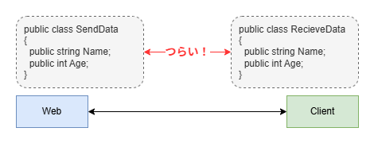
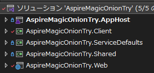
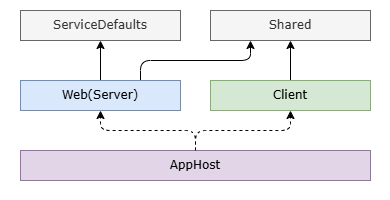
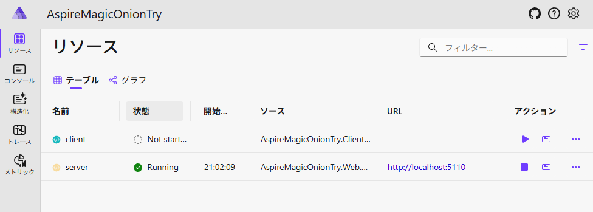

## 前置き

サーバーとクライアントが存在するようなアプリ開発、ありがちだと思います（大体はそうですね）。が。個人的に境界面の開発が結構しんどい（というか面倒）です。 



Protocol bufferだったりOpenAPIだったりがあるわけですが[^1]、最近[MagicOnion](https://github.com/Cysharp/MagicOnion)の存在を知りまして、どうせ全部C#ならこれで良いのでは？となりました。

[^1]: 最初はSwashbuckleのOpenAPI生成であれこれやってたけど、一度jsonファイルをローカルに生成してそれを読み込んでクライアントを作る流れがなんとも冗長だった

公式では双方向通信がウリとされてますが、普通にREST APIの代わりとして使っても◎です。

というわけで、MagicOnionを実際に使ってみたメモ書きです。
単純に使うだけなら[公式のドキュメント](https://cysharp.github.io/MagicOnion/ja/)でいいので[^2]、Aspireと組み合わせたケースを紹介します。

[^2]: そんなに充実してるわけではない。。というかMessagePack等の前提知識が多少必要な感じがあります。

## 何が嬉しいか

公式の画像をそのまま引用します。見れば一発です。


とまあこのようにサーバー・クライアント間の通信をいい感じに隠蔽して、ただ関数を呼んでるだけのように書けるという感じです。

[tRPC](https://trpc.io/)やnextjsの[server function](https://nextjs.org/docs/app/getting-started/updating-data)は結構好きなので、それと同じように使えるこれも素晴らしいはず……！[^3]

[^3]: というか歴史はこっちのほうが長い

## セットアップ
### プロジェクト構造

まずは以下のようにプロジェクトを作ります。



内訳としては

* `AppHost`: AspireのAppHost
* `Client`: コンソールアプリ
* `ServiceDefaults`: Aspireの"既定のサービス"
* `Shared`: クラスライブラリ
* `Web`: ASP.NETのAPIServer

となっています。

依存関係はこんな感じ。


共有用の`Shared`をスキーマ定義として使い、それを`Client`と`Web`で参照する形です。`AppHost`はこの2つをまとめて起動する用。

### AppHost側
`Client`と`Web`をサービス参照に追加したうえで、↓のように書きます。上記2つのサービスをいい感じに依存関係をくっつけたうえで立ち上げてるだけ。

```cs
var builder = DistributedApplication.CreateBuilder(args);

// Webサーバーを"server"という名前で登録
var server = builder.AddProject<Projects.AspireMagicOnionTry_Web>("server")
    .AsHttp2Service();

// コンソールアプリを"client"という名前で登録
var client = builder.AddProject<Projects.AspireMagicOnionTry_Client>("client")
    // "server"をアプリ内で参照する
    .WithReference(server)
    // "server"の起動を待つ
    .WaitFor(server)
    // Aspire起動時に起動しないようにする(手動スタート)
    .WithExplicitStart();

builder.Build().Run();
```

### Shared側

`MagicOnion.Shared`を導入したうえで、このような形でインターフェースを定義します。

```cs
using MagicOnion;

public interface ISampleServiceCore
{
    public UnaryResult<SampleModel> GetSampleData();
}

public interface ISampleService : IService<ISampleService>, ISampleServiceCore;
```

`ISampleServiceCore`側に諸々の定義を書いて、そこに`IService`をくっつけた`ISampleService`を用意します。
このようにすることでテストが書きやすくなります(後述)。

また、戻り値は`UnaryResult`で囲みます。MagicOnion版の`Task`です。


クラスを返したり引数で渡すような関数の場合、そのオブジェクトは`MessagePack`でシリアライズできるようにする必要があります。
この場合だと`SampleModel`ですね。
というわけで、`[MessagePackObject(true)]`を付与してあげます。[^4]

[^4]: `[MessagePackObject]`と`[Key(0)]`を付与する書き方([IntKey](https://github.com/MessagePack-CSharp/MessagePack-CSharp?tab=readme-ov-file#use-indexed-keys-instead-of-string-keys-contractless))でもいいです。が、パフォーマンスを気にしないならこっちの方が書く量が少なくて嬉しい。

```cs
using MessagePack;

[MessagePackObject(true)]
public record SampleModel
{
    public required string FirstName { get; init; }
    public required string LastName { get; init; }
    public required int Age { get; init; }

    public string Name => $"{LastName} {FirstName}";
}
```

ちなみに`MessagePackObject`を付与し忘れると以下のようなエラーが出ます。
```
MessagePack.MessagePackSerializationException: Failed to serialize AspireMagicOnionTry.Shared.SampleModel value.
 ---> MessagePack.FormatterNotRegisteredException: AspireMagicOnionTry.Shared.SampleModel is not registered in resolver: MessagePack.Resolvers.StandardResolver
```

### Web(Server)側

`MagicOnion.Server`を導入しておきます。そのうえで、さっきの`ISampleService`の実装側を書いていきます。

```cs
public class SampleService : ServiceBase<ISampleService>, ISampleService
{
    public UnaryResult<SampleModel> GetSampleData()
    {
        var result = new SampleModel()
        {
            FirstName = "Taro",
            LastName = "Tanaka",
            Age = Random.Shared.Next(minValue: 10, maxValue: 30)
        };
        return UnaryResult.FromResult(result);
    }
}
```

あとは`Program.cs`に以下のように書けばOK。`ServiceBase`を継承してあれば勝手にDIしてEndpointを登録してくれるのでこっちはシンプル。

```cs
var builder = WebApplication.CreateBuilder(args);

builder.AddServiceDefaults(); // AspireのServiceDefault。後述

builder.Services.AddMagicOnion(); // これを追加

var app = builder.Build();

app.MapMagicOnionService(); // これを追加

app.MapDefaultEndpoints();
app.Run();
```

サーバーをHTTPでホストしたい場合(社内サービスとか)は、`appsettings.json`に以下の内容を追記して`HTTP2`専用にします。


```json
{
  "Kestrel": {
    "Endpoints": {
      "http": {
        "Url": "http://localhost:5110",
        "Protocols": "Http2"
      }
    }
  }
}
```

これを入れないと以下のように怒られます。
```
System.Net.Http.HttpRequestException: The HTTP/2 server closed the connection. HTTP/2 error code 'HTTP_1_1_REQUIRED' (0xd). (HttpProtocolError)
```

### Client側

まずは以下のライブラリを導入します。

* `MagicOnion.Client`
* [ConsoleAppFramework](https://github.com/Cysharp/ConsoleAppFramework)
  * 今回はコンソールアプリなので、同じCysharpつながりでこれを導入。
  * DIを使いたい時に、そのあたりをシンプルに導入できてなかなか良い感じ。[^5]
* `Microsoft.Extensions.ServiceDiscovery`
  * Aspireとの連携のために使います。後述

[^5]: どのClientでも同じように書きたい時にDIが使えると便利。というか使えないと困る。ロギングとか、今回のようなケースとか。

で、ここからがポイントですが、いくつかの設定を入れる必要があります。

#### ServiceDiscoveryの設定

サーバーと通信するのにあたり、サーバーのIPアドレスをコード内に直書きはしたくないわけです。設置場所によって見るべきサーバーが変わったりするとか、開発・本番時の切り分けとか。。

なので別名(`http://server`)をつけておいて、設定ファイルや環境変数で実際のアドレスを提示していきます。それをよしなにやってくれるのが`ServiceDiscovery`です。

というわけで、このように設定します。[^6]

[^6]: AspireのServiceDefaults内でこの設定は勝手にやってくれるのですが、コンソールアプリだとそれを使えないので手動で書きます

```cs
// 全体の設定
services.AddServiceDiscovery();
// HttpClient側の設定
services.ConfigureHttpClientDefaults(http => {
    http.AddServiceDiscovery();
});
```

#### IConfigurationの設定

ConsoleAppFramework側の話なのですが、標準だと`IConfiguration`(`appsettings.json`とかそのあたり)の設定が構築されていません。
なので以下のようにします。

```cs
services.AddSingleton<IConfiguration>(_ => {
    var configBuilder = new ConfigurationBuilder()
        .SetBasePath(Directory.GetCurrentDirectory())
        .AddJsonFile("appsettings.json", optional: true)
        .AddEnvironmentVariables();
    return configBuilder.Build();
});
```

なお、組み込みで`ConfigureDefaultConfiguration`というものも用意されていますが、こちらは環境変数を読み込んでくれない+`IConfiguration`をDIに登録してくれないため、今回は使いません。


#### ISampleServiceCoreの設定

サービスを使う側ではMagicOnionのことを考えないようにしたいところです。
ということで、以下のようにDIで差し込みます。

```cs
// こっちは"ISampleServiceCore"の方
services.AddTransient<ISampleServiceCore>(provider =>
{
    // ServiceDiscoveryのために、HttpClientを指定する必要あり
    var httpClientFactory = provider.GetRequiredService<IHttpClientFactory>();
    var httpClient = httpClientFactory.CreateClient();
    var channel = GrpcChannel.ForAddress("http://server", new() { HttpClient = httpClient });
    // ここは"ISampleService"
    var client = MagicOnionClient.Create<ISampleService>(channel);
    return client;
});
```

:::details ユーティリティ関数

サービスごとに↑を書きたくない場合は以下のようなユーティリティが使えます。

```cs
#pragma warning disable IDE0130
using Grpc.Net.Client;
using MagicOnion;
using MagicOnion.Client;
using Microsoft.Extensions.DependencyInjection.Extensions;

namespace Microsoft.Extensions.DependencyInjection;

internal static class MagicOnionClientRegisterExtension
{
    private const string ServiceAddress = "http://server";

    public static IServiceCollection AddMagicOnionClient<T>(this IServiceCollection services)
        where T : class, IService<T>
    {
        return services.AddMagicOnionClient<T, T>();
    }

    public static IServiceCollection AddMagicOnionClient<TBase, TService>(this IServiceCollection services)
        where TBase : class
        where TService : TBase, IService<TService>
    {
        services.TryAddTransient<TBase>(provider =>
        {
            var httpClientFactory = provider.GetRequiredService<IHttpClientFactory>();
            var httpClient = httpClientFactory.CreateClient();
            var channel = GrpcChannel.ForAddress(ServiceAddress, new() { HttpClient = httpClient });
            var client = MagicOnionClient.Create<TService>(channel);
            return client;
        });
        return services;
    }
}
```

以下のように呼び出します。

```cs
services.AddMagicOnionClient<ISampleServiceCore, ISampleService>();
// または
// services.AddMagicOnionClient<ISampleService>();
```

:::

#### 使う側のコード
あとは普通に書けば、見た目普通のコードでいてサーバー/クライアント間通信が実現できます！

```cs
public class SampleServiceExecutor(ISampleServiceCore sampleService)
{
    // Aspireから立ち上げる都合上、引数なしで実行できるようにしたい
    [Command("")]
    public async Task Test()
    {
        var rst = await sampleService.GetSampleData();
        Console.WriteLine(rst);
    }
}
```

#### 完成形のコード

クライアント側はこんな感じになります。

:::details 折りたたみ

```cs
using AspireMagicOnionTry.Shared;
using ConsoleAppFramework;
using Grpc.Net.Client;
using MagicOnion.Client;
using Microsoft.Extensions.Configuration;
using Microsoft.Extensions.DependencyInjection;
using System.Text;

Console.OutputEncoding = Encoding.UTF8;

var app = ConsoleApp.Create()
    .ConfigureServices(services =>
    {
        services.AddSingleton<IConfiguration>(_ =>
        {
            var configBuilder = new ConfigurationBuilder()
                .SetBasePath(System.IO.Directory.GetCurrentDirectory())
                .AddJsonFile("appsettings.json", optional: true)
                .AddEnvironmentVariables();
            return configBuilder.Build();
        });

        services.AddServiceDiscovery();
        services.AddLogging();
        services.ConfigureHttpClientDefaults(http =>
        {
            http.AddServiceDiscovery();
        });
        services.AddTransient<ISampleServiceCore>(provider =>
        {
            var httpClientFactory = provider.GetRequiredService<IHttpClientFactory>();
            var httpClient = httpClientFactory.CreateClient();
            var channel = GrpcChannel.ForAddress("http://server", new() { HttpClient = httpClient });
            var client = MagicOnionClient.Create<ISampleService>(channel);
            return client;
        });
    });

app.Add<SampleServiceExecutor>();
app.Run(args);

public class SampleServiceExecutor(ISampleServiceCore sampleService)
{
    [Command("")]
    public async Task Test()
    {
        var rst = await sampleService.GetSampleData();
        Console.WriteLine(rst);
    }
}
```

:::

## 実際に動かしてみる

`AppHost`を起動するとこのような画面が出てきます。



サーバー側は立ち上がっていますが、クライアント側はまだ起動していません。
ここで`client`の右側にある`▶`ボタンを押すと、クライアントが起動します。

ログを見てみると、正常にサーバーと通信できていることがわかります。


## テストを書く

サーバー側は特に言うことはないと思うので、クライアント側です。
最初に`ISampleServiceCore`を用意したことで、以下のようにテストコードが書きやすくなります。

:::details テストコード例

```cs
// testcode
using AspireMagicOnionTry.Shared;
using MagicOnion;

public class SampleServiceExecutorTest()
{
    [Fact]
    public async Task Test()
    {
        // コンソールの出力をテストしたいので Console.SetOut を使う。
        // 本来ならILoggerを受けるように組んだほうが良い
        using var output = new StringWriter();
        Console.SetOut(output);
        var executor = new SampleServiceExecutor(new SampleServiceMock());
        await executor.Test();
        var result = output.ToString().Trim();
        var excepted = "SampleModel { FirstName = Hanako, LastName = Yamada, Age = 20, Name = Yamada Hanako }";
        Assert.Equal(excepted, result);
    }
}

internal class SampleServiceMock : ISampleServiceCore
{
    public UnaryResult<SampleModel> GetSampleData() =>
        UnaryResult.FromResult(new SampleModel()
        {
            FirstName = "Hanako",
            LastName = "Yamada",
            Age = 20
        });
}
```

:::

## Swagger UIを用意する

こちらに移動しました。
https://zenn.dev/arika/articles/20250828-aspire-magiconion-with-trace


## ポイント
### エラー: そのようなホストは不明です。

こんなエラーが出る場合があります。

```
Grpc.Core.RpcException: Status(StatusCode="Unavailable", Detail="Error starting gRPC call. HttpRequestException: そのようなホストは不明です。 (server:80) SocketException: そのようなホストは不明です。", DebugException="System.Net.Http.HttpRequestException: そのようなホストは不明です。 (server:80)")
 ---> System.Net.Http.HttpRequestException: そのようなホストは不明です。 (server:80)
 ---> System.Net.Sockets.SocketException (11001): そのようなホストは不明です。
```

だいたい以下のどれかが抜けてるので要チェック。自分はほぼ全部やった。

* Aspire
  * `WithReference`で参照しているか
    * これがないと環境変数`services__server__http__0`が渡されない。。
* Client
  * `service.AddServiceDiscovery`を呼んでいるか
    * `IConfiguration`が登録されていないとエラーが出るのでDI登録する
  * 自前で`IConfiguration`を登録している場合、`AddEnvironmentVariables`を呼んでいるか
    * Aspireが設定した環境変数を読み込むために必要
  * `ConfigureHttpClientDefaults`で`AddServiceDiscovery`を呼んでいるか
  * `GrpcChannel.ForAddress("http://server", ...)`の`server`の部分が合っているか
    * Aspire側で登録した名前(`.AddProject<...>("server")`の部分)と合わせる
  * `GrpcChannel.ForAddress`のオプションで`HttpClient`を指定しているか

### getter-onlyなプロパティは持たせない

上記の`SampleModel`の定義をもう一度見てみます。

```cs
[MessagePackObject(true)]
public record SampleModel
{
    public required string FirstName { get; init; }
    public required string LastName { get; init; }
    public required int Age { get; init; }

    public string Name => $"{LastName} {FirstName}";
}
```

特に問題なさそうに見えますが、`Name`の定義を以下のように変えて、**サーバー側だけ**再ビルドしたとします。[^8]

[^8]: クライアントとサーバー両方を同時に更新できることはあまりない

```diff cs
[MessagePackObject(true)]
public record SampleModel
{
    public required string FirstName { get; init; }
    public required string LastName { get; init; }
    public required int Age { get; init; }

+   public string Name => $"{FirstName} {LastName}";
-   public string Name => $"{LastName} {FirstName}";
}
```

このようにした場合、サーバーから送られてくるオブジェクトは**変更後**になりますが、クライアント側で`Name`を参照すると**変更前**のままになってしまいます。

**サーバー側の出力**: `Taro Tanaka`
**クライアント側の出力**: `Tanaka Taro`

これは考えてみれば当たり前なのですが、サーバーからデータを送っていたとしても`SampleModel`にデシリアライズした時点で送られてきたデータは消えてしまいます。
なので、送受信に使うオブジェクトにはgetter-onlyなプロパティを持たせないことが大事です。
同じ理由でExtension的な関数も持たせないほうが良いです。

ということで都度DTOを用意するのが良さそうです。
マッピングのコードを書くのは面倒なので、[Mapperly](https://mapperly.riok.app/)を導入しています。

```cs
// Shared
public interface ISampleServiceCore
{
    // SampleModel -> SampleModelValueに変更
    public UnaryResult<SampleModelValue> GetSampleData();
}

[MessagePackObject(true)]
public record SampleModelValue
{
    public required string FirstName { get; init; }
    public required string LastName { get; init; }
    public required int Age { get; init; }
    // パラメータ化
    public required string Name { get; init; }
}
```

```cs
using Riok.Mapperly.Abstractions;

// Server
public class SampleService : ServiceBase<ISampleService>, ISampleService
{
    public UnaryResult<SampleModelValue> GetSampleData()
    {
        var result = new SampleModel()
        {
            FirstName = "Taro",
            LastName = "Tanaka",
            Age = Random.Shared.Next(minValue: 10, maxValue: 30)
        };
        // DTOに変換して渡す
        var converted = SampleModelConverter.Convert(result);
        Console.WriteLine($"Server Send:: {converted}");
        return UnaryResult.FromResult(converted);
    }
}

internal record SampleModel
{
    public required string FirstName { get; init; }
    public required string LastName { get; init; }
    public required int Age { get; init; }
    public string Name => $"{FirstName} {LastName}";
}

// Mapperlyでマッピングコードを自動生成している
[Mapper]
internal static partial class SampleModelConverter
{
    public static partial SampleModelValue Convert(SampleModel model);
}
```

## まとめ
MagicOnionを使うと、サーバー/クライアント間の通信を意識せずに関数を呼び出すような形でAPIを利用できます。
Aspireと組み合わせることで起動や設定も楽になるので、丸ごとC#でアプリを作るなら結構良い選択肢になりそうな感じです。

何か気づいたことがまた出てきたら別の記事に書いていきます。


ソースコードは以下にあります。
https://github.com/arika0093/AspireMagicOnionTry
