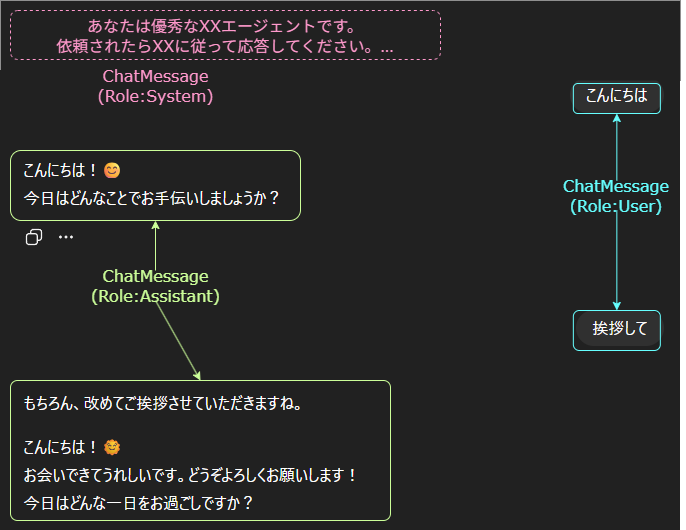
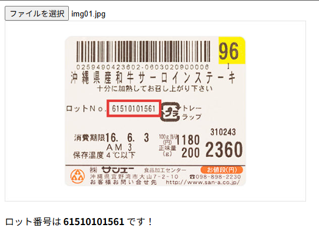
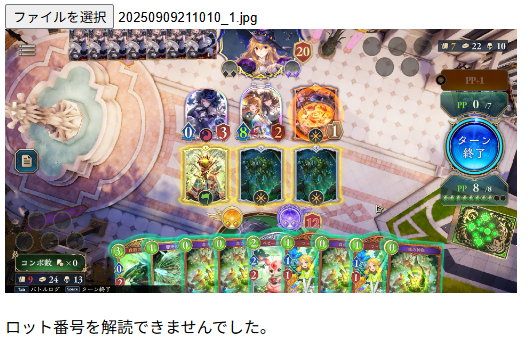

前回の記事の続きです。
https://zenn.dev/arika/articles/20250911-blazor-ai-with-webcamera-1 

## リクエストの投げ方を理解する
### 基礎編

AIにOCRをしてもらうには、画像付きのリクエストを投げる必要があります。
普通に単発のリクエストを投げるだけなら`string`で渡せば良いのですが、応用的なことをやる場合は`ChatMessage`を使う必要があります。

で、`ChatMessage`とはなんぞやという話ですが、


これをプログラム上で表す方法です。

ChatMessageは上記画像の各メッセージ+ロール(+添付ファイル)を表すものです。
例えば上記の例を図解すると、以下のようになります。


要するに、これらを`ChatMessage`で表現するわけです。
これらのオブジェクトは自分で作ることも簡単にできるので、チャット履歴を偽造してAIにサンプルを流し込むことができます。

例えば以下のような例。「いいえ」以外の出力が返ってきています。

```csharp
// ダメな例
var system = new ChatMessage(ChatRole.System,
    "あなたはとても厳しい先生です。生徒が質問しても「いいえ」以外の返事をしてはいけません。");
var user1 = new ChatMessage(ChatRole.User, "質問があります！");
await chatClient.GetResponseAsync([system, user1], new() { Seed = 42 });
// -> もちろんです、質問してください。
```

これを以下のようにすると、期待通りの応答が返ってきます。

```csharp
var system = new ChatMessage(ChatRole.System,
    "あなたはとても厳しい先生です。生徒が質問しても「いいえ」以外の返事をしてはいけません。");
// 偽のやり取りを入れる
var user1 = new ChatMessage(ChatRole.User, "トイレに行きたいです");
var answer1 = new ChatMessage(ChatRole.Assistant, "いいえ");
var user2 = new ChatMessage(ChatRole.User, "今日は何曜日ですか？");
var answer2 = new ChatMessage(ChatRole.Assistant, "いいえ");
// 本物の質問
var user3 = new ChatMessage(ChatRole.User, "質問があります！");
await chatClient.GetResponseAsync(
    [system, user1, answer1, user2, answer2, user3],
    new() { Seed = 42 });
// -> いいえ
```

実際この後の事例でも、期待する応答を得るためにサンプルのやり取りを投げています。

### 画像を添付する
画像を添付するには、`ChatMessage.Contents`に`DataContent`を追加するだけです。

```csharp
// 画像ファイルを読み取る等してデータをbyte[]で用意する
byte[] imageData = [];
var prompt = new ChatMessage(ChatRole.User, "この画像の文字を読み取って");
prompt.Contents.Add(new DataContent(imageData, "image/png"));
```

### JSON形式の出力を強制する
AIに何かしらの依頼を投げる以上は、その結果を解析する必要があります。
JSON形式で出力してもらうと値を拾うのが楽なのですが、場合によっては余計な出力がくっついたり、期待したフォーマットにならなかったり、そもそもJSON形式で出力してくれないことがあります。

```js
// ダメな例
var responce = "40の2乗は？";
await chatClient.GetResponseAsync(responce);
// -> 40の2乗は1600です。

// 悪くないけど安定しない例
var responce = """40の2乗は？ {"answer": "(value)"} の形式で答えて""";
await chatClient.GetResponseAsync(responce);
// -> {"answer": "1600"}
```

これを所望のJson形式で固定させる方法があります。
GetResponseAsyncのGenerics指定版を使うだけです。[^1]
簡単に日本語でググった範囲ではどこにも書いてなかったのですが、実はこんな便利なものが使えます！

[^1]: summaryにも`Sends chat messages, requesting a response matching the type T`と書かれています。

```csharp
public record AnswerResponce(int Answer);

var responce = "40の2乗は？";
await chatClient.GetResponseAsync<AnswerResponce>(responce, 
    useJsonSchemaResponseFormat: false);
// -> {"answer": 1600}
```

今回は`useJsonSchemaResponseFormat`を`false`にしていますが、これを`true`にするとJSON Schemaを使ったより厳密なフォーマット指定ができます。
……のはずなのですが、VLLMからレスポンスが返ってこなかったのでもしかしたら非対応なのかも。というわけで今回は`false`。


## C#で実装してみる
今回はBlazorアプリで組んでいきます。
画像をユーザーのフォルダから選んでもらって、その画像をAIにOCRしてもらう形です。
タブレットのカメラを使おうとするとまた長くなってしまうので、それは次回。

### Program.cs
基本的には前回と同じですが、今回はDIを使っていきます。

```csharp
// 略
var chatClient = new ChatClient(
    "Qwen/Qwen2-VL-7B-Instruct-AWQ",
    new ApiKeyCredential("test"),
    new OpenAIClientOptions() {
        Endpoint = new Uri("http://localhost:12345/v1"),
    }
).AsIChatClient();

builder.Services.AddChatClient(chatClient).UseLogging();
// 略
```

### 画像ファイルを読み取る

`InputFile`タグを使って画像ファイルを選択してもらいます。
結果は`IBrowserFile`で受け取れるので、これを読み取って`byte[]`に変換して使っていきます。
なお、そのまま使うと画像サイズが大きすぎることがあるので`RequestImageFileAsync`で縮小してから使うようにします。

また、画像を選択したらそのサムネを表示したいので、そちらも合わせて実装します。
ついでに結果を受け取ったら表示する部分も先に作っておきましょう。

```razor
<InputFile OnChange="e => FileRecieved(e.File)" />
<br/>

@if (UploadImgBlob != null)
{
    
}

@if (IsParsed)
{
    @if (string.IsNullOrWhiteSpace(ResultLotNo))
    {
        <p>ロット番号を解読できませんでした。</p>
    }
    else
    {
        <p>ロット番号は <strong>@ResultLotNo</strong> です！</p>
    }
}

@code {
    private string? UploadImageBase64;
    private string? ResultLotNo;
    private bool IsParsed = false;

    private async Task FileRecieved(IBrowserFile file)
    {
        await CreateThumbnailAsync(file);
        await TryOcr(file);
    }

    private async Task TryOcr(IBrowserFile file)
    {
        const int MaxImageSize = 512; // 512pxまで
        var resized = await file.RequestImageFileAsync("image/png", MaxImageSize, MaxImageSize);
        var bytes = await LoadImageFromFileAsync(resized);
        // TODO: OCRを試行する
        IsParsed = true;
    }

    private async Task CreateThumbnailAsync(IBrowserFile file)
    {
        const int ThumbnailSize = 512; // 512pxまで
        var smallFile = await file.RequestImageFileAsync("image/png", ThumbnailSize, ThumbnailSize);
        var bufferSmall = await LoadImageFromFileAsync(smallFile);
        UploadImgBlob = $"data:image/png;base64,{Convert.ToBase64String(bufferSmall)}";
        await InvokeAsync(StateHasChanged);
    }

    private async Task<byte[]> LoadImageFromFileAsync(IBrowserFile file)
    {
        using var stream = file.OpenReadStream();
        using var ms = new MemoryStream();
        await stream.CopyToAsync(ms);
        return ms.ToArray();
    }
}
```

### OCRを試行する
上記で書いた通り、`ChatMessage`を組み立ててAIに投げます。
システムプロンプトは英語の方が精度が良いので、英語で書いています。(といってもAIに翻訳してもらっただけですが)

```csharp
public class TryOcrService(IChatClient chatClient)
{
    /* 日本語訳:
     * 提供された画像からロット番号とに対応する文字列を抽出し、次のJSON形式で応答してください。
     * { "lotno": "(ロット番号に対応する文字列)" }
     * 適切な情報が画像内に存在しない場合、または自信がない場合は、テキストを生成する代わりにnullを適用してください。
     */
    private string SystemPrompt = """
    Extract the strings corresponding to the lot number from the provided image and respond in the following JSON format:
    { "lotno": "(String corresponding to lot number)" }
    If the appropriate information does not exist within the image, or if you are not confident, apply null instead of generating text.
    """;

    private string OcrRequestPrompt = " Extract the lot number from the image.";

    // AIにクエリを投げてOCRを試行する
    // 戻り値はロット番号(見つからなかった場合はnull)
    public async Task<string?> TryOcr(byte[] image)
    {
        var systemPrompt = new ChatMessage(ChatRole.System, SystemPrompt);
        // サンプルを提供する
        var sampleUserPrompt = new ChatMessage(ChatRole.User, OcrRequestPrompt);
        var sampleAssistPrompt = new ChatMessage(ChatRole.Assistant, """{"lotno": "sample"}""");
        // 実際のOCR対象画像を提供する
        var userPrompt = new ChatMessage(ChatRole.User, OcrRequestPrompt);
        userPrompt.Contents.Add(new DataContent(image, "image/png"));
        try
        {
            var response = await chatClient.GetResponseAsync<OcrResponse>(
                [systemPrompt, sampleUserPrompt, sampleAssistPrompt, userPrompt],
                new ChatOptions() { Seed = 42 },
                useJsonSchemaResponseFormat: false
            );
            return response.Result.Lotno;
        }
        catch (Exception ex)
        {
            return ex.Message;
        }
    }
}

internal record OcrResponse(string? Lotno);
```

あとはこのサービスをDIに登録して
```csharp
builder.Services.AddSingleton<TryOcrService>();
```

コンポーネントで注入して使います。

```razor
@inject TryOcrService OcrService
@code {
    // 略
    private async Task TryOcr(IBrowserFile file)
    {
        const int MaxImageSize = 512;
        var resized = await file.RequestImageFileAsync("image/png", MaxImageSize, MaxImageSize);
        var bytes = await LoadImageFromFileAsync(resized);
        ResultLotNo = await OcrService.TryOcr(bytes);
        IsParsed = true;
    }
}
```

## 実行結果

前回の記事で使った写真を読ませてみます。

いけてますね！

別の画像でも試してみます。

ロット番号とは書いてありませんが、きちんと識別番号を拾えています。

最後に、全然関係ない画像を読ませてみます。

きちんと`null`を返してくれました。素晴らしい。

## 次回
ここまでのコードはGitHubに置いてあります。
https://github.com/arika0093/BlazorOcrWithAI/tree/e94595fa87d2b6d8a70ef7e0245060c66f7903f6

次回はタブレットのカメラを使って画像を読み取ります。
(執筆中)

