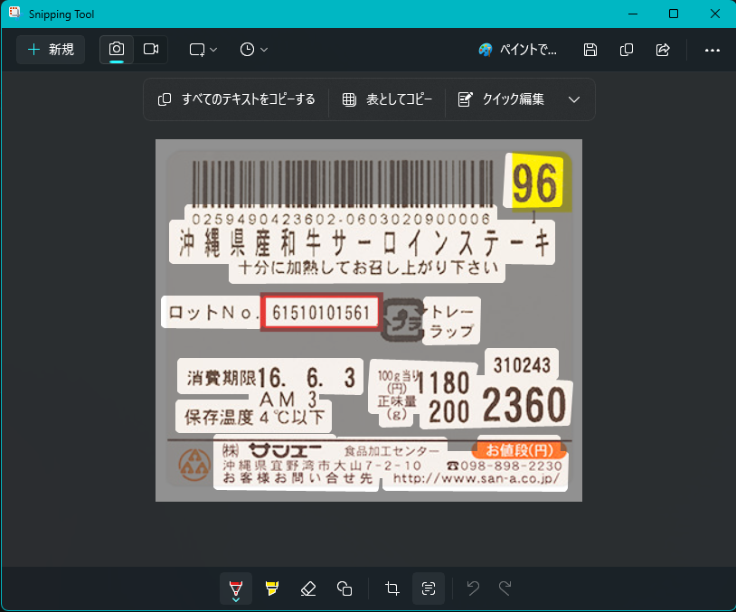
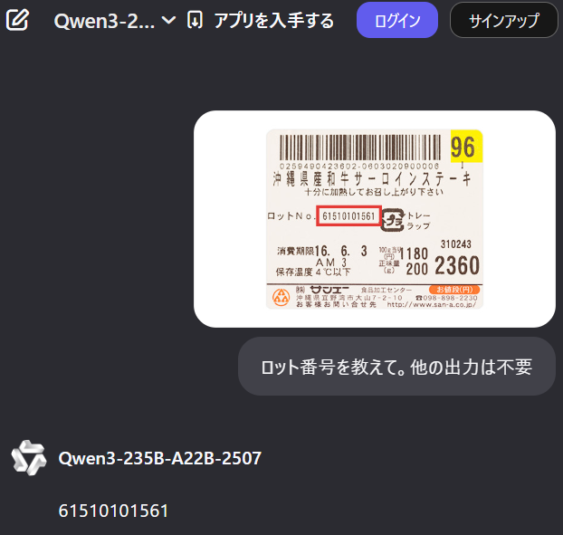
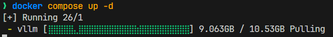

## 概要

以下のようなケースを想定します。 

* 業務効率化ソフトを作る
* スマホやタブレットを使って、製品のロット番号を読み取る
  * バーコードなんて良心的なものは付いてないものとします。
* 情報は社外に出さない（出せない）。全部自前でホスティングする

製造業あるあるだと思います。特に一番最後。

## なぜAIを使うのか

作成の前に。ここは大事です。手段が目的になってはいけません。

前提として、普通にOCRしたほうが読み取り精度は高いことが多いです。
が、画像全体の文脈を読み取る、という観点においてはAIのほうが強いといえます。

例えば以下のような画像。（適当にGoogleで拾ってきました）


この画像を素直にOCRにかけると、以下のような結果になります。



```
0259490423602-0603020900006
61510101561
トレー
ラップ
96
沖縄県産和牛サーロインステーキ
十分に加熱してお召し上がり下さい
ロットNo
消費期限16. 6. 3
AM 3
保存温度4℃以下
(株) サンエー
沖縄県宜野湾市大山7-2-10
お客様お問い合せ先
100当91180
正味量
(g)
食品加工センター
200
310243
2360
お値段(円)
3098-898-2230
http://www.san-a.co.jp/
```

言うことない精度です。

ですが、この文字列のどれがロット番号でしょうか？というと、なかなか難しくなってきます。
人間が見れば「61510101561」だと一発でわかりますが、この文字列の中から予備知識なしで探すのはまあ無理でしょう。

というわけで、こういうときはAIを使うと良い、と言えそうです。

試しに Qwen3に聞いてみました。



余裕ですね。

このように、人間がやると余裕だけど機械には難しい、というケースにおいて(生成)AIは強力なツールになり得ます。

前置き終わり。

## 準備
今回は全部自前でホスティングすることを目指します。
というわけで、おそらく一番大変であろうAIサービスの立て方から。

### AIサービスを立てる

AIサービスなんて雑な表現ですが、要するに(ChatGPTのような)チャットのリクエストを投げるとそれに対して応答してくれるAPIサービスを用意します。
ここで、**どのモデルを動かすか** と **どうやってAPIを提供するか** がポイントになります。

### どのモデルを使うか

世間で言うところの`gpt-4o`とか`gpt-5`とかの話です。ただしこれらはOpenAIの商用サービスですので今回は使えません。
代わりにHuggingFaceに色々転がっているのでそいつらを使っていきます。

自分でいくつか試した所感だと、Qwen系統が安定して日本語の読み取りができて高性能な印象です。
というわけで、[`Qwen2-VL-7B-Instruct-AWQ`](https://huggingface.co/Qwen/Qwen2-VL-7B-Instruct-AWQ) というモデルを使うことにします。


よくわからん名前ですが、噛み砕くと

* `Qwen2`: Qwenシリーズの第2世代
* `VL`: Vision-Language、つまり画像とテキストの両方を扱える。
* `7B`: 70億パラメータ。でかいほど強い（が重い）
* `Instruct`: 指示に従うように調整されている。◯◯して、という指示に従いやすい。
* `AWQ`: 4bit量子化されている。軽い（が精度が落ちる）

先頭のやつはシリーズ名なので置いといて、それ以外の全部が大事です。


まずVLであること。言うまでもなく画像を扱えることが必須です。

次にモデルサイズ。ここの数字が低いと精度が落ちます。そこまで問題ないこともあるのですが、サイズが落ちると多言語対応能力がみるみる落ちることが多いです。この記事を読むような人は日本語を扱うでしょうから、極力高めに確保したい（といっても7Bは大きい方ではないですが）

そしてInstructであること。これも重要です。Instruct系統は指示に従うように調整されているので、こちらを使います。

最後にAWQ。4bit量子化されているので軽いです。
セルフホストしなければならない状況でつよつよマシンを使えるとは思えない[^1] ので、パフォーマンスも大事です。

[^1]: 商用サービスを使ったほうが維持コストや性能等で明らかに有利です。言うまでもないことですが。

---

ちなみに [Qwen2.5シリーズでもVLがあります](https://github.com/QwenLM/Qwen2.5-VL)が、こっちはライセンスが商用利用不可なので使えません。要注意。
紛らわしいことに上記レポジトリはApache2.0となっていますが、これはモデルを呼び出すサンプルコード部分のライセンスであってモデル部分は別です。

### どうやってAPIを提供するか

モデルだけでは動きません。モデルを何らかの形で走らせて、APIとして提供するための仕組みが必要です。
モデルを動かす仕組みはOllamaやLLM Studioなど色々ありますが、今回は[vLLM](https://github.com/vllm-project/vllm)を使います。
OpenAI互換のAPIを提供でき、比較的カンタンに設定できて、無償なのでうってつけです。

というわけで docker compose でサクッと立ち上げます。(dockerセットアップ済のPCが必要です)

```yml
services:
  vllm:
    image: 'vllm/vllm-openai'
    deploy:
      resources:
        reservations:
          devices:
          - capabilities: [gpu]
            driver: nvidia
    volumes:
      - './cache:/root/.cache/huggingface'
    command: '--model Qwen/Qwen2-VL-7B-Instruct-AWQ'
    ports:
      - '12345:8000' # 適当に指定する
```

容量は全然手軽ではないですが。待ちます。


起動するとモデルファイルのダウンロードが始まります。これも時間がかかります。手元の環境でだいたい10分程度。

全部終わるとサーバーが立ち上がります。

```log
vllm-1  | (APIServer pid=1) INFO 09-11 06:39:15 [api_server.py:1880] Starting vLLM API server 0 on http://0.0.0.0:8000
vllm-1  | (APIServer pid=1) INFO 09-11 06:39:15 [launcher.py:36] Available routes are:
vllm-1  | (APIServer pid=1) INFO 09-11 06:39:15 [launcher.py:44] Route: /openapi.json, Methods: GET, HEAD
vllm-1  | (APIServer pid=1) INFO 09-11 06:39:15 [launcher.py:44] Route: /docs, Methods: GET, HEAD
```

## 動作確認
C#で簡単なクライアントを作って動作確認します。`Microsoft.Extensions.AI`を使っていきます。
これを書いている時点で`.AI`の方はGAしていますが、`.AI.OpenAI`の方はまだプレビューです。


```xml
<PackageReference Include="Microsoft.Extensions.AI" Version="9.9.0" />
<PackageReference Include="Microsoft.Extensions.AI.OpenAI" Version="9.9.0-preview.1.25458.4" />
```

```csharp
using System.ClientModel;
using Microsoft.Extensions.AI;
using OpenAI;
using OpenAI.Chat;

var chatClient = new ChatClient(
    "Qwen/Qwen2-VL-7B-Instruct-AWQ", // モデル名
    new ApiKeyCredential("test"), // なんでもいいけど何かしら入れないと怒られる。
    new OpenAIClientOptions()
    {
        // さっき立ち上げたローカルサーバー
        Endpoint = new Uri("http://localhost:12345/v1"),
    }
).AsIChatClient();

var message = "Hello, what can you do?";
await foreach (
    var update in chatClient.GetStreamingResponseAsync(message, new() { Seed = 42 })
) {
    Console.Write(update);
}
```

`.AsIChatClient()`を呼ぶのがポイントです。
こうすることでどのAIサービスを使おうが関係なく`IChatClient`インターフェースで扱えるようになります。

実行結果:


なかなかの速度で応答できていそうです。
ちなみに`NVIDIA GeForce RTX 4070 Ti SUPER`で動かしています。

## 次回
ここまでのコードはGitHubに置いてあります。(といってもほとんど上記のコードそのままですが)
https://github.com/arika0093/BlazorOcrWithAI/tree/9303a17c1602dde8b3be73c617b61e2114e148b8

次は`Microsoft.Extensions.AI`で画像付きのリクエストを投げて、AIにOCRしてもらうところまでやります。
https://zenn.dev/arika/articles/20250911-blazor-ai-with-webcamera-2

