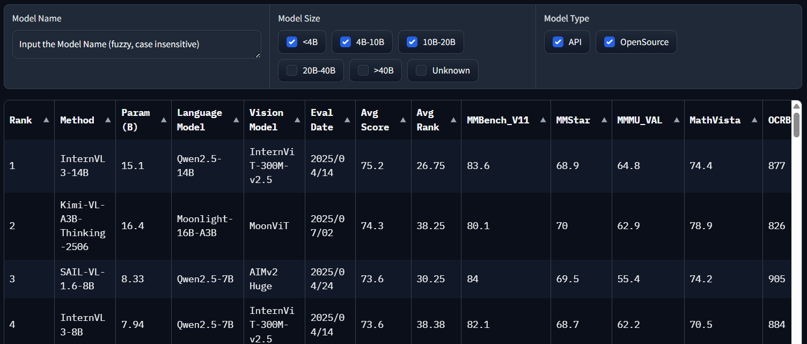

Aspireを使って、C#簡潔でAIを使うための開発環境を作ってみます。

## vLLMとは
OpenAI互換のAPIを提供する、軽量なLLMサーバーです。
具体的な使用例は↓の記事を参照。

https://zenn.dev/arika/articles/20250911-blazor-ai-with-webcamera-1
https://zenn.dev/arika/articles/20250911-blazor-ai-with-webcamera-2


## 準備
Aspireのプロジェクトを作成します。
VisualStudioからやってもいいのですが、今回はCLIから。

```bash
dotnet new install Aspire.ProjectTemplates
```

実行すると以下のようにテンプレートがインストールされます。

```
成功: Aspire.ProjectTemplates::9.4.2により次のテンプレートがインストールされました。
テンプレート名                            短い名前                言語  タグ
----------------------------------------  ----------------------  ----  -------------------------------------------------------------------------------
.NET Aspire アプリ ホスト                 aspire-apphost          [C#]  Common/.NET Aspire/Cloud
.NET Aspire サービスの既定値              aspire-servicedefaults  [C#]  Common/.NET Aspire/Cloud/Web/Web API/API/Service
.NET Aspire スターター アプリ             aspire-starter          [C#]  Common/.NET Aspire/Blazor/Web/Web API/API/Service/Cloud/Test/MSTest/NUnit/xUnit
.NET Aspire テスト プロジェクト (MSTest)  aspire-mstest           [C#]  Common/.NET Aspire/Cloud/Web/Web API/API/Service/Test/MSTest
.NET Aspire テスト プロジェクト (NUnit)   aspire-nunit            [C#]  Common/.NET Aspire/Cloud/Web/Web API/API/Service/Test/NUnit
.NET Aspire テスト プロジェクト (xUnit)   aspire-xunit            [C#]  Common/.NET Aspire/Cloud/Web/Web API/API/Service/Test/xUnit
.NET Aspire 空のアプリ                    aspire                  [C#]  Common/.NET Aspire/Cloud/Web/Web API/API/Service
```

今回は`aspire`を使います。
紛らわしいのですが、「空のアプリ」を使うのが正解です。空のアプリといいながら、「アプリ ホスト」と「サービスの既定値」の合体版が提供されます。
（確かにプロジェクトはないけれど！）

```bash
mkdir VllmWithAspire
cd VllmWithAspire
dotnet new aspire
```

ソリューションファイルと2つのプロジェクトが作成されます。

```
ls -1
VllmWithAspire.AppHost
VllmWithAspire.ServiceDefaults
VllmWithAspire.sln
```

## vLLMを追加する

`VllmWithAspire.AppHost`の`Program.cs`を開き、以下のように編集します。

```csharp
var builder = DistributedApplication.CreateBuilder(args);

// ここから ------------------
// HF tokenを渡す場合
// var hfToken = builder.AddParameter("hf-token", secret: true);

// add vLLM service
const string ModelName = "OpenGVLab/InternVL3_5-4B-HF";
var vllm = builder
    .AddContainer("vllm", "vllm/vllm-openai")
    .WithHttpEndpoint(targetPort: 8000)
    .WithVolume("model_cache", "/root/.cache/huggingface")
    .WithHttpHealthCheck("/health")
    .WithLifetime(ContainerLifetime.Persistent)
    .WithContainerRuntimeArgs("--gpus=all")
    .WithArgs(
        "--model", ModelName,
        // "--hf-token", hfToken,
        "--max_model_len", "20480"
    );

// ここまで ------------------
builder.Build().Run();
```

色々でてきましたが、要するにdockerコンテナを起動するための引数を色々渡しています。

* `AddContainer`: 使用するイメージ名。第一引数の方は名称で、docker-composeのサービス名に相当。
* `WithHttpEndpoint`: コンテナの中で動いているHTTPサーバーのポート番号。vLLMは8000番で動いているので8000を指定。
* `WithVolume`: コンテナの中で使うボリューム。HuggingFaceのモデルをキャッシュするために使う。
* `WithHttpHealthCheck`: コンテナが起動したかどうかを確認するためのヘルスチェック用URL。vLLMは`/health`で起動確認ができる。
* `WithLifetime`: コンテナのライフタイム。`Persistent`にすると起動しっぱなしになる。
  * 今回のようなケースだと起動に時間がかかるので、`Persistent`にしておくと便利。
  * 自動でシャットダウンしてくれないので、手動で止める必要あり。
* `WithContainerRuntimeArgs`: コンテナのランタイムに渡す引数。GPUを使うので`--gpus=all`を指定。
* `WithArgs`: コンテナの中で動くvLLMに渡す引数。モデル名やHuggingFaceのトークンなどを指定。
  * `--model`: 使うモデル名。今回は`OpenGVLab/InternVL3_5-4B-HF`を指定。
  * `--hf-token`: HuggingFaceのトークンを渡す場合に指定。
  * `--max_model_len`: モデルの最大長。メモリ不足になる場合があるので、20480に下げている。

## コンソールアプリから呼び出す
せっかくAIサービスを立ち上げたので、呼び出してみましょう。
コンソールアプリのプロジェクトを追加します。

```bash
dotnet new console -n VllmWithAspire.ConsoleApp
dotnet sln add VllmWithAspire.ConsoleApp/VllmWithAspire.ConsoleApp.csproj
```

### vllmをコンテナ名で呼び出す

Aspireの機能（正確には違うけど）として、Service Discoveryというのがあります。
Aspireで起動した各種サービスのPort番号やホスト名は毎回変わってしまうので、代わりに名前で呼び出せるようにする仕組みです。
(docker-composeのサービス名で呼び出せるイメージと思ってもらえれば大体同じ)

というわけで、`http://localhost:12345/v1`のように直接呼び出すのではなく、代わりに`http://vllm/v1`のように呼び出そうと思います。

まずは必要なパッケージを追加します。

```bash
cd VllmWithAspire.ConsoleApp
dotnet add package Microsoft.Extensions.AI
dotnet add package Microsoft.Extensions.AI.OpenAI --prerelease
dotnet add package Microsoft.Extensions.DependencyInjection
```

また、`AspireWithVllm.ServiceDefault`への参照を追加します。

```bash
dotnet add reference ../VllmWithAspire.ServiceDefaults/VllmWithAspire.ServiceDefaults.csproj
```

### DIを設定する

最初はDIをちょちょいと設定すればOK！と思っていたのですが、実際やってみるとなかなか面倒です。というか気づきにくい。
オプションを俯瞰しているだけだと`HttpClient`を渡す方法がまったくわからないので色々ググる……。

正解は`ChatClient`の`Transport`。`new HttpClientPipelineTransport(httpClient)`とすることでhttpClientを渡すことができます。
後はServiceProviderから`IHttpClientFactory`を取得して、`CreateClient()`したものを渡せばOK。

もちろん言うまでもなく`ServiceDiscovery`は忘れずに。
(このあたりで、最初からASP.NETとかWorkerでやれば良かったんじゃないかと思い始める)


```csharp
using Microsoft.Extensions.AI;
using Microsoft.Extensions.Configuration;
using Microsoft.Extensions.DependencyInjection;
using OpenAI;
using System.ClientModel;
using System.ClientModel.Primitives;

var services = new ServiceCollection();

// ASP.NETとかWorkerならservices.AddServiceDefaultsを使えば良い
// service discoveryの設定
services.AddServiceDiscovery();
services.ConfigureHttpClientDefaults(http =>
{
    http.AddStandardResilienceHandler();
    http.AddServiceDiscovery();
});

// Configurationの登録
// これを入れないとせっかくAspireで設定してくれた環境変数が取れない
// ASP.NETとか(ry なら不要
var configuration = new ConfigurationBuilder()
    .AddJsonFile("appsettings.json", optional: true)
    .AddEnvironmentVariables()
    .Build();
services.AddSingleton<IConfiguration>(configuration);

// ChatClientの登録
// ここは何使ってても必要
services
    .AddChatClient(provider =>  
    {
        var httpClient = provider.GetRequiredService<IHttpClientFactory>().CreateClient();
        var config = provider.GetRequiredService<IConfiguration>();
        // せっかくなので設定から取るようにする。どうせvLLMの設定でも使うので、Aspireから渡せば無駄がない
        var modelName =
            config.GetValue<string>("MODEL_NAME")
            ?? throw new InvalidOperationException("MODEL_NAME is not set");
        var chatClient = new OpenAI.Chat.ChatClient(
            modelName,
            new ApiKeyCredential("test"), // 何かしら入れないと怒られる
            new OpenAIClientOptions()
            {
                // これでhttpClientを渡せる！
                Transport = new HttpClientPipelineTransport(httpClient),
                // やっとvllmで名前解決ができる……
                Endpoint = new Uri("http://vllm/v1"),
            }
        );
        return chatClient.AsIChatClient();
    })
    .UseLogging();

var provider = services.BuildServiceProvider();
// やっと設定完了
```

### Aspire側の設定をする
AppHost側にConsoleAppへの参照を追加します。

```bash
cd ../VllmWithAspire.AppHost
dotnet add reference ../VllmWithAspire.ConsoleApp/VllmWithAspire.ConsoleApp.csproj
```

AppHost側のProgram.csに、今回のコンソールアプリの呼び出しを追加します。

```csharp
builder
    .AddProject<Projects.VllmWithAspire_ConsoleApp>("console")
    // コンテナのHTTPエンドポイントを投げるときは .GetEndpoint("http") が必要
    .WithReference(vllm.GetEndpoint("http"))
    // せっかくなので環境変数でモデル名を渡す
    .WithEnvironment("MODEL_NAME", ModelName)
    // vLLMのサービスが利用可能になるまで待つ
    .WaitFor(vllm);
```

これでAspireでvLLMとコンソールアプリが連携できるようになりました。

## 使ってみる
後は簡単です。簡単に挨拶してみましょう。

```csharp
//  (省略)
// さっきの providerを作ったところから
var chatClient = provider.GetRequiredService<IChatClient>();

var request = "Hello, world!";
Console.WriteLine($">> {request}");
var response = await chatClient.GetResponseAsync(request);
Console.WriteLine($"<< {response.Text}");
```

ここまで書いたらAppHostを起動します。

```bash
# in ./VllmWithAspire.AppHost
dotnet run
```

コンソール画面が立ち上がり、URLが表示されるので開きます。

```log
info: Aspire.Hosting.DistributedApplication[0]
      Aspire version: 9.4.2+4884590ffaa580e742f479b4daf77f9d36451f35
...
info: Aspire.Hosting.DistributedApplication[0]
      Login to the dashboard at https://localhost:17170/login?t=01730bd5e5b593b770b2a821c880e9d5
```

こんな感じの画面が出てきます。


初回はvLLMのモデルをダウンロードするので時間がかかります。手元環境でだいたい2分ぐらい。

全部終わるとサーバーが立ち上がり、追ってコンソールアプリが実行されます。
ちゃんとvLLMが準備完了するのを待っていることがわかるかと思います。

```log
2025-09-17T21:01:17 Waiting for resource 'vllm' to enter the 'Running' state.
2025-09-17T21:01:20 Waiting for resource 'vllm' to become healthy.
2025-09-17T21:03:21 Waiting for resource ready to execute for 'vllm'.
2025-09-17T21:03:21 Finished waiting for resource 'vllm'.
2025-09-17T21:03:22 >> Hello, world!
2025-09-17T21:03:26 << Hello! How can I assist you today?
```

`<<`で始まる行がAIの応答です。ちゃんと動いていますね！

作業が終わったら`vllm`コンテナを手動で止めるのを忘れずに。


## まとめ
Aspireを使ってvllmの起動までやってあげると、AIなんじゃそらという感じのチームメンバーにも簡単にAIを使った開発環境を提供できます。
この手のやつは環境を作るのが大変ですからね！
というわけで、これを使ってメンバーにも色々作ってもらいましょう。

ここまでのコードはGitHubに置いてあります。
https://github.com/arika0093/VllmWithAspire