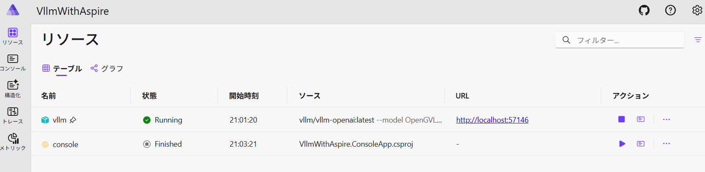

## やりたいこと
最近娘(0歳3ヶ月)がよくタオル遊びをしていて、目を離すとタオルで顔を覆ってしまい窒息しないか心配です。
またそろそろ寝返りをしそうなので、寝返りをしたらひっくり返す必要があります。

というわけでAIに映像を見てもらい、これらの異常があれば通知してもらう仕組みを作りたいと思います。

## 使うモデルを探す
今回は映像認識をしたいのでVision-Language Modelを探す。適当にリーダーボードを見てみる。

https://huggingface.co/spaces/opencompass/open_vlm_leaderboard

軽量かつオープンなモデルを探したいので、検索条件のModel Sizeで20B以上のものとUnknownを外した。



1位は`InternVL3-14B`だったので、これを使ってみる。
今回は日本語性能とかいらないので、単純に上位のものが良いだろうという判断。

https://huggingface.co/OpenGVLab/InternVL3-14B

実際に動かしてみるとメモリ不足とのこと…… 仕方ないのでサイズを下げる。
で、探してたら数日前にInternVL3.5が出ていた。これの4B版を採用。

https://huggingface.co/OpenGVLab/InternVL3_5-4B-HF
`-HF`がついてるのはHuggingFace互換（ついてない方は過去のInternVL互換）ということらしい。
最初つけない方で試してみたら`429 Too Many Requests`が出てきて、調べてみたら[こっちを使ってみて](https://huggingface.co/OpenGVLab/InternVL3_5-14B/discussions/2)とのこと。


性能がすごい。4BでもQwen2.5-VL-72Bより良い（本当…？）

## Aspireでvllmを使う

Aspireをセットアップする。

```csharp
// add secret for HF-Token
var hfToken = builder.AddParameter("hf-token", secret: true);

// add VLLM service
const string ModelName = "OpenGVLab/InternVL3_5-4B-HF";
var vllm = builder
    .AddContainer("vllm", "vllm/vllm-openai")
    .WithHttpEndpoint(targetPort: 8000)
    .WithVolume("model_cache", "/root/.cache/huggingface")
    .WithHttpHealthCheck("/health")
    .WithLifetime(ContainerLifetime.Persistent)
    .WithContainerRuntimeArgs("--gpus=all")
    .WithArgs(
        "--model",
        ModelName,
        "--trust-remote-code",
        "--max_model_len",
        "20480",
        "--hf-token",
        hfToken
    );
```

各パラメータの説明:
* `ContainerLifetime.Persistent`でいちいち起動し直さなくて済む。裏でdocker-compose up -dしてるようなイメージ
* GPUを使うので`WithContainerRuntimeArgs("--gpus=all")`が必要。
* `HealthCheck`でvllmの起動確認を行うことで、他のプロジェクトの起動待ちができる。
* WithArgsでvllmの引数を指定。今回のモデルでは`--trust-remote-code`が必要。
* `--max_model_len`を20480に下げた。（メモリ不足のため）
* `--hf-token`でHuggingFaceのトークンを渡す。裏で定期的にHFのファイルにアクセスしているようで、トークン無しでしばらく放置すると429エラーになる。

## 検証
まずはコンソールアプリで動作確認していく。

### Aspireでセットアップしたvllmを呼び出す

せっかくAspireを使っているのでServiceDiscoveryで`http://vllm/v1`と呼び出したい。
ただ実際やってみるとなかなか面倒だった。というか気づきにくい。オプションを俯瞰しているだけだと`HttpClient`を渡す方法がまったくわからない。
正解は`ChatClient`の`Transport`。`new HttpClientPipelineTransport(httpClient)`とすることでhttpClientを渡すことができる。
後はServiceProviderから`IHttpClientFactory`を取得して、`CreateClient()`したものを渡せばOK。

もちろん言うまでもなく`ServiceDiscovery`は忘れずに。
(このあたりで、最初からASP.NETとかWorkerでやれば良かったんじゃないかと思い始める)

```csharp
var services = new ServiceCollection();

// ASP.NETとかWorkerならServiceDefaultsを使えば良い
// service discovery
services.AddServiceDiscovery();
services.ConfigureHttpClientDefaults(http =>
{
    http.AddStandardResilienceHandler();
    http.AddServiceDiscovery();
});

// Configurationの登録
// これを入れないとせっかくAspireで設定してくれた環境変数が取れない
// ASP.NETとか(ry なら不要
var configuration = new ConfigurationBuilder()
    .AddJsonFile("appsettings.json", optional: true)
    .AddEnvironmentVariables()
    .Build();
services.AddSingleton<IConfiguration>(configuration);

// ChatClientの登録
// ここは何使ってても必要
services
    .AddChatClient(provider =>  
    {
        var httpClient = provider.GetRequiredService<IHttpClientFactory>().CreateClient();
        var config = provider.GetRequiredService<IConfiguration>();
        // せっかくなので設定から取るようにする。どうせVLLMの設定でも使うので、Aspireから渡せば無駄がない
        var modelName =
            config.GetValue<string>("MODEL_NAME")
            ?? throw new InvalidOperationException("MODEL_NAME is not set");
        var chatClient = new OpenAI.Chat.ChatClient(
            modelName,
            new ApiKeyCredential("test"),
            new OpenAIClientOptions()
            {
                // これでhttpClientを渡せる！
                Transport = new HttpClientPipelineTransport(httpClient),
                // やっとvllmで名前解決ができる……
                Endpoint = new Uri("http://vllm/v1"),
            }
        );
        return chatClient.AsIChatClient();
    })
    .UseLogging();
```

追加でAspire.AppHost側のProgram.csをいじる。

```csharp
builder
    .AddProject<SampleProject>("sample")
    // コンテナのHTTPエンドポイントを投げるときは .GetEndpoint("http") が必要
    .WithReference(vllm.GetEndpoint("http"))
    // せっかくなので環境変数でモデル名を渡す
    .WithEnvironment("MODEL_NAME", ModelName)
    .WaitFor(vllm);
```

これでAspireで立ち上げたVLLMの呼び出しができるようになった。

### 動画を渡してみる

調べてみると、どうも動画を直接渡すのではなく、動画からフレームを抽出してそれを渡すらしい。
ということでAIに聞いてみて、`OpenCvSharp`でフレームを抽出するコードを生成してもらった。
画像が大きすぎるとメモリ不足になるので、320x240にリサイズしている。

```csharp
// dotnet add package OpenCvSharp
// dotnet add package OpenCvSharp4.runtime.win

/// <summary>
/// 動画の終わりから(fps)FPSごとに(sampleCount)枚抽出する
/// </summary>
List<byte[]> SampleFramesFromMp4AsBytes(string filePath, int sampleCount, double fps)
{
    const int maxWidth = 320;
    const int maxHeight = 240;
    var result = new List<byte[]>();
    using var capture = new VideoCapture(filePath);

    if (!capture.IsOpened())
    {
        Console.WriteLine("動画ファイルを開けませんでした。");
        return result;
    }

    double videoFps = capture.Fps;
    int totalFrames = (int)capture.FrameCount;
    int interval = (int)(videoFps / fps);

    for (int i = 0; i < sampleCount; i++)
    {
        int frameNumber = i * interval;
        if (frameNumber >= totalFrames)
            break;

        capture.Set(VideoCaptureProperties.PosFrames, frameNumber);
        using var frame = new Mat();
        if (capture.Read(frame) && !frame.Empty())
        {
            // アスペクト比を維持してリサイズ
            int width = frame.Width;
            int height = frame.Height;
            double widthRatio = (double)maxWidth / width;
            double heightRatio = (double)maxHeight / height;
            double scale = Math.Min(widthRatio, heightRatio);
            int newWidth = (int)(width * scale);
            int newHeight = (int)(height * scale);

            using var resized = new Mat();
            Cv2.Resize(
                frame,
                resized,
                new Size(newWidth, newHeight),
                0,
                0,
                InterpolationFlags.Lanczos4
            );

            Cv2.ImEncode(".png", resized, out var buf);
            result.Add(buf.ToArray());
        }
    }
    return result;
}
```

あとは、これを呼び出して`DataContent`に画像を追加していくだけ。

```csharp
// 2秒おきに1枚、最大5枚 
var files = SampleFramesFromMp4AsBytes("sample.mp4", sampleCount: 5, fps: 0.5);

// AIに投げるメッセージを作成
var system = new ChatMessage(
    ChatRole.System,
    // 訳: "あなたは優秀なベビーシッターです。提供された画像をもとに、赤ちゃんの異常に気づく責任があります。"
    "You are an excellent babysitter. Based on the images provided, you have the responsibility to notice any abnormalities in the baby."
);
var inputs = new ChatMessage(
    ChatRole.User,
    // 訳: "赤ちゃんの様子を教えてください。指定されたJSON形式で回答してください。"
    "How is the baby doing? Please respond in the specified JSON format."
);
inputs.Contents =
    files.Select(file => new DataContent(file, "image/png")).ToList() as IList<AIContent>;
```

で、AIに投げる。

```csharp
var result = await client.GetResponseAsync<ResultData>(
    [system, inputs],
    new ChatOptions() { },
    useJsonSchemaResponseFormat: true
);
Console.WriteLine(result.Result);
```

この際、所定のJSON形式で回答してもらうために`ResultData`を用意する。

```csharp
[Description("result data structure")]
public record ResultData
{
    // 訳: 赤ちゃんの顔はタオルや毛布で覆われていますか？
    [Description("Is the baby's face covered with a towel or blanket?")]
    public bool IsFaceCovered { get; init; }

    // 訳: 赤ちゃんは泣いていますか？
    [Description("Is the baby crying?")]
    public bool IsBabyCrying { get; init; }

    // 訳: 赤ちゃんの生命に直ちに危険が及ぶ状態ですか？例えば、顔色が青白いなど。
    [Description("Is there an immediate risk to life? For example, such as pallor.")]
    public bool IsRiskToLife { get; init; }

    // 訳: この出力を生成した理由を簡単に説明してください。
    [Description("Please briefly explain why you produced this output.")]
    public string Explanation { get; init; }
}
```

### 実施結果


