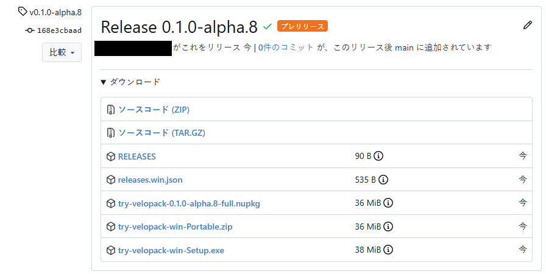
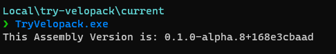
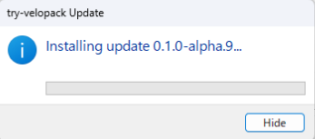
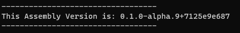

頒布したアプリケーションを手動で更新するのは色々と面倒なので、自動でアップデートできる仕組みを入れたい。
調べてみたらSquirrelの後継である[Velopack](https://github.com/velopack/velopack)があったので、試してみる。
https://github.com/velopack/velopack

## 使ってみる
### セットアップ
今回はコンソールアプリで試す。おそらくWPF, WinForms, ASP.NETなどでも同じようにできる。

まずはNuGetから`velopack`をインストールする。
また、バージョン管理のために`Nerdbank.GitVersioning`も入れておく。

```bash
dotnet add package velopack # 0.0.1298
dotnet add package Nerdbank.GitVersioning # 3.7.115
```

`Nerdbank.GitVersioning`の使い方は以下の記事を参照のこと。
https://zenn.dev/arika/articles/20250623-gitversioning

### アプリを作成する
リリースの公開先として、今回は`gitea`を使用していく。
`github`やファイルサーバー、S3なども使えるのでホスティング先はかなり融通が効く。


```csharp
using Velopack;
using Velopack.Exceptions;
using Velopack.Sources;

// Main処理の先頭に追加
VelopackApp.Build().Run();

// この関数はいつ呼んでもいい。
// 例えば定期的に呼び出すとか、アプリケーション更新チェックのボタンを押したときとか。
await UpdateCheck();

Console.WriteLine($"This Assembly Version is: {ThisAssembly.AssemblyInformationalVersion}");


async Task UpdateCheck()
{
    const string RepoUrl = "http://my-gitea-server.example.com/user/TryVelopack";
    try
    {
        // プレリリースを含めるかは適宜変更
        // tokenはprivate repositoryなら必要、publicならnullでOK
        var giteaSource = new GiteaSource(repoUrl: RepoUrl, accessToken: null, prerelease: true);
        var mgr = new UpdateManager(giteaSource);
        // check for new version
        var newVersion = await mgr.CheckForUpdatesAsync();
        if(newVersion == null){
            // no update available
            return;
        }
        // download new version
        Console.WriteLine($"new version available! :: {newVersion.TargetFullRelease.Version}");
        await mgr.DownloadUpdatesAsync(newVersion);
        // install new version and restart app
        mgr.ApplyUpdatesAndRestart(newVersion);
    }
    catch(NotInstalledException)
    {
        // 開発中などはインストールされていないため、無視
    }
}
```

### Giteaに公開する
Gitea ActionsでGiteaのリリースに自動アップロードするようにする。
今回はGiteaだが、GitHubの場合でもほぼ同じ。(vpkの引数が`gitea`から`github`に変わるだけ)

```yml
name: Deploy to Gitea Releases

on:
  push:
    branches:
      - main

permissions:
  contents: write

jobs:
  deploy-to-gitea-releases:
    runs-on: windows-latest
    steps:
      - name: Checkout Repository
        uses: actions/checkout@v4
        with:
          # gitversioningを使用するために履歴全体が必要
          fetch-depth: 0

      - name: Set up dotnet 9.0
        uses: actions/setup-dotnet@v4
        with:
          dotnet-version: 9.0.x

      # GitVersioningからバージョン情報を取得
      - uses: dotnet/nbgv@master
        id: nbgv

      # publish application
      # 自己解凍形式で発行、Windows x64 向け
      - name: Publish Application
        run: dotnet publish TryVelopack/TryVelopack.csproj -c Release -o publish -r win-x64 --self-contained true

      # Velopackでリリースを生成
      - name: Create Release
        run: |
          dotnet tool install -g vpk
          vpk download gitea --repoUrl ${{ env.VPK_REPO_URL }}
          vpk pack -p publish -u ${{ env.IDENTIFIER }} -v ${{ steps.nbgv.outputs.SemVer2 }} --mainExe ${{ env.APPLICATION_EXE }} --packTitle "${{ env.SHORTCUT_NAME }}" --shortcuts ${{ env.SHORTCUT_LOCATION }}
          vpk upload gitea --repoUrl ${{ env.VPK_REPO_URL }}
        env:
          # ID, 重複しないようにする。
          IDENTIFIER: try-velopack
          # 実行ファイルを明示的に指定する必要あり
          APPLICATION_EXE: TryVelopack.exe
          # ショートカットの名前
          SHORTCUT_NAME: Try Velopack
          # ショートカットの作成場所
          # Desktop, StartMenu, StartMenuRoot, Startup, Noneが選べる。
          # カンマ区切りで指定可能. 例: Desktop,StartMenu
          SHORTCUT_LOCATION: Desktop
          # VPKの設定
          VPK_REPO_URL: http://my-gitea-server.example.com/${{ gitea.repository }}
          VPK_RELEASE_NAME: Release ${{ steps.nbgv.outputs.SemVer2 }}
          VPK_TAG: v${{ steps.nbgv.outputs.SemVer2 }}
          VPK_TARGET_COMMITISH: ${{ github.ref }}
          VPK_PUBLISH: true
          VPK_TOKEN: ${{ secrets.GITEA_TOKEN }}
          # プレリリース判定
          VPK_PRE: ${{ contains(steps.nbgv.outputs.SemVer2, '-') }}
```

うまくいくとこうなる。


`try-velopack-win-Setup.exe`をダウンロードして実行すると、デスクトップにショートカットが生える。
ファイルの場所を開いてみると、`AppData\Local\(IDENTIFIER)\current`にインストールされる模様。

実行してみる。


うまくリリースできていそう。

### アップデートしてみる

ここでアップデートを入れてみる。
区切り線をいれて、最後に`ReadKey`で待ち受けるようにしてみた。

```csharp diff
+Console.WriteLine("----------------------------------");
Console.WriteLine($"This Assembly Version is: {ThisAssembly.AssemblyInformationalVersion}");
+Console.WriteLine("----------------------------------");
+Console.ReadKey();
```

これで再度コミット+Push。


`0.1.0-alpha.9`がリリースされているのがわかる。
また、差分パッケージ(`-delta.nupkg`)も生成されている。これを使って高速アップデートができるということらしい。


ここで、さっきインストールしたアプリを再度実行。
すると、新バージョンを自動で検知してインストールプロセスが走る。



そして、更新が完了すると自動で再起動してくれる。



無事に更新されていることがわかる。

なお、格納先のフォルダ(`AppData\Local\(IDENTIFIER)\current`)を何らかのアプリが開いていると更新に失敗する。まではいいのだが、延々と再起動を繰り返すので注意が必要。

### アンインストール
設定>アプリ>インストールされているアプリ にいるので、ここから簡単にアンインストールできる。


## IHostServiceとして常駐させてみる
上記では起動時に更新チェックを行っていたが、`BackgroundService`として常駐させて、定期的に更新チェックを行うようにしてみる。

まずは手動更新用のサービスを作成する。

```csharp
// アプリケーションの更新状態を確認、記録する
internal class ApplicationUpdateCheckService
{
    private const string RepositoryUrl = "http://my-gitea-server.example.com/user/TryVelopack";

    // アプリケーション更新状態
    public UpdateStatusRecord Status
    {
        get => _status;
        set => _status = value with {
            CheckedAt = DateTimeOffset.Now,
        };
    }
    private UpdateStatusRecord _status = new();

    // 手動で更新確認を行う時はこの関数を直接呼ぶ
    public async Task UpdateCheck()
    {
        try {
            var mgr = UpdateManager;
            // check for new version
            var newVersion = await mgr.CheckForUpdatesAsync();
            Status = new() {
                UpdateAvailable = newVersion != null,
                UpdateInfo = newVersion,
            };
        }
        catch(NotInstalledException) {
            // 開発中などはインストールされていないため、無視
            Status = new() {
                UpdateAvailable = false,
                UpdateInfo = null,
            };
        }
        catch(Exception ex) {
            // その他の例外ならエラーを通知
            Status = new() {
                UpdateAvailable = false,
                UpdateInfo = null,
                ErrorMessage = ex.Message
            };
        }
    }

    /// <summary>
    /// アプリケーションを更新し、再起動します。
    /// </summary>
    public async Task ApplicationUpdateAndRestart()
    {
        if(!Status.UpdateAvailable) {
            return;
        }
        // すでにチェック済のはずなのでそれを使う
        var updateInfo = Status.UpdateInfo;
        ArgumentNullException.ThrowIfNull(updateInfo);
        var mgr = UpdateManager;
        await mgr.DownloadUpdatesAsync(updateInfo);
        mgr.ApplyUpdatesAndRestart(updateInfo);
    }

    // UpdateManagerのインスタンスを取得
    private UpdateManager UpdateManager
    {
        get
        {
            // 今回は直接レポジトリURLを指定しているが、本来は設定などから取得したほうがいい
            var giteaSource = new GiteaSource(repoUrl: RepositoryUrl, accessToken: null, prerelease: true);
            var mgr = new UpdateManager(giteaSource);
            return mgr;
        }
    }
}

internal record UpdateStatusRecord
{
    public bool UpdateAvailable { get; init; }
    public string? ErrorMessage { get; init; }
    public UpdateInfo? UpdateInfo { get; init; }
    public DateTimeOffset CheckedAt { get; init; }

    public string? NewVersion => UpdateInfo?.TargetFullRelease.Version.ToString();
}
```

そしてこれを自動化する`BackgroundService`を作成する。

```csharp
internal class AutoUpdateWatchBackgroundService(ApplicationUpdateCheckService updateService) : BackgroundService
{
    // アップデート確認の間隔
    // 間隔が短いと、GitHub等ではAPI制限に引っかかる可能性があるので注意
    private readonly PeriodicTimer _timer = new(TimeSpan.FromHours(12));

    /// <inheritdoc/>
    protected override async Task ExecuteAsync(CancellationToken stoppingToken)
    {
        while(!stoppingToken.IsCancellationRequested) {
            await updateService.UpdateCheck();
            // 次の着火を待つ
            await _timer.WaitForNextTickAsync(stoppingToken);
        }
    }
}
```

これらをProgram.csで登録する。

```csharp
builder.Services.AddSingleton<ApplicationUpdateCheckService>();
builder.Services.AddHostedService<AutoUpdateWatchBackgroundService>();
```

あとは適当にUIを作って参照すれば良い。例としてBlazorのコードを示す。

```razor
@inject ApplicationUpdateCheckService UpdateCheckService
@{
    var status = UpdateCheckService.Status;
}

<div>last checked at @status.CheckedAt</div>
@if(status.ErrorMessage != null)
{
    // error
    <div>@status.ErrorMessage</div>
}
else if(status.UpdateAvailable)
{
    // update available
    <div>new version are available! :: @status.NewVersion</div>
    <br />
    <button @onclick="UpdateCheckService.ApplicationUpdateAndRestart">Update</button>
}
else
{
    // no update
    <div>no update available</div>
    <br />
    <button @onclick="UpdateCheckService.UpdateCheck">Check Manually</button>
}
```


## まとめ
非常に簡単に自動アップデートの仕組みを導入できた。素晴らしい！
ぜひ使ってみてください。
