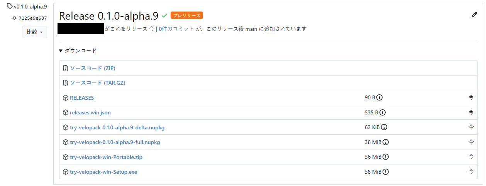
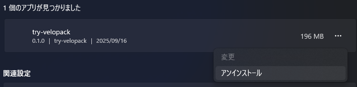
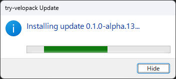

頒布したアプリケーションを手動で更新するのは色々と面倒なので、自動でアップデートできる仕組みを入れたい。
調べてみたらSquirrelの後継である[Velopack](https://github.com/velopack/velopack)があったので、試してみる。
https://github.com/velopack/velopack

## 使ってみる
### セットアップ
今回はコンソールアプリで試す。おそらくWPF, WinForms, ASP.NETなどでも同じようにできる。

まずはNuGetから`velopack`をインストールする。
また、バージョン管理のために`Nerdbank.GitVersioning`も入れておく。

```bash
dotnet add package velopack # 0.0.1298
dotnet add package Nerdbank.GitVersioning # 3.7.115
```

`Nerdbank.GitVersioning`の使い方は以下の記事を参照のこと。
https://zenn.dev/arika/articles/20250623-gitversioning

### アプリを作成する
リリースの公開先として、今回は`gitea`を使用していく。
`github`やファイルサーバー、S3なども使えるのでホスティング先はかなり融通が効く。


```csharp
using Velopack;
using Velopack.Exceptions;
using Velopack.Sources;

// Main処理の先頭に追加
VelopackApp.Build().Run();

// この関数はいつ呼んでもいい。
// 例えば定期的に呼び出すとか、アプリケーション更新チェックのボタンを押したときとか。
await UpdateCheck();

Console.WriteLine($"This Assembly Version is: {ThisAssembly.AssemblyInformationalVersion}");


async Task UpdateCheck()
{
    const string RepoUrl = "http://my-gitea-server.example.com/user/TryVelopack";
    try
    {
        // プレリリースを含めるかは適宜変更
        // tokenはprivate repositoryなら必要、publicならnullでOK
        var giteaSource = new GiteaSource(repoUrl: RepoUrl, accessToken: null, prerelease: true);
        var mgr = new UpdateManager(giteaSource);
        // check for new version
        var newVersion = await mgr.CheckForUpdatesAsync();
        if(newVersion == null){
            // no update available
            return;
        }
        // download new version
        Console.WriteLine($"new version available! :: {newVersion.TargetFullRelease.Version}");
        await mgr.DownloadUpdatesAsync(newVersion);
        // install new version and restart app
        mgr.ApplyUpdatesAndRestart(newVersion);
    }
    catch(NotInstalledException)
    {
        // 開発中などはインストールされていないため、無視
    }
}
```

### Giteaに公開する
Gitea ActionsでGiteaのリリースに自動アップロードするようにする。
今回はGiteaだが、GitHubの場合でもほぼ同じ。(vpkの引数が`gitea`から`github`に変わるだけ)

```yml
name: Deploy to Gitea Releases

on:
  push:
    branches:
      - main

permissions:
  contents: write

jobs:
  deploy-to-gitea-releases:
    runs-on: windows-latest
    steps:
      - name: Checkout Repository
        uses: actions/checkout@v4
        with:
          # gitversioningを使用するために履歴全体が必要
          fetch-depth: 0

      - name: Set up dotnet 9.0
        uses: actions/setup-dotnet@v4
        with:
          dotnet-version: 9.0.x

      # GitVersioningからバージョン情報を取得
      - uses: dotnet/nbgv@master
        id: nbgv

      # publish application
      # 自己解凍形式で発行、Windows x64 向け
      - name: Publish Application
        run: dotnet publish TryVelopack/TryVelopack.csproj -c Release -o publish -r win-x64 --self-contained true

      # Velopackでリリースを生成
      - name: Create Release
        run: |
          dotnet tool install -g vpk
          vpk download gitea --repoUrl ${{ env.VPK_REPO_URL }}
          vpk pack -p publish \
            -u ${{ env.IDENTIFIER }} \
            -v ${{ steps.nbgv.outputs.SemVer2 }} \
            --mainExe ${{ env.APPLICATION_EXE }} \
            --packTitle "${{ env.SHORTCUT_NAME }}" \
            --shortcuts ${{ env.SHORTCUT_LOCATION }}
          vpk upload gitea --repoUrl ${{ env.VPK_REPO_URL }}
        env:
          # ID, 重複しないようにする。
          IDENTIFIER: try-velopack
          # 実行ファイルを明示的に指定する必要あり
          APPLICATION_EXE: TryVelopack.exe
          # ショートカットの名前
          SHORTCUT_NAME: Try Velopack
          # ショートカットの作成場所
          # Desktop, StartMenu, StartMenuRoot, Startup, Noneが選べる。
          # カンマ区切りで指定可能. 例: Desktop,StartMenu
          SHORTCUT_LOCATION: Desktop
          # VPKの設定
          VPK_REPO_URL: http://my-gitea-server.example.com/${{ gitea.repository }}
          VPK_RELEASE_NAME: Release ${{ steps.nbgv.outputs.SemVer2 }}
          VPK_TAG: v${{ steps.nbgv.outputs.SemVer2 }}
          VPK_TARGET_COMMITISH: ${{ github.ref }}
          VPK_PUBLISH: true
          VPK_TOKEN: ${{ secrets.GITEA_TOKEN }}
          # プレリリースなら含める、そうでない場合は空文字
          VPK_PRE: ${{ contains(steps.nbgv.outputs.SemVer2, '-') && 'true' || '' }}
          # イントラネット環境で動かしてるなら、プロキシを経由しないほうが良さげ
          # (ファイルのアップロードで落ちる)
          NO_PROXY: "my-gitea-server.example.com"
```

うまくいくとこうなる。


`try-velopack-win-Setup.exe`をダウンロードして実行すると、デスクトップにショートカットが生える。
ファイルの場所を開いてみると、`AppData\Local\(IDENTIFIER)\current`にインストールされる模様。

実行してみる。


うまくリリースできていそう。

### アップデートしてみる

ここでアップデートを入れてみる。
区切り線をいれて、最後に`ReadKey`で待ち受けるようにしてみた。

```csharp diff
+Console.WriteLine("----------------------------------");
Console.WriteLine($"This Assembly Version is: {ThisAssembly.AssemblyInformationalVersion}");
+Console.WriteLine("----------------------------------");
+Console.ReadKey();
```

これで再度コミット+Push。


`0.1.0-alpha.9`がリリースされているのがわかる。
また、差分パッケージ(`-delta.nupkg`)も生成されている。これを使って高速アップデートができるということらしい。


ここで、さっきインストールしたアプリを再度実行。
すると、新バージョンを自動で検知してインストールプロセスが走る。


そして、更新が完了すると自動で再起動してくれる。


無事に更新されていることがわかる。

なお、格納先のフォルダ(`AppData\Local\(IDENTIFIER)\current`)を何らかのアプリが開いていると更新に失敗する。まではいいのだが、延々と再起動を繰り返すので注意が必要。

### アンインストール
設定>アプリ>インストールされているアプリ にいるので、ここから簡単にアンインストールできる。



## 動的にレポジトリのアドレスを参照する

上記ではレポジトリのURLを直接指定しているが、実際は直接参照できない(リバースプロキシ経由で参照する)ことがあり得る。また、今後のことを考えると動的にURLを切り替えたい。
というわけでConfiguration経由の指定を試す。

まずはパッケージを導入。

```bash
dotnet add package Microsoft.Extensions.Configuration
dotnet add package Microsoft.Extensions.Configuration.Json
```

そして設定を追加。

```csharp
// レポジトリを参照する用の設定ファイルを追加
// appsettings.jsonは使わないようにする (後述)
var repositoryConfigFile = "repository.json";
var defaultRepositoryUrl = "http://my-gitea-server.example.com/user/TryVelopack";
var defaultJson = $$"""
{"RepositoryUrl": "{{defaultRepositoryUrl}}"}
""";
// ファイルがなければ作成するようにする
// (作成しなくても良いが、サンプルがあると後で弄りやすい)
if(!File.Exists(repositoryConfigFile)){
    File.WriteAllText(repositoryConfigFile, defaultJson);
}
var configuration = new ConfigurationBuilder()
    .AddJsonFile(repositoryConfigFile, optional: true)
    .Build() as IConfiguration;
```

わざわざ`appsettings.json`を使わず別のファイルにしているのは、頒布物に`appsettings.json`を含めてしまう可能性があるため。
もし含まれている場合アップデートした際に設定が上書きされてしまうので、頒布物に含まれないファイルを用意してやる必要がある。


あとはコード部分で参照するだけ。

```csharp diff
-await UpdateCheck();
+await UpdateCheck(configuration);

-async Task UpdateCheck()
+async Task UpdateCheck(IConfiguration configuration)
{
-   var RepoUrl = "http://my-gitea-server.example.com/user/TryVelopack";
+   var RepoUrl = configuration["RepositoryUrl"]
        ?? throw new InvalidDataException("RepositoryUrl is not set in repository.json");

    // 略
}
```

動作確認するために、テスト用のリバースプロキシを用意。Caddyを使うと簡単に用意できる。

```yml
services:
  caddy:
    image: 'caddy:latest'
    restart: unless-stopped
    entrypoint: |
      caddy reverse-proxy --from :80 --to http://my-gitea-server.example.com -r -v --internal-certs --change-host-header --insecure
```

ホストできたので、`repository.json`を書き換えて実行してみる。
```json
{
  "RepositoryUrl": "http://192.168.X.Y/user/TryVelopack"
}
```

注意点として、2025/09/16現在では`port:80`でないと動作しない模様。
([ここ](https://github.com/velopack/velopack/pull/697)で修正されているが、まだリリースされていない)

起動することを確認してから、適当なアップデートをリリースする。

すると無事リバースプロキシ経由で更新を取得することができた(わかりにくいが)。




## まとめ
非常に簡単に自動アップデートの仕組みを導入できた。素晴らしい！
ぜひ使ってみてください。


TODO
20250623/gitversioning の記事にこの記事のリンクを貼る
