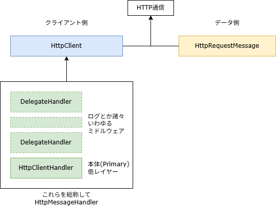
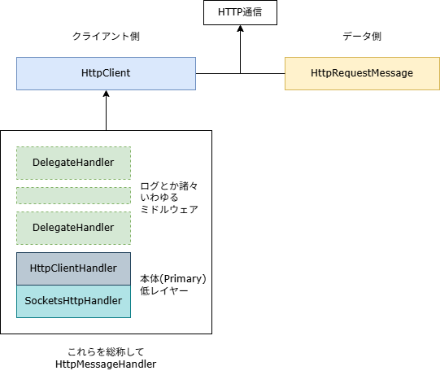
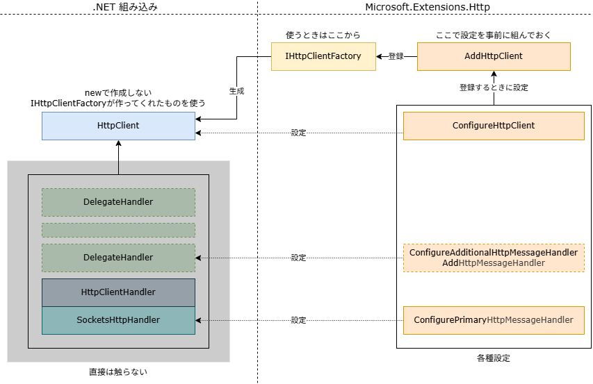
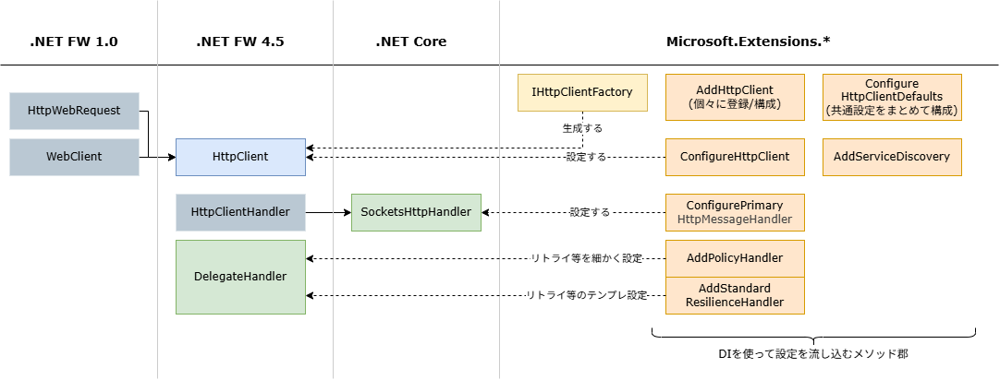

HttpClientの周辺に色々クラスやらなんやらがあって、どれを使えばいいのか正直よくわからない！
そのあたりの知識整理をしていきます。

## C#のHTTP通信の歴史を追う
C#は歴史が長いので、HTTP通信を行うためのクラスも色々あります。
それぞれの経緯を見ていくことですんなりと理解できるはず！ということでCopilotに聞きながら整理してみます。
できる限り裏を取りながら書いていますが、間違っていたら教えてください。

## .NET Framework 1.0 (2002年)
* `HttpWebRequest`/`HttpWebResponse`
  * 低レベルで使いづらい
  * 非同期処理がBegin/Endパターン
* `WebClient`
  * 高レベルで使いやすい
  * 非同期処理がイベントベース
  * カスタマイズ性が低い

今どきこんな古いもの(20年以上前！)を使うことはないと思いますが、昔の記事でたまに出てきます。
もう使わないので理解はしなくていいですね！
必要になったらググってください。

## .NET Framework 4.5 (2012年)
ここで今回の主役が登場します。

* `HttpClient`
  * 今回の本題。現代(10年以上前からあるけど)の標準。
  * 非同期処理がasync/awaitで書ける
  * 高レベルの処理
* `HttpRequestMessage`
  * `HttpClient`で使うリクエストの中身
* `HttpClientHandler`
  * `HttpClient`の詳細部分を指定する
  * 低レベルの処理
* `DelegateHandler`
  * `HttpClientHandler`を継承して、処理を挟み込むためのクラス
  * ロギングやリトライなどの共通処理を実装するのに使われたり
* `HttpMessageHandler`
  * 上記`HttpClientHandler`と`DelegateHandler`の基底クラス


`HttpClient`は使いやすく画期的なものだった様子が当時のブログ等から伺えます。
ただ、なんかたくさんクラスがあります。これはどういうことなのか。

個人的にですが、他の言語の経験があるとややこしい気がします。
例えばnodejsとかを触っていると`fetch`の引数に全部指定するイメージです。[^1] [^2]

[^1]: プロキシを使う場合は https-proxy-agent というライブラリを使う。組み込みでサポートしていないの、個人的には信じられない。。。 と思っていたのですが、最近[サポートされそう](https://github.com/nodejs/node/issues/8381)な流れになってきた様子。5年遅いですが

[^2]: timeoutにはAbortControllerを使う。C#を触っているとなんかこの書き方もイマイチな気がしてしまう

```js
// 例:: example.com に POST リクエストを送信する
// * Headerに "X-Custom-Header: Value" を追加する
// * タイムアウトは 5000 ミリ秒に設定する
// * プロキシは http://proxy.example.com を使用する
// * リダイレクトは許可しない
// -----------------------------------
import { HttpsProxyAgent } from 'https-proxy-agent';

const controller = new AbortController();
const timeout = setTimeout(() => controller.abort(), 5000);

// 全部fetchの引数に指定する
var resp = fetch('https://example.com', {
  method: 'POST', // POST
  headers: {
    'X-Custom-Header': 'Value' // ヘッダー
  },
  redirect: 'error', // リダイレクト禁止
  signal: controller.signal, // タイムアウト
  agent: new HttpsProxyAgent('http://proxy.example.com'), // プロキシ
});
// この後も色々あるけど略
```

ではC#だとどうなのというと、こうなります。

```csharp
// 例:: example.com に POST リクエストを送信する
// * Headerに "X-Custom-Header: Value" を追加する
// * タイムアウトは 5000 ミリ秒に設定する
// * プロキシは http://proxy.example.com を使用する
// * リダイレクトは許可しない
// -----------------------------------
var handler = new HttpClientHandler()
{
    Proxy = new WebProxy("http://proxy.example.com"), // プロキシ
    AllowAutoRedirect = false, // リダイレクト禁止
};
var client = new HttpClient(handler)
{
    Timeout = TimeSpan.FromMilliseconds(5000), // タイムアウト
};
var message = new HttpRequestMessage()
{
    RequestUri = new Uri("https://example.com"),
    Method = HttpMethod.Post, // POST
    Headers = {
        { "X-Custom-Header", "Value" } // ヘッダー
    }
};
await client.SendAsync(message);
```

こうしてみると、それぞれの役割がわかりやすいです。

* `HttpRequestMessage`は**送信**リクエストの中身。
  * HTTPメソッドや追加ヘッダーなど、HTTPリクエストの平文に書いてある内容を指定するイメージ。
  * ここの内容はリクエストごとに変わるので、毎回新しく作る。
* `HttpClient`は**送信・受信全体**を見ているような**高レベルの内容**が中心。
  * Timeoutとか、受信レスポンスサイズの上限など。
  * 各リクエストで共通のヘッダーを指定する機能がある。
    * おそらく各用途ごとに`HttpClient`を作ることを想定されているので、こういう機能がついてる
  * 引数に詳細部分である`HttpClientHandler`を渡す。
* `HttpClientHandler`はより**低レベルの内容**。
  * プロキシとか、SSL証明書の検証とか、リダイレクトどうするとか。
  * 全体の挙動ではあるが、より細かい部分を指定するイメージ



このように、**役割ごとにクラスが分かれている**のがC#のHttpClient周辺の特徴として言えそうです。

## .NET Core 2.1 (2017年)
### SocketsHttpHandler
ここまで`HttpClientHandler`を使う話をしてきましたが、.NET Core 2.1で`SocketsHttpHandler`が登場しました。
これからのコードでは`SocketsHttpHandler`を使うことが[推奨されています](https://github.com/grpc/grpc-dotnet/issues/1961)。 




数行上で`HttpClientHandler`の話をしていたのになんだか即落ち2コマみたいな感じがしますが、実際は5年経ってるので許してください。

`SocketsHttpHandler`は`HttpClientHandler`と同じように使えますし、実際`HttpClientHandler`の[内部で使われています](https://github.com/dotnet/runtime/blob/f518b2e533ba9c5ed9c1dce3651a77e9a1807b8b/src/libraries/System.Net.Http/src/System/Net/Http/HttpClientHandler.cs#L16)。 [^4]

[^4]: 中身で同じものを使ってるなら別にいいじゃんという気もしてしまいますが。


## Microsoft.Extensions.Http (2018年)
### IHttpClientFactory / AddHttpClient
これまでは`HttpClient`を直接newして使っていましたが、かなり分かりにくい間違いが頻発していました。
例えば、以下のようなコードは**NG**です。[詳細](https://qiita.com/superriver/items/91781bca04a76aec7dc0)

```csharp
// usingしてはいけない。1個のインスタンスを使い回すのが理想。
// ただ、Singletonだと今度は古いDNS情報を使い続けてしまう問題がある。。。
using (var client = new HttpClient())
{
    var response = await client.GetAsync(url);
    // ...
}
```

このあたりうまく管理するのが非常に難しいので、いい感じにやってくれる仕組みが追加されました。
それが`IHttpClientFactory`と`AddHttpClient`です。

これらはDIコンテナ前提の仕組みとなっています。
DIコンテナに登録して使うというところがミソで、HttpClientの寿命管理だったり使いまわしをいい感じに管理してくれるようになりました。
こいつを使うことで、`new HttpClient()`をしなくて済みます。
使うのも簡単で、コンストラクタで`IHttpClientFactory`を受け取って、`CreateClient`を呼ぶだけです。

```csharp
public class SampleRequestService(IHttpClientFactory httpClientFactory)
{
    public async Task DoRequestAsync()
    {
        var client = httpClientFactory.CreateClient();
        var message = new HttpRequestMessage();
        // ...
        var response = await client.SendAsync(message);
        // ...
    }
}
```

めでたしめでたし。
なのですが、今度は`HttpClient`と`HttpClientHandler(SocketsHttpHandler)`がコードから見えなくなった都合上、上記でやっていたような設定を変えたい場合に困ります。
これをどのようにやるかというと、`AddHttpClient`という拡張メソッドで構成を登録し、`.Configure*`の関数で設定を弄ります。（つまり使う場所で設定するのではなく、最初にやる方式です）
名前をつけられるので、用途ごとに設定を変えたい場合も対応できます。

```csharp
// 名前をつけてもつけなくてもOK
builder.Services.AddHttpClient("clientA")
  // SocketsHttpHandlerの設定(低レベル)
  // HttpClientHandlerを使ってもいいけど。。
  .ConfigurePrimaryHttpMessageHandler(provider => new SocketsHttpHandler
  {
      Proxy = new WebProxy("http://myproxy:8080"),
  })
  // HttpClientの設定(高レベル)
  .ConfigureHttpClient(http =>
  {
      http.Timeout = TimeSpan.FromSeconds(30);
  });

// 使うとき
// 名前をつけて登録したなら、同じ名前でCreateClientする
var client = httpClientFactory.CreateClient("clientA");
```

基本的には`ConfigurePrimaryHttpMessageHandler`で`SocketsHttpHandler`を設定し、`ConfigureHttpClient`で`HttpClient`を設定するイメージです。

ちなみに、`ConfigureAdditionalHttpMessageHandler`や`AddHttpMessageHandler`もあります。
これらは`DelegatingHandler`（ログとかのミドルウェア）を追加/編集するためのものと考えておけば良さそうです。

図解するとこんな感じ。


## Microsoft.Extensions.Http.Polly (2018年)
HttpClientの話をするなら避けて通れないのが`Polly`です。
https://www.pollydocs.org/getting-started.html

`Polly`はリトライやサーキットブレーカーなどのレジリエンスパターンを実装するためのライブラリです。
Polly自体はHttpClientに特化したものではなく、初出も[2013年](https://www.nuget.org/packages/Polly/1.0.0)とかなり古めのライブラリです。

Pollyが提供するリトライなどの仕組みは非常に便利なので、これをHTTP通信に組み合わせた[`Microsoft.Extensions.Http.Polly`](https://www.nuget.org/packages/Microsoft.Extensions.Http.Polly)が2018年に登場しました。
Nugetのリリース日を見ると`Http`の方は2018/2/26, `Http.Polly`の方は2018/4/13でほぼ同時期ですね。

使うのは簡単で、`AddHttpClient`の後に`.AddPolicyHandler`をチェーンするだけです。

```csharp
builder.Services.AddHttpClient("clientB")  
    .AddPolicyHandler(GetRetryPolicy());

static IAsyncPolicy<HttpResponseMessage> GetRetryPolicy()  
{
    // 失敗したら3回, 指数関数的に待ってリトライするポリシー
    return HttpPolicyExtensions  
        .HandleTransientHttpError()  
        .WaitAndRetryAsync(3, retryAttempt => TimeSpan.FromSeconds(Math.Pow(2, retryAttempt)));  
}
```

## .NET 8 (2023年)
`.NET 8`組み込みではなく`Microsoft.Extensions.*` 8.0の話ですが、時期的に同じなのでこの括りです。

### ConfigureHttpClientDefaults
`Microsoft.Extensions.Http`の8.0.0で新しいAPIが追加されています。
その名も`ConfigureHttpClientDefaults`です。

従来は`.AddHttpClient`で複数のクライアントを登録する場合、共通の設定をするには同じような内容を何度も書く必要がありました。
これらをまとめて全ての`HttpClient`に共通の設定 をきれいに書けるようになりました。
名前付きの方で設定した場合はそちらが優先されるので、上書きも簡単です。

```csharp
// before
builder.Services.AddHttpClient("clientA")
  .ConfigurePrimaryHttpMessageHandler(() => new SocketsHttpHandler
  {
      Proxy = new WebProxy("http://myproxy:8080"),
  });
builder.Services.AddHttpClient("clientB")
  .ConfigurePrimaryHttpMessageHandler(() => new SocketsHttpHandler
  {
      Proxy = new WebProxy("http://myproxy:8080"),
  });

// -----------------
// after
builder.Services.ConfigureHttpClientDefaults(http =>
{
    hhttp.CongigurePrimaryHttpMessageHandler(() => new SocketsHttpHandler
    {
        Proxy = new WebProxy("http://myproxy:8080"),
    });
});
builder.Services.AddHttpClient("clientA");
builder.Services.AddHttpClient("clientB");
```

このブログが非常に詳しいので、詳細はそちらで。
https://blog.neno.dev/entry/2024/07/12/175331


### AddStandardResilienceHandler
上記の`Microsoft.Extensions.Http.Polly`を使う場合、リトライポリシーを自分で用意する必要があります。
といってもよくあるパターンは決まっているので、それを簡単に使えると嬉しいです。

それをやってくれるAPIが`AddStandardResilienceHandler`です。
使うのは非常に簡単で、上記の`ConfigureHttpClientDefaults`と組み合わせて

```csharp
builder.Services.ConfigureHttpClientDefaults(http =>
{
    http.AddStandardResilienceHandler()
        // a.example.com と b.example.com で別々に制御する
        .SelectPipelineByAuthority();
});
```

これだけで、よくあるリトライポリシーが設定されます。素晴らしい！
構成としては
* 失敗したら3回リトライ, 2秒待機
* 同時実行レートリミット1000回
* トータル30秒のタイムアウト
* リクエスト10秒のタイムアウト
* サーキットブレーカーあり

このブログが詳しいです。
https://blog.neno.dev/entry/2024/08/08/171524


## 注意点
見ての通り、現代C#では基本的にDIを使ってHttpClientの設定構成、生成を行うことになります。
ただ、`Microsoft.Extensions.*`の名前が示す通り、これらは組み込みではなくあくまで拡張機能です。
そうなると問題になるのが、他のライブラリとの連携です。

一例として`grpc-dotnet`ライブラリを見てみます。
gRPC通信を行うために内部で`HttpClient`を使っていますが、特に設定しないと[内部生成されたものを使います](https://github.com/grpc/grpc-dotnet/blob/f4148e8833dcedf8ef13b0817c0fc1c036921f7e/src/Grpc.Net.Client/GrpcChannel.cs#L164)。
つまり、上記で行ったような設定が反映されません。

ではどうするかというと、オプションに`HttpClient`プロパティが用意されているので、DI登録時に手動で設定する必要があります。

```csharp
// DIにGrpcChannelを登録することを想定。
// 実際にはGrpcChannelをそのまま登録することはあまり無いでしょうが、例として。
services.AddTransient<GrpcChannel>(provider =>
{
    // DIで設定したHttpClientを使いたい！(Service DiscoveryとかPollyとか)
    // そこで、引数のproviderからIHttpClientFactoryを受け取って使う
    var httpClientFactory = provider.GetRequiredService<IHttpClientFactory>();
    var httpClient = httpClientFactory.CreateClient();
    // 後はGrpcChannelに渡せばOK
    return GrpcChannel.ForAddress("http://localhost:12345", new() { HttpClient = httpClient });
});
```

面倒ですね。正直毎回これ書くのちょっと飽き飽きしているので、そろそろ組み込みにしてほしいです。

## まとめ
改めて登場人物をまとめると以下のような感じです。



とりあえずこの記事で出たものを全部使うとこうなります。適宜取捨選択してください。

```csharp
using Microsoft.Extensions.DependencyInjection;
using Microsoft.Extensions.Http.Resilience;

var services = new ServiceCollection();
// Service Discoveryを設定(全体)
services.AddServiceDiscovery();
// HttpClientの共通設定
services.ConfigureHttpClientDefaults(http =>
{
    http.ConfigurePrimaryHttpMessageHandler(provider =>
        // SocketsHttpHandler/HttpClientHandlerの設定
        new SocketsHttpHandler
        {
            // proxy, redirect, ssl, etc...
        })
        // HttpClientの設定
        .ConfigureHttpClient(http =>
        {
            // timeout, default header, http version, etc...
        })
        // Service Discoveryの設定(Client側)
        .AddServiceDiscovery()
        // Pollyの設定
        .AddStandardResilienceHandler()
        .SelectPipelineByAuthority();
});

// DIでIHttpClientFactoryを受け取って使う
var client = httpClientFactory.CreateClient();
var response = await client.SendAsync(new HttpRequestMessage { /* ... */ });
```

## あとがき
軽い気持ちでまとめ始めたのですが、思いのほか長くなってしまいました。
自分的にはいい勉強になりました！
間違いがありましたらぜひ教えてください。

