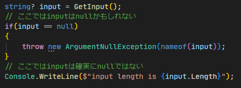
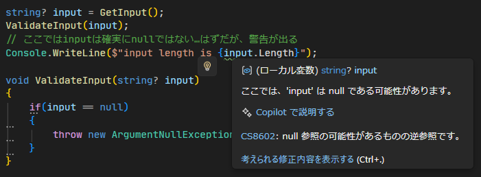
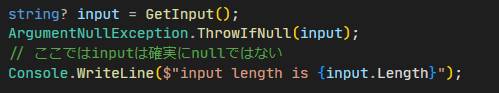
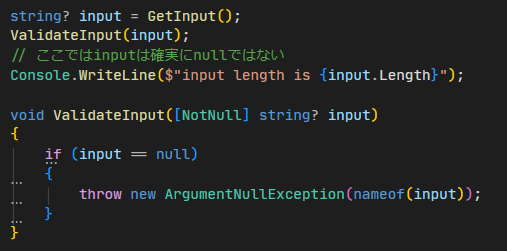
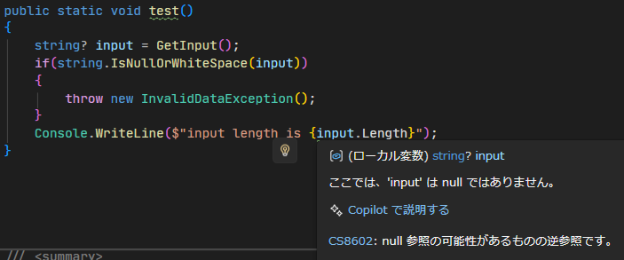
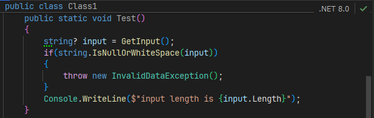
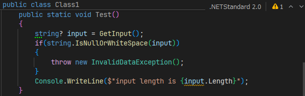

## 前置き

```csharp
string? input = GetInput();
// ここではinputはnullかもしれない
if (input == null){
  throw new ArgumentNullException(nameof(input));
}
// ここではinputは確実にnullではない
Console.WriteLine($"input length is {input.Length}");
```

よくあるコードですね。
`input`がnullのときは例外が投げられ、以降のコードは実行されません。コンパイラはこれを自動で判定して`input.Length`に警告を出しません。


なら、このようなコードでも同じように動いてほしいと思うかもしれません。

```csharp
string? input = GetInput();
ValidateInput(input);
// ここではinputは確実にnullではない…はずだが、警告が出る
Console.WriteLine($"input length is {input.Length}");

void ValidateInput(string? input){
  if (input == null){
    throw new ArgumentNullException(nameof(input));
  }
}
```

ですが、こちらは警告が出ます。


ところで、このようなケースのときに使える便利関数があります。`ArgumentNullException.ThrowIfNull`です。
やっていることは上記の`ValidateInput`と全く同じです。

```csharp
string? input = GetInput();
ArgumentNullException.ThrowIfNull(input);
// ここではinputは確実にnullではない
Console.WriteLine($"input length is {input.Length}");
```

が、今度は警告が出ません。



どういう仕組みなのか？

## NotNull属性

`ThrowIfNull`関数の上で`F12`を押して定義を見てみましょう。

```csharp
public static void ThrowIfNull(
  [NotNull] object? argument,
  [CallerArgumentExpression(nameof(argument))] string? paramName = null
)
{
  if (argument is null) {
    Throw(paramName);
  }
}
```

最初の引数の部分に`[NotNull]`という属性が付与されているのがわかります。 [^1]
この属性は、引数がnullでないことを呼び出し元に伝えるための属性です。これにより、この関数の後が実行される = 引数のオブジェクトは確実にnullではない、ということをコンパイラに伝えることができます。

[^1]: ちなみに2番めの`CallerArgumentExpression`属性は、引数の式を文字列として取得するための属性です。これにより、例外メッセージに引数名を含めることができます。今回は関係ないのでスルー。

試しに、先程自作した`ValidateInput`関数に`[NotNull]`属性を付与してみます。

```csharp
using System.Diagnostics.CodeAnalysis;

string? input = GetInput();
ValidateInput(input);
// ここではinputは確実にnullではない
Console.WriteLine($"input length is {input.Length}");

void ValidateInput([NotNull] string? input)
{
  if (input == null) {
    throw new ArgumentNullException(nameof(input));
  }
}
```

すると、警告が出なくなります！



ちなみに性善説で成り立っている属性なので、極論こんなこともできます。

```csharp
string? input = GetInput();
UsoValidateInput(input);
// ここではinputは確実にnullだけど、コンパイラは騙される
Console.WriteLine($"input length is {input.Length}");

void UsoValidateInput([NotNull] string? input)
{
  // 判定を逆にした！
  if (input != null) {
    throw new ArgumentNullException(nameof(input));
  }
}
```

## NotNullWhen属性
条件付きでnullでないことを伝える属性もあります。その名もズバリ`NotNullWhen`属性です。
結果が`true`ならnullじゃない、あるいは逆に`false`ならnullじゃない、ということを伝えることができます。

どこで使われているかというと、`Try*`メソッドでよく使われています。

```csharp
string? nullableString = GetInput();
if(int.TryParse(nullableString, out var result))
{
  // ここに来た時点で nullableString は確実にnullではない
  Console.WriteLine(nullableString.Length);
}
```

一応定義を見てみると、こんな感じです。変換成功した(=`true`)なら`s`はnullではない、ということを伝えています。

```csharp
public static bool TryParse([NotNullWhen(true)] string? s, out int result)
```


## .NET Standard 2.0
### 落とし穴
このように大変便利な仕組みなのですが、1つ落とし穴があります。それは、.NET Standard 2.0や.NET Frameworkでは（そのままだと）使えないということです。~~またか~~
例えば以下のような(よくある！)コードを書いたとします。これをビルドすると 古い環境限定で警告が出ます。

```csharp
string? input = GetInput();
if(string.IsNullOrWhiteSpace(input))
{
  throw new InvalidDataException();
}
// ここではinputは確実にnullではない…けど、.NET Standard 2.0では警告が出る
Console.WriteLine($"input length is {input.Length}");
```

厄介なのは、`TargetFrameworks`を`netstandard2.0;net8.0`のように複数指定しているとおかしな警告が出るところです。
例えば上記コードをVSで見るとこうなります。nullなんだかnullじゃないんだか、どっちや！という感じですが、これは.NETのバージョン事に判定が違うためです。


一方、RiderだとバージョンをUIで切り替えられるので、以下のようにバージョン毎に警告が出たり出なかったりするのがわかります。

**.NET 8.0**


**.NET Standard 2.0**



例によって定義を見ると

```csharp
// .NET 8.0
public static bool IsNullOrWhiteSpace([NotNullWhen(false)] string? value);

// .NET Standard 2.0
public static bool IsNullOrWhiteSpace(string? value);
```

となっています。納得ですね。

### 対策
自分で`[NotNullWhen(false)]`属性を付与したラッパー関数を作ります。

```csharp
public static bool IsNullOrWhiteSpaceEx([NotNullWhen(false)] string? s)
  => string.IsNullOrWhiteSpace(s);
```

そうは言っても.NET Standard 2.0だと`NotNullWhen`属性が使えないのでは？と思うかもしれません。[^2]
が、コンパイラは**この名前の属性さえ付いていれば良い**ので、以下のように自分で定義してしまえばOKです。[^3]

[^2]: 実際、組み込みとして用意されたのは`.NET Core 3`以降です。

[^3]: 属性として定義していればOKという緩い制約にしておくことで、古い環境でも使おうと思えば簡単に使えるし、組み込みで用意されていればそのまま使えるし、何より互換性を一切壊さない、という良くできた設計です。ただ、`string.IsNullOrWhiteSpace`のようなやつには付与してほしかった……（これも破壊的変更になってしまうので、文化的に不可能なのはわかりますが）

```csharp
// ここの名前空間下にないと認識しない
namespace System.Diagnostics.CodeAnalysis;
// boolの引数がある[NotNullWhenAttribute]という名前なら他は何でも良い
public sealed class NotNullWhenAttribute(bool _) : Attribute;
```

あるいは、`PolySharp`のようなNuGetパッケージを使うのも手です。導入するだけで上記の`NotNullWhen`属性含め様々な属性が使えるようになります。新しい環境なら何も生成しないので、どのプロジェクトにでもとりあえず突っ込んでおけます。
https://github.com/Sergio0694/PolySharp


ただ上記のどちらの方法でも大本の`string.IsNullOrWhiteSpace`はそのままなので、どのみち自前のラッパー関数は必要です。
~~めんどくさいですね~~


## 参考文献
* https://www.misuzilla.org/Blog/2019/09/25/NullableReferenceTypes
* https://ufcpp.net/study/csharp/resource/nullablereferencetype/