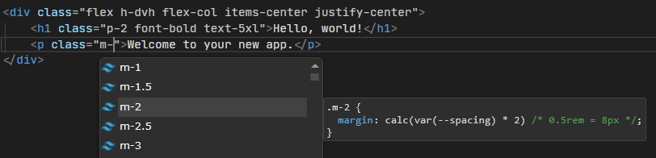

**追記**
2025/10/22: `Elixus.Tailwind`を使用する方法に変更。

Blazorでtailwindcssを使っていきます。

## Tailwindcssとは
https://tailwindcss.com/

CSSフレームワークです。
この手のフレームワークは大量にありますが、何と言っても「ユーティリティファースト」という思想が特徴的です。

```html
<button class="bg-blue-500 hover:bg-blue-700 text-white font-bold py-2 px-4 rounded">
  Button
</button>
```

と、このようにひたすら細かくクラスを指定していくスタイルです。
これだけ見ると面倒そうだしstyle直書きと何が違うの？という感じですが、様々なユーティリティクラスが用意されており、組み合わせることで柔軟にデザインを調整できるのが特徴です。
また、「ダークモードなら◯◯」「横幅が◯◯px以下なら△△」といったレスポンシブデザインも簡単に実装できます。
（上記の例でもhover:bg-blue-700がホバー時の背景色を指定していますね！）

## Blazorで使う
さて、実際使おうと思って調べると、

* nodejsを入れて、
* npmでtailwindcss/postcssを入れて、
* postcssを設定して、
* tailwind.config.jsを作って、
* その上でwatchを別に走らせて……
 
という手順が出てきます。
誰かが訂正しないと誤った認識が広まってしまうので、ここで明記しておきましょう。

**上記の手順、いりません！**

---
結論から書くと、nodejsで開発するのと同じぐらいには手軽にBlazorでtailwindcssを使うことができます。

### 誤り1: nodejs/npmが必要

まず、tailwindcssは大量のユーティリティクラスで構成されているため、全てのクラスを含むとCSSファイルが非常に大きくなります。
CDNで全部入りも提供されていますがあくまでも開発用で、実際使用するときにはビルドを経由して必要なクラスのみにすることが一般的です。

その際、ググって最初に出てくるのは`postcss`を使う方法です。これだけ見るとnodejs/npmが必要に見えます。

が！ 実は**公式にCLIツールが提供**されており、これを使うことで**nodejs/postcssは不要**になります。(中身はpkgでexe化されたnodejsアプリケーションですが、CLIだけで独立して動くようになっています)

https://tailwindcss.com/docs/installation/tailwind-cli
https://tailwindcss.com/blog/standalone-cli

### 誤り2: tailwind.config.jsが必要
tailwindcssの最新版はv4(2025/10時点)ですが、v3とは大きく設定方法が変わっています。
公式もcssフレームワークのくせにjsファイルを設定に使うのはどうかと思ったのか、v4からは基本的にcssファイルに直接設定を書くようになりました。
https://azukiazusa.dev/blog/tailwind-css-v4-css-first-configurations/

具体例はたくさんあるので控えますが、とりあえず設定方法を調べるときは「tailwindcss v4」とかでググると良いと思います。
`tailwind.config.js`を使うものは大体古いと思って差し支えないです。

### 誤り3: CLIをインストールしてパスを通す必要がある・別途実行させる必要がある
これに関してはある意味正しい[^1] のですが、勝手にやってもらうこともできます。NuGetで探すといくつか出てきますが、自分が触った中では`Elixus.Tailwind`が一番手軽に使えます。
https://www.nuget.org/packages/Elixus.Tailwind

[^1]: そのほうが融通がきく。watchしたり、CIで実行したりとか。

CLIをインストールしてパスを通す必要もなく、プロジェクトにPackageReferenceを追加して、入力用のCSSファイルを用意するだけでOKです（勝手にCLIをダウンロードして使ってくれます）

### 上記をまとめると

* nodejs/npmは不要
* tailwind.config.jsは不要
* NuGetでmvdmio.Tailwind.NETを入れればCLIインストールもいらない
* C#のビルドに組み込んで自動生成できる

素晴らしい！

## 実際に使ってみる
というわけで試してみましょう。

まずは上記の`Elixus.Tailwind`を導入します。また、合わせて設定用の`tailwind.input.css`のパスも指定します。

```xml
<ItemGroup>
  <PackageReference Include="mvdmio.Tailwind.NET" Version="1.*" />
  <TailwindFile Include="tailwindcss.input.css" />
</ItemGroup>
```

次に、入力用のCSSファイルを用意します。

```css
/* tailwind.input.css */
@import "tailwindcss";
```

忘れずに`App.razor`に参照を追加します。

```razor
<link rel="stylesheet" href="@Assets["tailwind.output.css"]" />
```

ホットリロードを有効化させるために、`Program.cs`を編集します。

```cs
builder.Services.AddTailwindWatcher(autoDetect: true);
```

後はコンポーネントで使ってみるだけです。

```razor
@page "/"

<PageTitle>Home</PageTitle>

<div class="flex h-dvh flex-col items-center justify-center">
    <h1 class="p-2 font-bold text-5xl">Hello, world!</h1>
    <p>Welcome to your new app.</p>
</div>
```

最後にビルドしてみます。


すると、`wwwroot/tailwind.output.css`が生成され、以下のようにスタイルが適用されます！


出力されたCSSファイルを見てみると、必要なクラスだけが含まれていることがわかります。

```css
/*! tailwindcss v4.1.14 | MIT License | https://tailwindcss.com */
/* 略 */
@layer utilities {
  .visible {
    visibility: visible;
  }
  .static {
    position: static;
  }
  .flex {
    display: flex;
  }
  .h-dvh {
    height: 100dvh;
  }
  .flex-col {
    flex-direction: column;
  }
  .items-center {
    align-items: center;
  }
  .justify-center {
    justify-content: center;
  }
  .p-2 {
    padding: calc(var(--spacing) * 2);
  }
  .text-5xl {
    font-size: var(--text-5xl);
    line-height: var(--tw-leading, var(--text-5xl--line-height));
  }
  .font-bold {
    --tw-font-weight: var(--font-weight-bold);
    font-weight: var(--font-weight-bold);
  }
}
/* 以下略 */
```

## エディターサポートを追加する
tailwindには大量のクラスがあるため、エディターで補完が効くと非常に便利です（というか無いと辛い！）
幸い、VisualStudioにも拡張機能があるのでそれを入れてみます。
https://marketplace.visualstudio.com/items?itemName=TheronWang.TailwindCSSIntellisense

インストールした後、class属性を編集してみると……



このように補完が効くようになりました！これで快適に開発できそうです。

## prefixを付ける
Blazorフレームワークを既に使用していて補完的にtailwindcssを導入したい場合、既存のクラス名と衝突する可能性があります。
その場合、tailwindcssのクラスにprefixを付けることができます。

`tailwind.input.css`を以下のようにするだけです。
```css
@import "tailwindcss" prefix("tw");
```

後は `tw:` を付けてクラスを指定すればOKです。先程の例だと以下のようになります。

```razor
<div class="tw:flex tw:h-dvh tw:flex-col tw:items-center tw:justify-center">
    <h1 class="tw:p-2 tw:font-bold tw:text-5xl">Hello, world!</h1>
    <p>Welcome to your new app.</p>
</div>
```

~~見ての通り面倒なので付けないほうが楽です~~

## まとめ

Blazorでtailwindcssを使う方法を紹介しました。
思ったよりも簡単に導入できるので今後使っていこうと思います。
