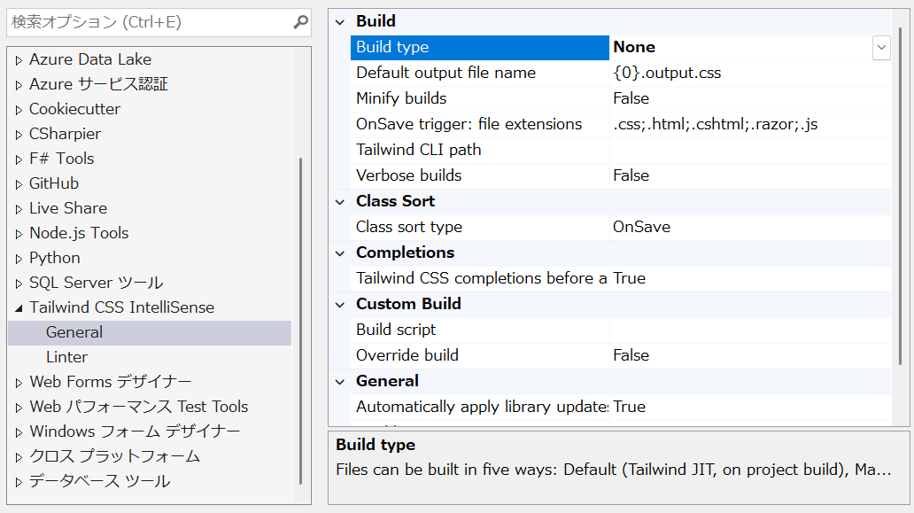

Blazorでtailwindcssを使っていきます。

## Tailwindcssとは
https://tailwindcss.com/

CSSフレームワークです。
この手のフレームワークは大量にありますが、何と言っても「ユーティリティファースト」という思想が特徴的です。

```html
<button class="bg-blue-500 hover:bg-blue-700 text-white font-bold py-2 px-4 rounded">
  Button
</button>
```

と、このようにひたすら細かくクラスを指定していくスタイルです。
これだけ見ると面倒そうだしstyle直書きと何が違うの？という感じですが、様々なユーティリティクラスが用意されており、組み合わせることで柔軟にデザインを調整できるのが特徴です。
また、「ダークモードなら◯◯」「横幅が◯◯px以下なら△△」といったレスポンシブデザインも簡単に実装できます。
（上記の例でもhover:bg-blue-700がホバー時の背景色を指定していますね！）

## Blazorで使う
さて、実際使おうと思って調べると、

* nodejsを入れて、
* npmでtailwindcss/postcssを入れて、
* postcssを設定して、
* tailwind.config.jsを作って、
* その上でwatchを別に走らせて……
 
という手順が出てきます。
誰かが訂正しないと誤った認識が広まってしまうので、ここで明記しておきましょう。

**上記の手順、いりません！**

---
結論から書くと、nodejsで開発するのと同じぐらいには手軽にBlazorでtailwindcssを使うことができます。

### 誤り1: nodejs/npmが必要

まず、tailwindcssは大量のユーティリティクラスで構成されているため、全てのクラスを含むとCSSファイルが非常に大きくなります。
CDNで全部入りも提供されていますがあくまでも開発用で、実際使用するときにはビルドを経由して必要なクラスのみにすることが一般的です。

その際、ググって最初に出てくるのは`postcss`を使う方法です。これだけ見るとnodejs/npmが必要に見えます。

が！ 実は**公式にCLIツールが提供**されており、これを使うことで**nodejs/postcssは不要**になります。(中身はpkgでexe化されたnodejsアプリケーションですが、CLIだけで独立して動くようになっています)

https://tailwindcss.com/docs/installation/tailwind-cli
https://tailwindcss.com/blog/standalone-cli

### 誤り2: tailwind.config.jsが必要
tailwindcssの最新版はv4(2025/10時点)ですが、v3とは大きく設定方法が変わっています。
公式もcssフレームワークのくせにjsファイルを設定に使うのはどうかと思ったのか、v4からは基本的にcssファイルに直接設定を書くようになりました。
https://azukiazusa.dev/blog/tailwind-css-v4-css-first-configurations/

具体例はたくさんあるので控えますが、とりあえず設定方法を調べるときは「tailwindcss v4」とかでググると良いと思います。
`tailwind.config.js`を使うものは大体古いと思って差し支えないです。

### 誤り3: CLIをインストールしてパスを通す必要がある・別途実行させる必要がある
これに関してはある意味正しい[^1] のですが、勝手にやってもらうこともできます。NuGetで探すといくつか出てきますが、自分が触った中では`Tailwind.Hosting`が一番手軽に使えます。
https://www.nuget.org/packages/Tailwind.Hosting

[^1]: そのほうが融通がきく。watchしたり、CIで実行したりとか。

CLIをインストールしてパスを通す必要もなく、プロジェクトにPackageReferenceを追加して、入力用のCSSファイルを用意するだけでOKです（勝手にCLIをダウンロードして使ってくれます）

### 上記をまとめると

* nodejs/npmは不要
* tailwind.config.jsは不要
* NuGetで専用のパッケージを入れればCLIインストールもいらない
* C#のビルドに組み込んで自動生成できる

素晴らしい！

## 実際に使ってみる
というわけで試してみましょう。

まずは上記の`Tailwind.Hosting`を導入します。また、合わせて設定用の`tailwind.css`のパスも指定します。

```xml
<Project Sdk="Microsoft.NET.Sdk.Web">
  <PropertyGroup>
      <!-- 略 -->
  </PropertyGroup>
  <!-- tailwind setting -->
  <ItemGroup>
    <PackageReference Include="Tailwind.Hosting" Version="*" />
    <PackageReference Include="Tailwind.Hosting.Build" Version="*" />
  </ItemGroup>
  <PropertyGroup Label="Tailwind.Hosting.Build Props">
    <TailwindVersion>latest</TailwindVersion>
    <TailwindWatch>true</TailwindWatch>
    <TailwindInputCssFile>tailwind.css</TailwindInputCssFile>
    <TailwindOutputCssFile>wwwroot/app.css</TailwindOutputCssFile>
  </PropertyGroup>
  <!--  Windowsの場合で、ビルドエラーが出たらコメントアウトする
  <Target Name="CleanUpTailwindStaticCache" BeforeTargets="PrepareForBuild">
    <ItemGroup>
      <Content Remove="$(TailwindOutputCssFile)" />
    </ItemGroup>
  </Target>
  -->
</Project>
```

次に、入力用のCSSファイルを用意します。

```css
/* tailwind.css */
@import "tailwindcss";
```

後はコンポーネントで使ってみるだけです。

```razor
@page "/"

<PageTitle>Home</PageTitle>

<div class="flex h-dvh flex-col items-center justify-center">
    <h1 class="p-2 font-bold text-5xl">Hello, world!</h1>
    <p>Welcome to your new app.</p>
</div>
```

最後にビルドしてみます。
すると、`wwwroot/app.css`が生成され、以下のようにスタイルが適用されます！


出力されたCSSファイルを見てみると、必要なクラスだけが含まれていることがわかります。

```css
/*! tailwindcss v4.1.14 | MIT License | https://tailwindcss.com */
/* 略 */
@layer utilities {
  .visible {
    visibility: visible;
  }
  .static {
    position: static;
  }
  .flex {
    display: flex;
  }
  .h-dvh {
    height: 100dvh;
  }
  .flex-col {
    flex-direction: column;
  }
  .items-center {
    align-items: center;
  }
  .justify-center {
    justify-content: center;
  }
  .p-2 {
    padding: calc(var(--spacing) * 2);
  }
  .text-5xl {
    font-size: var(--text-5xl);
    line-height: var(--tw-leading, var(--text-5xl--line-height));
  }
  .font-bold {
    --tw-font-weight: var(--font-weight-bold);
    font-weight: var(--font-weight-bold);
  }
}
/* 以下略 */
```

## エディターサポートを追加する
tailwindには大量のクラスがあるため、エディターで補完が効くと非常に便利です（というか無いと辛い！）
幸い、VisualStudioにも拡張機能があるのでそれを入れてみます。
https://marketplace.visualstudio.com/items?itemName=TheronWang.TailwindCSSIntellisense

インストールした後、class属性を編集してみると……


このように補完が効くようになりました！これで快適に開発できそうです。

そのままだと拡張機能側でもビルドが走ってしまうのが気になる場合は、オプションからBuild Typeを`None`にしておくと良さそうです。



## 開発時のみCDNを使う

ここまででビルド時にはtailwindcssを使って最適化されたCSSを生成できるようになりました。が、実際にはDevToolsでちょっとクラス名をいじって表示をサクッと確認したい、ということもあると思います。
このような場合、ビルド済のCSSには全てのクラスが含まれているわけではないため、うまく反映されず不便です。

上記Tailwind.Hostingにもwatchで監視する方法が紹介されていますが、自分の場合どうにも機能しなかったこと、そもそも`dotnet watch`じゃないと動かないこと等が気になりました。
そこで、開発時だけCDNを使うようにしてみました。以下の内容で適当にコンポーネントを作成して`App.razor`などに追加するだけです。

```razor
@* Tailwind CSS CDN for Development Only *@
@if (IS_USE_TAILWIND_CDN)
{
    <script src="@("https://cdn.jsdelivr.net/npm/@tailwindcss/browser@4")"></script>
}

@code {
#if DEBUG
    private const bool IS_USE_TAILWIND_CDN = true;
#else
    private const bool IS_USE_TAILWIND_CDN = false;
#endif
}
```

これで、DevToolsで編集した場合でも(開発時のみ)自動反映されるようになります。

## 細かいTIPS
### プロキシ環境下で使う
場合によっては`407 Proxy Authentication Required`のエラーが表示されることがあります。
その場合は、`HTTPS_PROXY`の値を設定してCLIから`dotnet build`を実行してあげればOKです。
最初の一回だけ上記の手順を踏めば、2回目以降はダウンロード済みのCLIを使用してくれます。

### prefixを付ける
Blazorフレームワークを既に使用していて補完的にtailwindcssを導入したい場合、既存のクラス名と衝突する可能性があります。
その場合、tailwindcssのクラスにprefixを付けることができます。

`tailwind.input.css`を以下のようにするだけです。
```css
@import "tailwindcss" prefix("tw");
```

後は `tw:` を付けてクラスを指定すればOKです。先程の例だと以下のようになります。

```razor
<div class="tw:flex tw:h-dvh tw:flex-col tw:items-center tw:justify-center">
    <h1 class="tw:p-2 tw:font-bold tw:text-5xl">Hello, world!</h1>
    <p>Welcome to your new app.</p>
</div>
```

~~見ての通り面倒なので付けないほうが楽です~~

## まとめ

Blazorでtailwindcssを使う方法を紹介しました。
思ったよりも簡単に導入できるので今後使っていこうと思います。

## 追記履歴
**2025/10/22**:  
`Tailwind.Hosting`を使用する方法に変更。
以前紹介していた`mvdmio.Tailwind.NET`はnodejsが必須で、記事の概要とマッチしてなかったため使用をやめました。

**2025/11/30**:
`CleanUpTailwindStaticCache`の記述を変更。開発時のみCDNを使う方法を追加。
