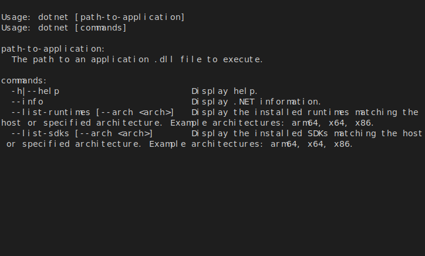
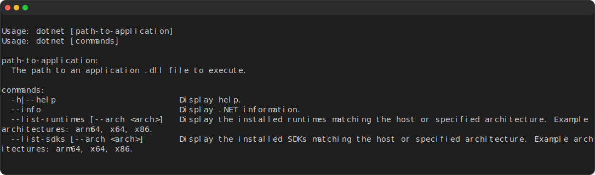
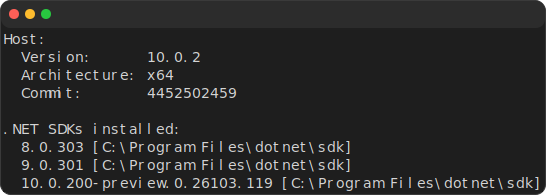

ライブラリの実行結果をREADMEに貼り付けるにあたり、png等の貼り付けだと画質が微妙になりがちです。
そこでsvgで出力できるツールを調べて、ほしいものが見つからなかったのでさくっと作ってみました。

## 従来の方法/問題点
コンソール出力をSVGに変換する方法としては、`asciinema`と`svg-term`を組み合わせる方法が一般的です。

```bash
svg-term --out demo.svg --width 80 --height 24 --no-cursor --command "(command)"
```

`asciinema`はコンソールの出力を記録するツールで、`svg-term`はその記録をSVGに変換するツールです。

しかし、個人的に

* `asciinema`と`svg-term(npm/node)`の依存があるのが面倒
* `asciinema`はWSLでしか動かない(Windowsで手軽に生成できない)
* `dotnet tool install`で導入したい
* コンソールの出力をそのまま使いたいことは少なく、適切に切り取りたい
* コマンドが長い！

という点がちょっと気にいりませんでした。
そこで自作してみました（AIが99%ぐらいやりました）。

## 作ったツール
その名も`Console2Svg`です。

https://github.com/arika0093/Console2Svg

導入はdotnetがあるなら一発です。
ubuntu 24.04以降であれば`apt install dotnet-sdk-10.0`でdotnetを入れられるので、そこからさくっとインストールできます。

```bash
# dotnet
dotnet tool install -g ConsoleToSvg
```

## 使い方

以下のように`--`の後ろにコマンドを指定するだけです。

```bash
console2svg -- dotnet
```



そのまま実行すると幅80、高さ24のSVGが生成されます。変更したいときは`-w`と`-h`で指定します。
また、よくあるmac風のwindowをつけることもできます。

```bash
console2svg -w 120 -h 16 --window macos -- dotnet
```



出力が長い場合、そのうちの一部を切り取って使いたいこともあるかと思います。その場合、`crop-top`/`crop-bottom`オプションで切り取りを指定できます。指定方法もいくつかあり、`ch`(行数or文字), `px`(ピクセル), テキスト指定(指定したテキストが出てくるまで)から選べます。

例えば`dotnet --info`の出力は非常に長いので、HostおよびSDKsの情報だけ切り取ってみます。
この際、sdkの情報をピンポイントで切り取るのは難しいので、その下にいる`.NET runtimes installed`の行を基準にして、そこから2行上に切り取ることにします。

```bash
console2svg -w 60 -h 16 --window macos --crop-top "Host" --crop-bottom ".NET runtimes installed:-2" -- dotnet --info
```



`-m video`を指定することで動画も生成できます。`--loop`をつけると動画がループします。

```bash
console2svg -m video --window macos --loop -- copilot --banner
```



自分用のツールですが、比較的汎用的に使えるように作ったつもりなので、もし興味があれば使ってみてください。

## 感想
1日でできました。AIすごい。
最近人間の存在価値をよく考えるようになってきました。。。

