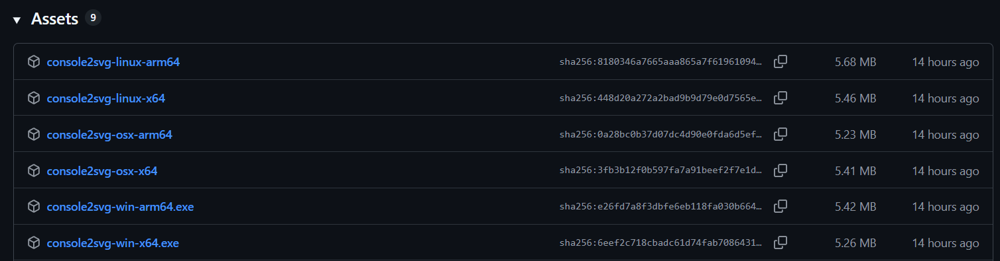

dotnetでNativeAOTバイナリを吐き出す場合、`dotnet publish`コマンドの`-r`オプションでRuntime Identifier（rid）を指定する必要があります。
このridはターゲットとするOSやアーキテクチャを表すものですが、これを実際どう指定すればよいのか、どの環境でビルドすればよいのかがいまいちわからない！ので調べてみました。

dotnet 10.0.103で検証しています。

## TL;DR

各OS/Arch向けに、どの`rid`および`runs-on`を指定すればよいのかの結論。

| Target OS/Architecture | rid         | runs-on              |
| ---------------------- | ----------- | -------------------- |
| Windows / x64          | win-x64     | windows-latest       |
| Windows / arm64        | win-arm64   | windows-latest       |
| Linux   / x64          | linux-x64   | ubuntu-latest        |
| Linux   / arm64        | linux-arm64 | **ubuntu-24.04-arm** |
| macOS   / x64          | osx-x64     | macos-latest         |
| macOS   / arm64        | osx-arm64   | macos-latest         |

## おさらい
### なぜridを指定する必要があるのか

従来のdotnetアプリケーションは一度IL(中間言語)までの変換を行い、それを.NETランタイムが解釈することで動作します。
これは要するに.NETランタイムが環境差異を吸収しているわけですが、NativeAOTは事前に機械語まで変換する(Ahead-Of-Time)コンパイルをします。
機械語を最初から吐き出すということはすなわち、CPUの種類(アーキテクチャ)をビルド時に意識する必要があるということです。

また、単純に実行ファイルのフォーマットも各OSで異なるので、ビルド時にそれも考慮しないといけません。

というわけで、これらを組み合わせたridが必要になるわけです。

### アーキテクチャの差異

機械語の出し分けをしないといけないというわけなので、機械語がどのように異なるのかを考慮する必要があります。
結論から言うと、`x64`, `x86`, `arm64`あたりを意識しておけば大体OKです。

* `x64`: intel/amdのcpu
  * 特に何も考えずにパソコンを買うと大体これ
  * 色々な名称(`x86-64`、`amd64`, `intel64`など)がありますが、基本的には同じと考えてOK
* `x86`: 32bitのintel/amd cpu
  * 最近はあまり見かけないですが、古いパソコンや一部組み込み機器などに存在
* `arm64`: arm系cpu。
  * 主にスマホ(android/iOS)とmac。
  * こちらも`aarch64`などの名称があります
  
詳しくは以下の記事などを参照してください。
* [「x86-64」「x64」「AMD64」これらは何が違うのか？](https://onoredekaiketsu.com/x86-64-x64-amd64-what-is-the-difference-between-these/)
* [ARM64とx64](https://zenn.dev/skrikzts/articles/0e35a39a484d78)

今回は`x64`,`arm64`向けのリリースを考えていきます。

### OSの差異
実行ファイルはUnix系=ELF、Windows=PE、macOS=Mach-Oと呼ばれるフォーマットでそれぞれ記述されます。
詳しくは[こちら](https://ja.wikipedia.org/wiki/%E5%AE%9F%E8%A1%8C%E5%8F%AF%E8%83%BD%E3%83%95%E3%82%A1%E3%82%A4%E3%83%AB%E3%83%95%E3%82%A9%E3%83%BC%E3%83%9E%E3%83%83%E3%83%88%E3%81%AE%E6%AF%94%E8%BC%83)。

## どの環境をターゲットにすればよいのか
疑問点その1。メジャーどころを優先的にサポートしたいよねということで。

### Windows
だいたいの人はx64だと思いますが、arm64機もぼちぼち増えてきています。流石にx86はもうサポートしなくてもいいかな。

### Linux
両方いる印象です。raspberry piなどのarm64機も結構普及してきているので、両方サポートしたいところ。

### macOS
新型(Apple Silicon以後, M1以降)はarm64です。それ以前はintelのx64。
[公式](https://support.apple.com/ja-jp/116943)に早見表があります(ありがたい)。

### 結論
全部やっときましょう。

## どの環境でビルドすればよいのか
疑問点その2。

### クロスコンパイルできない？
できない。

[公式ドキュメント](https://learn.microsoft.com/ja-jp/dotnet/core/deploying/native-aot/cross-compile)を見ると以下のように書いてあります。

> Windows/Linux で使用するネイティブ macOS SDK、Linux/macOS で使用する Windows SDK、または Windows/macOS で使用する Linux SDK を取得する標準化された方法がないため、**Native AOT では OS 間コンパイルはサポートされません。**

ただし、
> 必要なネイティブ ツールチェーンがインストールされている限り、 x64 と Windows、Mac、または Linux の arm64 アーキテクチャの間でクロスコンパイルできます。

ので、同一OS内であればアーキテクチャの違いはある程度吸収できます。

### GitHub Actionsでのデプロイ
各OSごとに実行する都合上デプロイはGitHub Actionsでやると楽そうですが、その際にどの`runs-on`を指定すればよいのか、という話。

まず、何が使えるのかから。[公式](https://docs.github.com/ja/actions/how-tos/write-workflows/choose-where-workflows-run/choose-the-runner-for-a-job)を見ると以下の通りです。

* `ubuntu-latest`: Linux/x64
* `ubuntu-24.04-arm`: Linux/arm64
* `windows-latest`: Windows/x64
* `windows-11-arm`: Windows/arm64
* `macos-latest`: macOS/arm64
* `macos-26-intel`: macOS/x64

また、アーキテクチャ互換ビルドについても上記の公式ドキュメントに書いてあります。
* macosは標準でサポート。
* windowsはCS2022 C++ビルドツールが入ってればサポート。windows-latestには入っているので問題なし。

一方でubuntu-latestでarm64向けに発行しようとすると以下のようなエラーになります。

```
Generating native code
/usr/bin/ld.bfd: unrecognised emulation mode: aarch64linux
Supported emulations: elf_x86_64 elf32_x86_64 elf_i386 elf_iamcu i386pep i386pe
```

一応必要なものを突っ込んでarm64ビルドすることもできるようですが、まあそんなことしなくても`ubuntu-24.04-arm`があるので、そちらを使うのが無難です。

### 結論

`windows-latest`, `macos-latest`, `ubuntu-latest`, `ubuntu-24.04-arm` を組み合わせて使うのが無難そう。

## GitHub Actionsでの発行方法例

以下のようにすることで GitHub Actions上で各OS/アーキテクチャ向けのNativeAOTバイナリをビルドして、GitHub Releaseにアップロードすることができます。

```yaml
permissions:
  id-token: write
  contents: write

env:
  CSPROJ_PATH: (your-project-path)
  APP_NAME: MyApp

jobs:
  build-aot:
    strategy:
      matrix:
        # ここで、OSとアーキテクチャの組み合わせを指定する
        include:
          - os: ubuntu-latest
            rid: linux-x64
          - os: ubuntu-24.04-arm
            rid: linux-arm64
          - os: windows-latest
            rid: win-x64
          - os: windows-latest  # or windows-11-arm
            rid: win-arm64
          - os: macos-latest # or macos-26-intel
            rid: osx-x64
          - os: macos-latest
            rid: osx-arm64

    # 各ジョブは、matrixで指定されたOSで実行される
    runs-on: ${{ matrix.os }}

    steps:
      # 各rid向けにビルド
      - uses: actions/checkout@v6
      - uses: actions/setup-dotnet@v5
      - name: Publish NativeAOT
        shell: bash
        run: |
          dotnet publish ${{ env.CSPROJ_PATH }} \
            -c Release \
            -r ${{ matrix.rid }} \
            --self-contained \
            -p:PublishAot=true \
            -p:PublishSingleFile=true \
            -p:WarningLevel=0 \
            -o ./native-publish/${{ matrix.rid }}
      # 一度アップロードしておいて、後で一括でGitHub Releaseにアップロードする
      - name: Upload native binary
        uses: actions/upload-artifact@v7
        with:
          name: native-${{ matrix.rid }}
          path: ./native-publish/${{ matrix.rid }}/${{ env.APP_NAME }}*

  release-github:
    needs: [build-aot]
    runs-on: ubuntu-latest

    steps:
      # 各rid向けにビルドしたバイナリを一括でダウンロード
      - name: Download all native binary artifacts
        uses: actions/download-artifact@v8
        with:
          pattern: native-*
          path: ./native-artifacts
          merge-multiple: false

      # バイナリ名が全部同じなので、ridをつけてリネームしておく
      # 例えば myapp-win-x64.exe, myapp-linux-arm64 みたいな感じ
      - name: Collect native binaries
        shell: bash
        run: |
          for dir in ./native-artifacts/native-*/; do
            app=${{ env.APP_NAME }}
            rid=$(basename "$dir" | sed 's/^native-//')
            if [[ "$rid" == win-* ]]; then
              src="$dir/${app}.exe"
              dst="./release-upload/${app}-${rid}.exe"
            else
              src="$dir/${app}"
              dst="./release-upload/${app}-${rid}"
            fi
            if [ -f "$src" ]; then
              cp "$src" "$dst"
            fi
          done

      # 最後にGitHub Releaseにアップロード
      - name: Create GitHub Release
        uses: softprops/action-gh-release@v2
        with:
          files: ./release-upload/*
```

これを実行すると、以下のようなGitHub Releaseができます。
