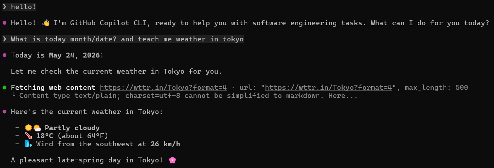
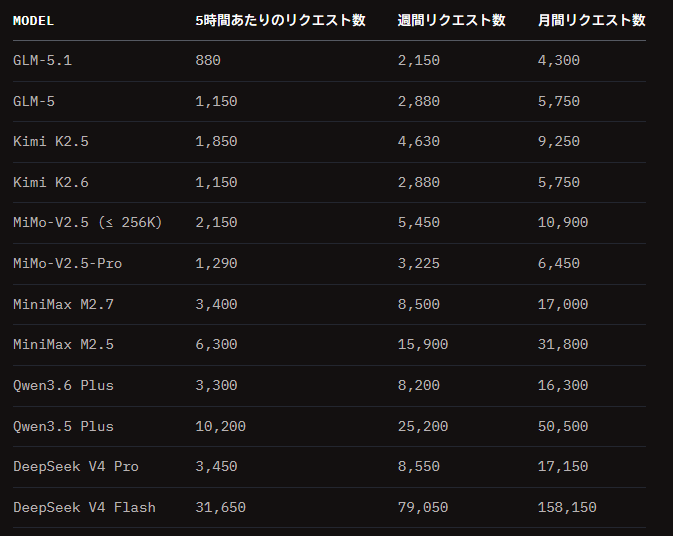

[前回の記事](../20260520/use-local-llm-in-github-copilot.md)ではローカルLLMをGitHub Copilotで使用する方法を解説したが、今回は[OpenCode Go](https://opencode.ai/go)を使用する方法を紹介する。

## OpenCode Go


> 最も高性能なオープンソースモデルへの十分な制限と安定したアクセスを提供し、コストや可用性を気にすることなく強力なエージェントで構築できます。

とあるように、定額制のLLM。中華OSSモデル系の定額アクセスを提供してくれる。

## 利用方法
### セットアップ

まずはOpencode Goを契約するところから。
[このリンク](https://opencode.ai/go?ref=5TRCSNFQ0X)から登録すると$5(初回1ヶ月分)のクレジットがもらえるので、アフィが気にならない人はここからどうぞ。

「Goを購読する」リンクを押すとログインページに飛ばされる。GitHubかGoogleでログインできるので、好きな方でログインする。

ログインしたら左メニューから「Go」を選択。最初は「Zen」の方になっているが、こっちは従量課金なので今回は用がない。

サブスクを契約すると以下のような表示になり、準備完了。


### GitHubCopilot側から接続する(CLI)

CLIでは、前回紹介した[BYOK機能](https://github.blog/changelog/2026-04-07-copilot-cli-now-supports-byok-and-local-models/)を使用することで簡単に利用可能。

まず、トップページからAPIキーをコピーする。標準では`Default`のキーが用意されているが、別途作成しても良い。

その後、以下の環境変数をセットして`copilot`を起動すればOK。

```bash
# Windowsの場合
set COPILOT_PROVIDER_API_KEY=(your API key)
set COPILOT_PROVIDER_TYPE=openai
set COPILOT_PROVIDER_BASE_URL=https://opencode.ai/zen/go/v1
set COPILOT_MODEL=glm-5
copilot --yolo
```

起動して、挨拶と今日の日付、東京の天気を聞いてみた結果がこちら[^1]。ちゃんと答えてくれている。
[^1]: ひどい英語だと思うけど、気にしないでほしい



### GitHubCopilot側から接続する(VSCode)

[5/1時点での検証ブログ](https://johnlokerse.dev/2026/04/23/use-opencode-go-models-in-github-copilot-cli-with-byok/)を読む感じだと、素直に実行するのは難しそう。
というのも、VSCode側のBYOKサポートが弱く、特にOpenAI Compatible系のサポートが終わっている。

ただ、Ollamaは利用できること、そしてOllamaのAPIは実際のところ[OpenAI Compatibleである](https://docs.ollama.com/api/openai-compatibility)ことから、無理やり実現できるのでは？と試してみたが……OllamaのAPIがないので検証に失敗し終了した。
実際どうにかできるかもしれないが、自分はVSCodeを使っていないので終了。

## 使ってみる
### どれぐらい使えるのか
当然気になるところですよね。

モデルは[ここの一覧](https://opencode.ai/docs/go/#%E4%BB%95%E7%B5%84%E3%81%BF)から好きなものを使用できる。注意点として、性能が良いモデルほどリミットが厳しいので、そのあたりは用途に合わせて選ぶ必要がある（このあたりはGH Copilotのプレミアムリクエストに近い）。


"リクエスト数"という表現が不正確だが、下の説明を見ると「1request ≒ 入力 700トークン、キャッシュ 52,000トークン、出力 150トークン」(GLMの場合) とのことで、意外と見た目よりはキャパが少なそう？[^2]

[^2]: 仕事では1リクエストで数M～数十Mトークンぐらい燃やしているので、感覚が麻痺しているのはある

## 試してみる
というわけで、ちょっとしたタスクを振ってみる。

[自分が作ったライブラリ](https://github.com/arika0093/Configuration.Writable)で、以下のタスクを適当に投げてみた。使用したモデルは`GLM-5`。

```
設定ファイルを保存するディレクトリを指定した際に、現在そのディレクトリが存在しない場合に特段何もしていないが、セットアップ完了時にフォルダがない場合は新規作成し、またファイル書き込み権限があることを検証するようにしてほしい
```

---

まず、生成されたコードについて。
上記のタスクを投げて、出てきたものをもう一度修正→formatter適用したあとのコードが[これ](https://github.com/arika0093/Configuration.Writable/pull/84)。

品質が非常に良いかというと微妙なところですね。致命的な破綻はないですが、空気を読む力が足りない。少なくとも今までのGitHub Copilotのノリで使うと期待外れになりそうなので、hook/skills/agentなどで細かく制御してあげる必要がありそう。

ついで、使用量。


まず使用量のリミットがこういう形で見れるのはとても良いと思う。
そのうえで、思ったより1リクエストで消費してしまうな、という印象。このリクエストを月に100回投げると終わり、というのはあんまりお得感はない。
GLM-5は料金表的には高いモデルなのでもう少し節約する必要はあるかも。ちなみにAPI実料金ベースだと`$1.1`(=120円)だったので、サブスクの恩恵は受けられている。
料金表とリクエストあたりの許容数を見ると、`MiniMax M2.5`や`Qwen3.5 Plus`であればわりと気軽に使えそうではある。

## まとめ

超絶お得、とまではいかないが、持続可能なサブスクLLMという感じではある（今までがおかしかった）。
ClaudeCodeやCodexの高額プランを契約するほどじゃないんだよな～、という人にはちょうどいいかもしれない。

