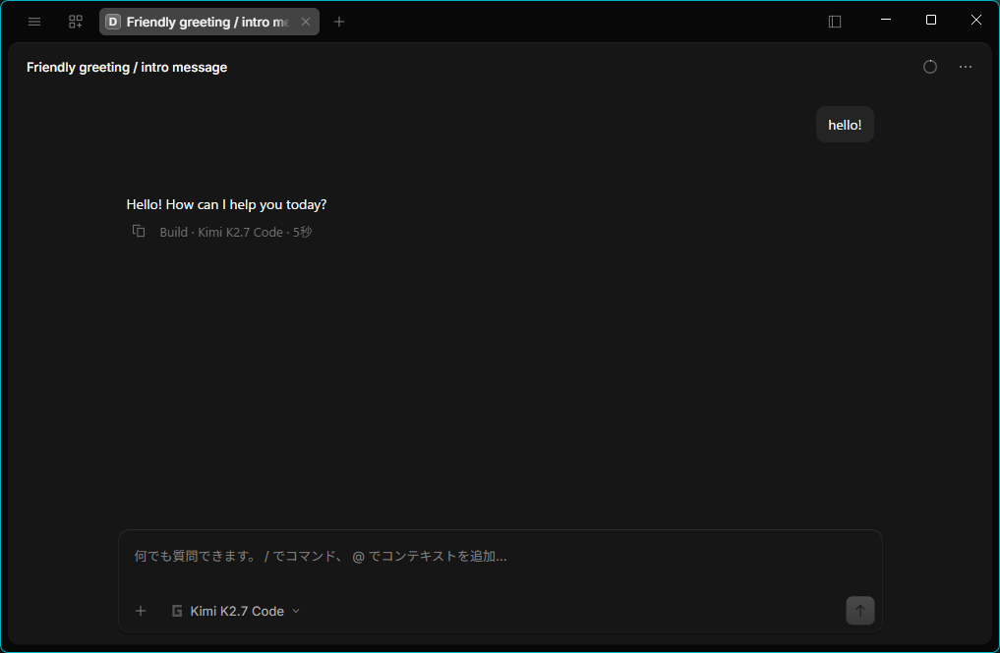
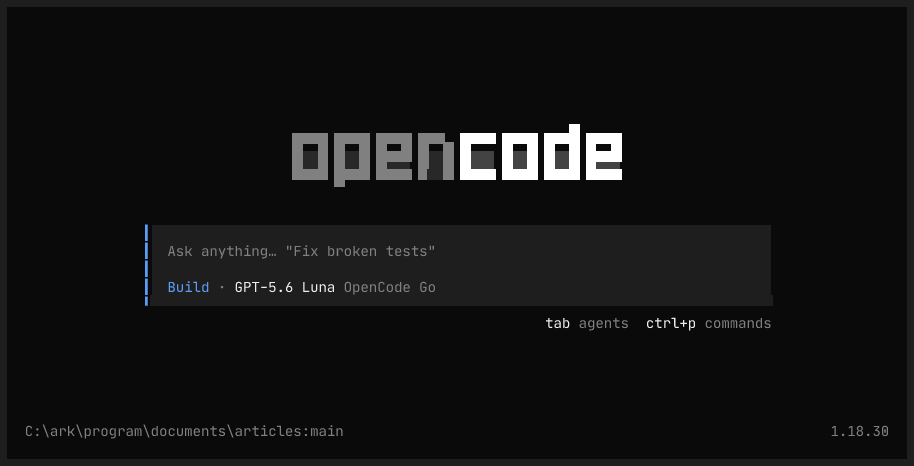
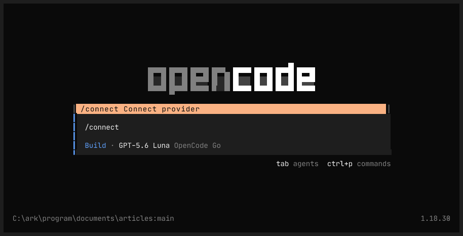
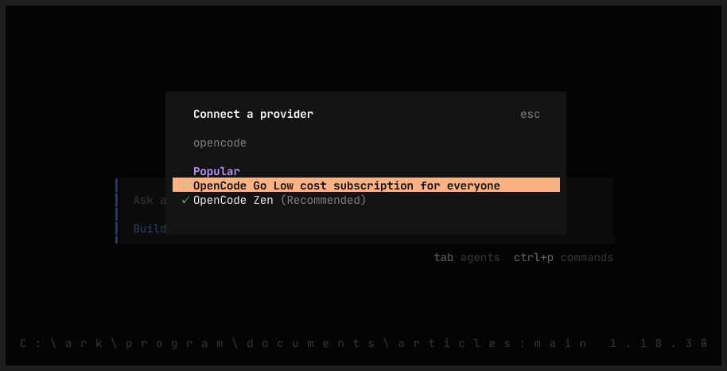
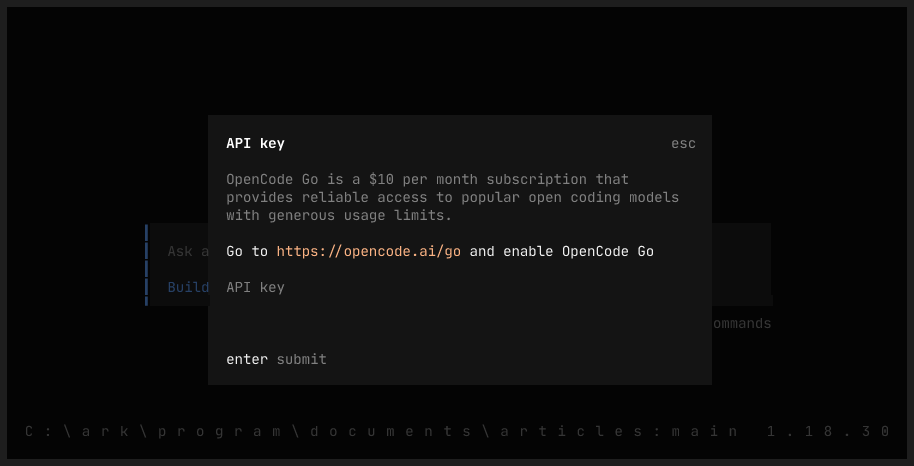
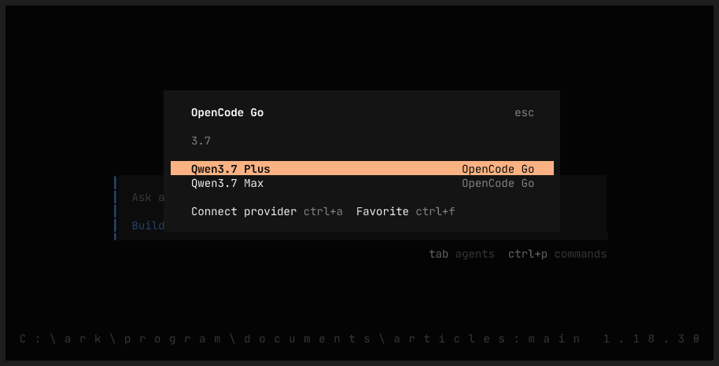
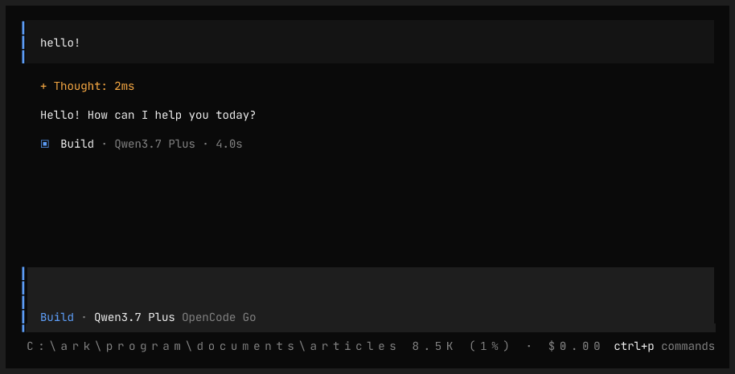
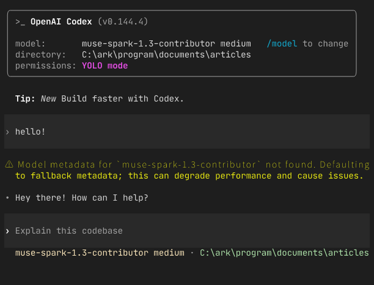

[OpenCode Go](https://opencode.ai/go)は、定額制で高性能なオープンソースモデルへのアクセスを提供してくれるサービス。  
[以前書いた記事](../20260524/use-opencode-go-in-github-copilot.md)から3ヶ月間ほど経ったので、改めてOpenCode Goを使ってみた利点と感想をまとめます。

## 現状の契約状況

自分は概ね以下のような使い方をしています。

* ChatGPT Plus ($30/月)
  * 基本的にGPT5.6 Luna(たまにTerra)を使用
    * ついでに、家族にも支給
* OpenCode Go ($10/月)
  * Qwen3.7 Plus / Kimi K2.7 Codeを主に使用。
  * タスクによってはDeepSeek V4 ProとかGLM5系の高級モデルを使用。
* GitHub Copilot (無課金)

月40ドル(=約6000円)でやれる範囲としては、個人的には十分と考えています。
これ以上を使いたくなったらChatGPT ProかClaude Code MAXですかね。

---

以下、ほかサービス
* ChatGPT(Pro = $100)
  * 高い。それにつきる
* Claude Code(MAX = $100)
  * 高い。。
  * モデルの性能はさておいて、OpenAIよりも信頼ならない側面がある
* Claude Code(Pro = $20)
  * あっという間に制限が来て、週末のちょっとした開発にも使えない。
* Gemini
  * 無課金で使える状態なので試したが、性能がいまいちだった。
  * 画像とかそういう方向ならいいんですけどね…　コーディングには向かないかな。
* GitHub Copilot(Pro)
  * Limitが厳しすぎる。
* Grok
  * 試したことない。Xに課金したくなったタイミングで検討。

## 感想
### よいところ

* 安い。
  * 月額10ドルで、60ドル相当の利用が可能。
  * 最新LLMには少々劣るものの、個人的には十分な性能。
* 不自然に安すぎるわけでもないので、持続性も◎
* モデルの候補がたくさんある。
  * 激安モデルからそれなりの高級モデルまで、使い分けも十分可能。

### よくないところ

* 流石に最新LLMには劣る。
  * 体感としては5.6 Terraぐらいの性能。
  * 高級モデルをちゃんと使えばSol弱ぐらいの性能は出せるかも。
  * このスペックで気に入らない人は、まあいらないでしょう。
* 知見がインターネット上に落ちてない。使い方がわかりにくい。
* ハーネス(codex cliとか)上で動かす方法が調べないと(調べても)わからない。

ドキュメントが少なすぎるのが一番のネック。
というわけで、この記事でそのあたりの情報を軽くまとめておきます。

## 使い方
### 事前準備
もちろん契約が必要です。
[前回の記事](../20260524/use-opencode-go-in-github-copilot.md)を参照。

APIキーが発行できたら次に進んでください。

### クライアント(ハーネス)
OpenCode GoはLLM "API"へのアクセスを提供してくれるサービス。
あくまでAPIだけなので、UIは別に用意する必要があります。
以下、Windowsから使う場合を想定して解説します（が他のOSでも大差はないです）

### OpenCode TUI
OpenCodeの公式クライアントがあります。

> こちらがOpenCodeの本丸で、Goは付随サービス的なものです。

https://opencode.ai/ja/download から、"OpenCode Desktop"の"Windows"をインストール.
起動後、OpenCode GoのAPIキーを登録すれば使えます。

UIは最低限です。一応使えはする、程度。



### OpenCode CLI

windowsの場合、npmからいれるのが一番簡単だと思います。

```bash
npm install -g opencode-ai
# linux系なら↓でもいい
# curl -fsSL https://opencode.ai/install | bash
```

その後, `opencode`で起動します。起動するとこんな画面になります。



そのままだと使えないので、`/connect`といれてプロバイダー登録画面に移動します。



ここで、`OpenCode`までいれると`OpenCode Go`が出てくるのでそれを選択



APIキーを貼り付けてEnterで登録完了。



その後、モデル選択画面が出るので適当に選択します。今回は`Qwen3.7 Plus`を選択。




これで使えるようになります。



### Codex

codexからも使えます。主にSol等に設計をさせて、sessionを引き継いで格安モデルに作業させるのが良さそう。

まず、`~/.codex/`配下に`opencode_go.config.toml`の名前で以下のファイルを保存します。

```toml
model_provider = "opencode_go"
model = "muse-spark-1.3-contributor"

[model_providers.opencode_go]
name                  = "OpenCode Go"
base_url              = "https://opencode.ai/zen/go/v1"
env_key               = "OPENCODE_GO_API_KEY"
wire_api              = "responses"
requires_openai_auth  = false
```

> [!TIP]
> codexの仕様上`/responses`に対応しているモデル(現時点だと`grok-4.6`, `gpt-5.6-luna`, `muse-spark-1.3-contributor`)しか使えません。


その後、環境変数に `OPENCODE_GO_API_KEY`の名前でAPIキーを登録します。
```bash
set OPENCODE_GO_API_KEY=sk-*******
```

最後に、以下のコマンドでcodexを起動することで、OpenCode Goを利用することができます。

```bash
codex --profile opencode_go 
```



### Claude Code

うまくいきませんでした。以下の環境変数設定で対応可能なはずでしたが、、、原因不明。

```bash
set ANTHROPIC_AUTH_TOKEN=sk-...
set ANTHROPIC_BASE_URL=https://opencode.ai/zen/go/
set ANTHROPIC_API_KEY=
set ANTHROPIC_MODEL=qwen3.7-plus
set CLAUDE_CODE_DISABLE_UNKNOWN_MODEL_WINDOW_ENFORCEMENT=1
claude
```

参考: https://unsloth.ai/docs/basics/claude-code

### GitHub Copilot CLI

[前回の記事](../20260524/use-opencode-go-in-github-copilot.md)を読んでください…と言いたいところですが、残念ながら今月頭頃から使えなくなってます。

というのも、所定のヘッダー`x-opencode-session`を付ける必要があるらしいですが、GitHub Copilot CLIがカスタムヘッダーに[対応していない](https://github.com/github/copilot-cli/issues/3399)ため、利用できなくなっています。

ローカルにプロキシを立てれば良いのですが、まあめんどくさいので一旦考えないことに。

## モデルの選択・費用確認

とってもわかりにくいのですが、以下の3個所を見る必要があります。

* [利用制限](https://opencode.ai/docs/ja/go#%E5%88%A9%E7%94%A8%E5%88%B6%E9%99%90)
* [推定リクエスト数](https://opencode.ai/docs/ja/go#%E6%8E%A8%E5%AE%9A%E3%83%AA%E3%82%AF%E3%82%A8%E3%82%B9%E3%83%88%E6%95%B0)
* [エンドポイント](https://opencode.ai/docs/ja/go#%E3%82%A8%E3%83%B3%E3%83%89%E3%83%9D%E3%82%A4%E3%83%B3%E3%83%88)

### 指定方法
上記"[エンドポイント](https://opencode.ai/docs/ja/go#%E3%82%A8%E3%83%B3%E3%83%89%E3%83%9D%E3%82%A4%E3%83%B3%E3%83%88)"の表にある`Model ID`の値を指定します。
例えばKimi K2.7 Codeを使いたい場合は`kimi-k2.7-code`, GLM-5.3なら`glm-5.3`です。

### 費用
まず、上記"[利用制限](https://opencode.ai/docs/ja/go#%E5%88%A9%E7%94%A8%E5%88%B6%E9%99%90)"の表の`月間上限`の値を見ます。
ここが`$60`なら月に$60相当のリクエストを使えますし、`$15`なら15ドル分使い切った時点でLimitになります。
要するに、ここが$60のモデルを使わないとあんまりお得じゃない、ということです。

高級モデルはそもそものリクエスト単価が高いことに加えて利用上限が$15なので、あまり使えないと思ったほうが良いです。
逆に安いモデルならいくら使ってもそうそう使い切りません。

実際のコストも上記"利用制限"の中にありますが、見てもわかりにくいので"[推定リクエスト数](https://opencode.ai/docs/ja/go#%E6%8E%A8%E5%AE%9A%E3%83%AA%E3%82%AF%E3%82%A8%E3%82%B9%E3%83%88%E6%95%B0)"のほうがわかりやすいでしょう。

### まとめ

自分的に主要なところからいくつか引っ張ってきました。参考までに(2026/09/13現在)。

| ID | Model | 月間リクエスト数 | 月間上限 | 備考 |
|---|---|---:|---|---|
| `glm-5.3-flash` | GLM-5.3-Flash | 31,580 | $60 | |
| `glm-5.3` | GLM-5.3 | 1,080 | $15 | |
| `kimi-k3` | Kimi K3 | 490 | $15 | |
| `kimi-k2.7-code` | Kimi K2.7 Code | 6,750 | $60 | |
| `minimax-m3` | MiniMax M3 | 16,000 | $60 | |
| `muse-spark-1.3-contributor` | Muse Spark 1.3 Contributor | 226,600 | $15 | 要:データ学習許可 |
| `qwen3.8-max` | Qwen3.8 Max | 810 | $15 | |
| `qwen3.8-flash` | Qwen3.8 Flash | 27,000 | $30 | |
| `qwen3.7-plus` | Qwen3.7 Plus | 21,600 | $60 | |
| `deepseek-v4.1-flash` | DeepSeek V4.1 Flash | 32,500 | $15 | 要:中国ホストモデル有効化 |
| `deepseek-v4-pro` | DeepSeek V4 Pro | 5,200 | $15 | 要:中国ホストモデル有効化 |
| `grok-4.6` | Grok 4.6 | 845 | $15 | |
| `gpt-5.6-luna` | GPT 5.6 Luna | 10,250 | $15 | |

`glm-5.3-flash`,`kimi-k2.7-code`,`qwen3.7-plus`あたりがオススメです。
また、データ学習されますが`muse-spark`系列は異常な回数使えますので気にならない人はこれでも。

## まとめ

というわけで、癖は強めですが個人的にはだいぶ満足しているサービスです。
興味がある方は試してみてください。

> [!NOTE]
> [このリンク](https://opencode.ai/go?ref=5TRCSNFQ0X)から契約すると$5(初回1ヶ月分)のクレジットがもらえます(再掲).
