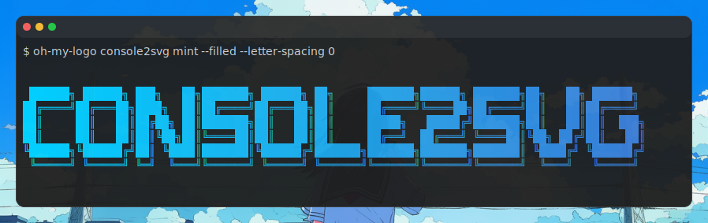

今まで作成してきたプロジェクトの一覧とその概要を紹介します。

## ツール
### Console2svg
https://github.com/arika0093/console2svg

http://eclairs.cc/posts/2026/20260225/tool-console-to-svg

コンソール出力を綺麗なSVG画像にするツールです。色々な出力パターンに対応しており、macos風のウインドウ枠もつけられます。
ブログ等に出力を貼り付けるのに便利です。
`dotnet tool`や`npm`でインストールできるほか、静的バイナリも配布しています。地味にwindows対応しているのもポイントです。




## ライブラリ
### Linqraft
https://github.com/arika0093/Linqraft

http://eclairs.cc/posts/2025/20251130/linqraft-with-interceptor

DTOの都度作成の手間を解消するライブラリです。なかなかおすすめです！

```csharp
var orders = dbContext.Orders
    // Roslyn解析によりOrderDtoのクラス定義を自動で生成する
    .SelectExpr<Order, OrderDto>(o => new
    {
        Id = o.Id,
        CustomerName = o.Customer?.Name,
        CustomerAddress = o.Customer?.Address?.Location,
    })
    .ToList(); 
``` 

### BlazorLocalTime

https://github.com/arika0093/BlazorLocalTime

https://eclairs.cc/posts/2025/20250622/blazor-localtime


Blazor Serverでローカル時間を扱うためのライブラリです。
サーバー側で素直に`ToString()`するとサーバー側時刻で表示されてしまうため、JavaScript側でローカル時間を取得して表示する仕組みを簡易的に組み込めるようなライブラリを作りました。

```razor
<LocalTimeText Value="@dateTime" Format="yyyy/MM/dd HH:mm:ss" />
```

API的には使いやすく気を遣いましたが、まあそもそもがニッチな領域ではありますね……
Blazor Serverを使っていて、複数のタイムゾーンに対応したい場合ってそんなにないよね。

