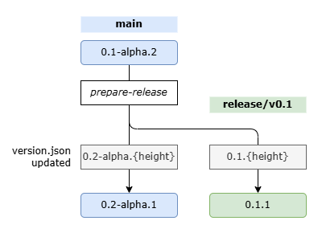

Managing NuGet package or application versions manually can be tedious. In this article, I'll explain how to automate versioning using [Nerdbank.GitVersioning](https://github.com/dotnet/Nerdbank.GitVersioning).

## What is Nerdbank.GitVersioning?

In short, it's a tool that automatically generates version numbers based on your Git commit history. It's not just for NuGet packages—you can use it with any .NET project. As it's maintained under the `dotnet` organization, it's an official tool and is widely considered a de facto standard.

## Setup

First, install the CLI tool:

```bash
dotnet tool install -g nbgv
```

Next, add `Nerdbank.GitVersioning` to your project:

```bash
dotnet add package Nerdbank.GitVersioning
```

If you have multiple projects, you can add the following to your `Directory.Build.props` to enable it for all projects:

```xml
<Project>
  <ItemGroup>
    <PackageReference Include="Nerdbank.GitVersioning" Version="3.*" Condition="!Exists('packages.config')" >
      <PrivateAssets>all</PrivateAssets>
      <IncludeAssets>runtime; build; native; contentfiles; analyzers; buildtransitive</IncludeAssets>
    </PackageReference>
  </ItemGroup>
</Project>
```

Finally, create a `version.json` file at the root of your project.

## version.json

This is a simple JSON file. Here's an example configuration:

```json
{
  "$schema": "https://raw.githubusercontent.com/dotnet/Nerdbank.GitVersioning/main/src/NerdBank.GitVersioning/version.schema.json",
  "version": "0.1-alpha.{height}",
  "pathFilters": [
    "src/"
  ],
  "publicReleaseRefSpec": [
    "^refs/heads/main",
    "^refs/heads/release/v\\d+(?:\\.\\d+)?$"
  ],
  "release": {
    "branchName": "release/v{version}"
  },
  "nuGetPackageVersion": {
    "semVer": 2.0
  },
  "cloudBuild": {
    "buildNumber": {
      "enabled": true
    }
  }
}
```

Let's break down the main parts of the configuration:

### version

```json
"version": "0.1-alpha.{height}"
```

This is the version number template. `{height}` represents the height of the Git commit history. For example, if you specify `0.1-alpha.{height}`, the first commit will be `0.1-alpha.1`, the next commit will be `0.1-alpha.2`, and so on. When you later run the `prepare-release` command (explained below), the version will bump to `0.2-alpha.1`. This way, version numbers are automatically incremented as you make changes.

### pathFilters

```json
"pathFilters": [
	"src/"
	// To exclude only version.json itself:
	// ":!version.json",
]
```

This property specifies which files should trigger a version update. In the example above, only changes under the `src/` directory will cause the version to update. This prevents changes to documentation or configuration files from bumping the version.

Even if you don't want to restrict to a specific directory, it's a good idea to exclude `version.json` itself from triggering version updates. The reason for this is explained later.

### publicReleaseRefSpec

```json
"publicReleaseRefSpec": [
	"^refs/heads/main",
	"^refs/heads/release/v\\d+(?:\\.\\d+)?$"
]
```

By default, the version number will include a commit hash suffix, like `0.1-alpha.1+8378bd9a46`. This is useful for development branches, where the same version number might correspond to different content. However, for release branches (such as `main` or `release/v1.0`), you typically want to omit the commit hash. The `publicReleaseRefSpec` setting controls this behavior.

You can use regular expressions to match dynamically generated branch names, such as:

```json
// Matches release/v1.0, release/v1.1, etc.
"^refs/heads/release/v\\d+(?:\\.\\d+)?$"
```

### release/branchName

```json
"release": {
	"branchName": "release/v{version}"
}
```

This specifies the naming pattern for release branches. In this example, release branches will be created under the `release/` prefix. If you change this pattern, remember to update the corresponding `publicReleaseRefSpec` as well.

## Accessing Version Information in Code

Nerdbank.GitVersioning generates a `ThisAssembly` class at build time, which you can use to access version info:

```csharp
internal static partial class ThisAssembly {
    internal const string AssemblyConfiguration = "Debug";
    internal const string AssemblyFileVersion = "1.1";
    internal const string AssemblyInformationalVersion = "1.1.0-alpha.13+1938044917";
    internal const string AssemblyName = "BlazorLocalTime";
    internal const string AssemblyTitle = "BlazorLocalTime";
    internal const string AssemblyVersion = "1.1.0.0";
    internal static readonly global::System.DateTime GitCommitAuthorDate = new global::System.DateTime(638862085700000000L, global::System.DateTimeKind.Utc);
    internal static readonly global::System.DateTime GitCommitDate = new global::System.DateTime(638862089820000000L, global::System.DateTimeKind.Utc);
    internal const string GitCommitId = "19380449172beecd6c25c229e8df9a07ed310cbe";
    internal const bool IsPrerelease = true;
    internal const bool IsPublicRelease = true;
    internal const string RootNamespace = "BlazorLocalTime";
}
```

To get the version string (e.g., `1.1.0-alpha.13`), you can split the `AssemblyInformationalVersion`:

```csharp
var v = ThisAssembly.AssemblyInformationalVersion.Split('+')[0];
// "1.1.0-alpha.13"
```

## Creating a Release

Use the `nbgv` CLI to prepare a release:

```bash
nbgv prepare-release
```

At this point, your branches will split as shown below, with each branch having its own updated `version.json`:



What’s happening here is that the current branch is branched off into something like `release/v0.1`, and the `version.json` version number is updated. A commit updating `version.json` is automatically generated at this stage, so when you build in this state, the version number will be `0.1.1`. If you want your versions to start from 0, it’s a good idea to exclude `version.json` from triggering version bumps.

If you want to insert an intermediate version name like `rc` instead of moving directly to `0.1.1`, you can do so as follows.

```bash
nbgv prepare-release rc
# -> release/v0.1-rc.1
```

## Using with CI/CD

You can automate releases using GitHub Actions.

### Get Version Info in GitHub Actions

Use [`dotnet/nbgv@master`](https://github.com/dotnet/nbgv) to retrieve version info:

```yaml
- uses: dotnet/nbgv@master
  id: nbgv
- name: Get version
  run: echo "${{ steps.nbgv.outputs.SemVer2 }}"
  # -> 0.1.1
```

### Creating a GitHub Release

Use `softprops/action-gh-release` to create a GitHub Release. Important points:

#### Set `fetch-depth` to 0
By default, GitHub Actions checks out only the latest commit. Since `Nerdbank.GitVersioning` generates version numbers based on the full commit history, you need to fetch all commits. Set `fetch-depth` to 0 in `actions/checkout@v4`:

```yaml
- name: Checkout repository
  uses: actions/checkout@v4
  with:
    fetch-depth: 0
```

#### Specify the `prerelease` Option
If the output from `nbgv` contains a hyphen (e.g., `0.1-alpha.1`), you likely want to treat it as a prerelease. Set the option as follows:

```yaml
prerelease: ${{ contains(steps.nbgv.outputs.SemVer2, '-') }}
```

#### Specify `target_commitish`
If you don't specify this, the tag will be attached to the latest commit on the `main` branch. To create a release on a branch like `release/v0.1`, explicitly set the commit hash:

```yaml
target_commitish: ${{ github.ref }}
```

#### Set Action Permissions
To create a GitHub Release, the workflow must have `contents: write` permissions:

```yaml
permissions:
  contents: write
```

#### Complete Example
Taking the above into account, here is a sample GitHub Actions workflow file to publish a NuGet package as a GitHub Release:

```yaml
name: Release Package to GitHub

on:
  workflow_dispatch:
  push:
    branches:
      - main
      - release/*

permissions:
  contents: write

jobs:
  release-github:
    runs-on: ubuntu-latest
    steps:
      - name: Checkout repository
        uses: actions/checkout@v4
        with:
          fetch-depth: 0

      - name: Setup .NET
        uses: actions/setup-dotnet@v4
        with:
          dotnet-version: "9.x"

      - uses: dotnet/nbgv@master
        id: nbgv

      - name: Restore dependencies
        run: dotnet restore --locked-mode
      - name: Build
        run: dotnet build --no-restore -c Release
      - name: Generate Nuget Package
        run: dotnet pack --no-build -c Release --output ./artifacts

      - name: Create Release
        id: create_release
        uses: softprops/action-gh-release@v1
        with:
          name: ${{ steps.nbgv.outputs.SemVer2 }}
          tag_name: ${{ steps.nbgv.outputs.SemVer2 }}
          target_commitish: ${{ github.ref }}
          generate_release_notes: true
          files: ./artifacts/*.nupkg
          prerelease: ${{ contains(steps.nbgv.outputs.SemVer2, '-') }}
        env:
          GITHUB_TOKEN: ${{ secrets.GITHUB_TOKEN }}
```

### Publishing to NuGet

Publishing to NuGet is similar. Register your `NUGET_API_KEY` as a GitHub Secret. Since NuGet packages can't be deleted, it's best to use `workflow_dispatch` to trigger the workflow manually.

```yaml
name: Release Package to NuGet

on:
  workflow_dispatch:

jobs:
  release-nuget:
    runs-on: ubuntu-latest
    steps:
      - name: Checkout repository
        uses: actions/checkout@v4
        with:
          fetch-depth: 0

      - name: Setup .NET
        uses: actions/setup-dotnet@v4
        with:
          dotnet-version: "9.x"

      - name: Restore dependencies
        run: dotnet restore --locked-mode
      - name: Build
        run: dotnet build --no-restore -c Release
      - name: Generate Nuget Package
        run: dotnet pack --no-build -c Release --output ./artifacts

      - name: Publish Nuget Package
        run: dotnet nuget push ./artifacts/*.nupkg --source https://api.nuget.org/v3/index.json --api-key $NUGET_API_KEY
        env:
          NUGET_API_KEY: ${{ secrets.NUGET_API_KEY }}
```

## Updating After Release

After running `prepare-release`, a release branch is created. If you want to update the release, you can cherry-pick commits from `main` to the release branch. To keep version numbers sequential, you might:

1. Develop on `main` as usual.
2. When you need to update a release, create a branch from the release branch (e.g., `v0.1-next`).
3. Cherry-pick the desired commits.
4. Push the branch and open a PR targeting the release branch.
5. Use squash merge to keep the commit history clean.
6. Delete the temporary branch after merging.

## Conclusion

This article explained how to automate versioning and releases for .NET projects using Nerdbank.GitVersioning and GitHub Actions. I hope this helps streamline your release process!
