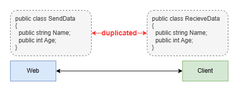
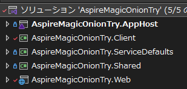
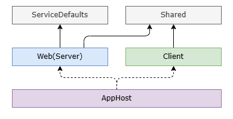
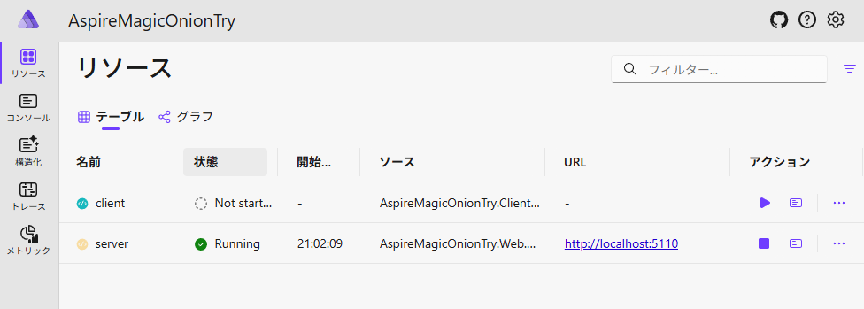
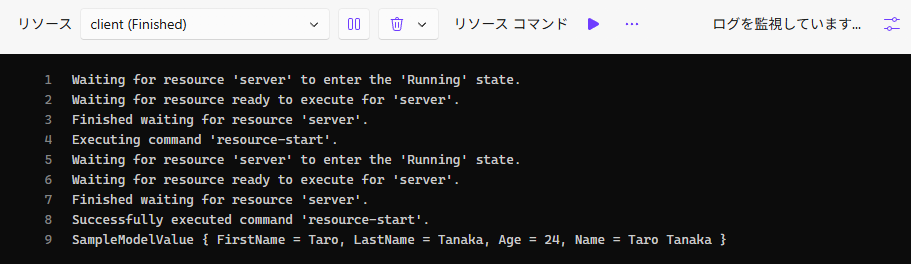
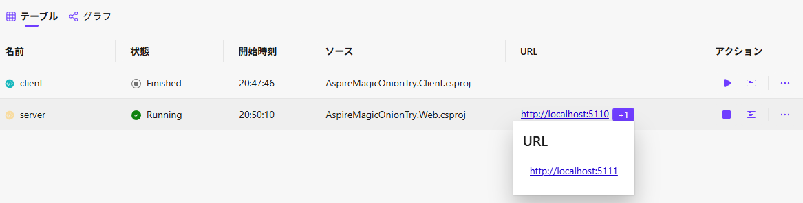
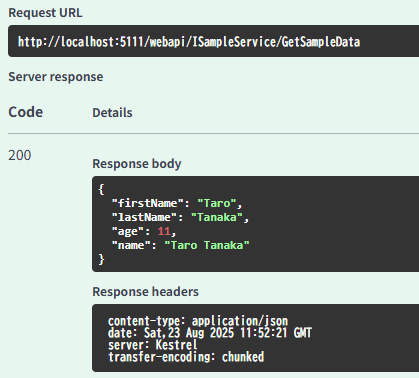

## Introduction

Server-client application development is quite common (it's usually the case). However, I personally find developing the boundary interfaces quite challenging (or rather, tedious).



While Protocol Buffers and OpenAPI exist[^1], I recently discovered [MagicOnion](https://github.com/Cysharp/MagicOnion) and thought, "If everything is in C#, why not use this?"

[^1]: Initially, I was working with Swashbuckle's OpenAPI generation, but the workflow of generating JSON files locally and then loading them to create clients felt quite redundant.

While the official documentation highlights bidirectional communication as its selling point, it works perfectly well as a replacement for REST APIs.

So here are my notes from actually using MagicOnion. While the [official documentation](https://cysharp.github.io/MagicOnion/ja/) is sufficient for basic usage[^2], I'll introduce a case where it's combined with Aspire.

[^2]: It's not particularly comprehensive, and it seems to require some prerequisite knowledge about MessagePack and similar technologies.

## What Makes It Great

Let me quote the official image directly. It explains everything at a glance.


As shown, it nicely abstracts server-client communication, allowing you to write code as if you're just calling functions.

Since I'm quite fond of [tRPC](https://trpc.io/) and Next.js [server functions](https://nextjs.org/docs/app/getting-started/updating-data), being able to use something similar should be wonderful![^3]

[^3]: Actually, this has a longer history.

## Setup
### Project Structure

First, create projects with the following structure:



The breakdown is:

* `AppHost`: Aspire's AppHost
* `Client`: Console application
* `ServiceDefaults`: Aspire's "Service Defaults"
* `Shared`: Class library
* `Web`: ASP.NET API Server

The dependency structure looks like this:


The shared `Shared` library is used as schema definition, referenced by both `Client` and `Web`. `AppHost` is used to launch these two together.

### AppHost Side
After adding `Client` and `Web` to service references, write as follows. It simply launches the two services with proper dependency relationships.

```cs
var builder = DistributedApplication.CreateBuilder(args);

// Register web server with name "server"
var server = builder.AddProject<Projects.AspireMagicOnionTry_Web>("server")
    .AsHttp2Service();

// Register console app with name "client"
var client = builder.AddProject<Projects.AspireMagicOnionTry_Client>("client")
    // Reference "server" within the app
    .WithReference(server)
    // Wait for "server" to start
    .WaitFor(server)
    // Don't start when Aspire starts (manual start)
    .WithExplicitStart();

builder.Build().Run();
```

### Shared Side

After introducing `MagicOnion.Shared`, define interfaces like this:

```cs
using MagicOnion;

public interface ISampleServiceCore
{
    public UnaryResult<SampleModel> GetSampleData();
}

public interface ISampleService : IService<ISampleService>, ISampleServiceCore;
```

Write various definitions in `ISampleServiceCore`, then prepare `ISampleService` by attaching `IService` to it.
This makes testing easier (discussed later).

Also, wrap return values with `UnaryResult`. It's the MagicOnion version of `Task`.

When functions return classes or take objects as parameters, those objects need to be serializable with `MessagePack`.
In this case, it's `SampleModel`.
So add `[MessagePackObject(true)]`.[^4]

[^4]: You can also use the `[MessagePackObject]` and `[Key(0)]` approach ([IntKey](https://github.com/MessagePack-CSharp/MessagePack-CSharp?tab=readme-ov-file#use-indexed-keys-instead-of-string-keys-contractless)). However, if you don't care about performance, this approach requires less writing and is more convenient.

```cs
using MessagePack;

[MessagePackObject(true)]
public record SampleModel
{
    public required string FirstName { get; init; }
    public required string LastName { get; init; }
    public required int Age { get; init; }

    public string Name => $"{LastName} {FirstName}";
}
```

If you forget to add `MessagePackObject`, you'll get an error like this:
```
MessagePack.MessagePackSerializationException: Failed to serialize AspireMagicOnionTry.Shared.SampleModel value.
 ---> MessagePack.FormatterNotRegisteredException: AspireMagicOnionTry.Shared.SampleModel is not registered in resolver: MessagePack.Resolvers.StandardResolver
```

### Web (Server) Side

Introduce `MagicOnion.Server` and then write the implementation of `ISampleService`:

```cs
public class SampleService : ServiceBase<ISampleService>, ISampleService
{
    public UnaryResult<SampleModel> GetSampleData()
    {
        var result = new SampleModel()
        {
            FirstName = "Taro",
            LastName = "Tanaka",
            Age = Random.Shared.Next(minValue: 10, maxValue: 30)
        };
        return UnaryResult.FromResult(result);
    }
}
```

Then write this in `Program.cs` and you're done. If you inherit from `ServiceBase`, it will automatically perform DI and register endpoints, keeping this side simple.

```cs
var builder = WebApplication.CreateBuilder(args);

builder.AddServiceDefaults(); // Aspire ServiceDefaults, discussed later

builder.Services.AddMagicOnion(); // Add this

var app = builder.Build();

app.MapMagicOnionService(); // Add this

app.MapDefaultEndpoints();
app.Run();
```

If you want to host the server over HTTP (for internal services), add this to `appsettings.json` to make it `HTTP2` only:

```json
{
  "Kestrel": {
    "Endpoints": {
      "http": {
        "Url": "http://localhost:5110",
        "Protocols": "Http2"
      }
    }
  }
}
```

Without this, you'll get an error like:
```
System.Net.Http.HttpRequestException: The HTTP/2 server closed the connection. HTTP/2 error code 'HTTP_1_1_REQUIRED' (0xd). (HttpProtocolError)
```

### Client Side

First, introduce these libraries:

* `MagicOnion.Client`
* [ConsoleAppFramework](https://github.com/Cysharp/ConsoleAppFramework)
  * Since this is a console app, I'll use this from the same Cysharp family.
  * When you want to use DI, it allows simple introduction of those aspects and works quite well.[^5]
* `Microsoft.Extensions.ServiceDiscovery`
  * Used for Aspire integration, discussed later.

[^5]: DI is convenient when you want to write the same way across different clients. Or rather, you'd be in trouble without it. For logging, cases like this, etc.

Now here's the key point: you need to configure several settings.

#### ServiceDiscovery Configuration

When communicating with the server, you don't want to hard-code the server's IP address. Depending on the deployment location, the target server might change, or you need to distinguish between development and production environments.

So you assign an alias (`http://server`) and provide the actual address through configuration files or environment variables. `ServiceDiscovery` handles this nicely.

Configure it like this:[^6]

[^6]: Aspire's ServiceDefaults automatically handle this configuration, but console apps can't use it, so we write it manually.

```cs
// Global configuration
services.AddServiceDiscovery();
// HttpClient configuration
services.ConfigureHttpClientDefaults(http => {
    http.AddServiceDiscovery();
});
```

#### IConfiguration Setup

This is about ConsoleAppFramework, but by default, `IConfiguration` (for `appsettings.json` and such) isn't configured.
So do this:

```cs
services.AddSingleton<IConfiguration>(_ => {
    var configBuilder = new ConfigurationBuilder()
        .SetBasePath(Directory.GetCurrentDirectory())
        .AddJsonFile("appsettings.json", optional: true)
        .AddEnvironmentVariables();
    return configBuilder.Build();
});
```

Note that while there's a built-in `ConfigureDefaultConfiguration`, it doesn't load environment variables and doesn't register `IConfiguration` in DI, so we won't use it this time.

#### ISampleServiceCore Configuration

On the service consumer side, you want to avoid thinking about MagicOnion details.
So inject it with DI like this:

```cs
// This is the "ISampleServiceCore" side
services.AddTransient<ISampleServiceCore>(provider =>
{
    // Need to specify HttpClient for ServiceDiscovery
    var httpClientFactory = provider.GetRequiredService<IHttpClientFactory>();
    var httpClient = httpClientFactory.CreateClient();
    var channel = GrpcChannel.ForAddress("http://server", new() { HttpClient = httpClient });
    // This is "ISampleService"
    var client = MagicOnionClient.Create<ISampleService>(channel);
    return client;
});
```

If you don't want to write the above for each service, you can use a utility like this:

```cs
#pragma warning disable IDE0130
using Grpc.Net.Client;
using MagicOnion;
using MagicOnion.Client;
using Microsoft.Extensions.DependencyInjection.Extensions;

namespace Microsoft.Extensions.DependencyInjection;

internal static class MagicOnionClientRegisterExtension
{
    private const string ServiceAddress = "http://server";

    public static IServiceCollection AddMagicOnionClient<T>(this IServiceCollection services)
        where T : class, IService<T>
    {
        return services.AddMagicOnionClient<T, T>();
    }

    public static IServiceCollection AddMagicOnionClient<TBase, TService>(this IServiceCollection services)
        where TBase : class
        where TService : TBase, IService<TService>
    {
        services.TryAddTransient<TBase>(provider =>
        {
            var httpClientFactory = provider.GetRequiredService<IHttpClientFactory>();
            var httpClient = httpClientFactory.CreateClient();
            var channel = GrpcChannel.ForAddress(ServiceAddress, new() { HttpClient = httpClient });
            var client = MagicOnionClient.Create<TService>(channel);
            return client;
        });
        return services;
    }
}
```

Call it like this:

```cs
services.AddMagicOnionClient<ISampleServiceCore, ISampleService>();
// or
// services.AddMagicOnionClient<ISampleService>();
```

#### Consumer Code
Now you can write normally, achieving server/client communication with seemingly ordinary code!

```cs
public class SampleServiceExecutor(ISampleServiceCore sampleService)
{
    // Want to execute without arguments due to launching from Aspire
    [Command("")]
    public async Task Test()
    {
        var rst = await sampleService.GetSampleData();
        Console.WriteLine(rst);
    }
}
```

#### Complete Client Code

The client side looks like this:

```cs
using AspireMagicOnionTry.Shared;
using ConsoleAppFramework;
using Grpc.Net.Client;
using MagicOnion.Client;
using Microsoft.Extensions.Configuration;
using Microsoft.Extensions.DependencyInjection;
using System.Text;

Console.OutputEncoding = Encoding.UTF8;

var app = ConsoleApp.Create()
    .ConfigureServices(services =>
    {
        services.AddSingleton<IConfiguration>(_ =>
        {
            var configBuilder = new ConfigurationBuilder()
                .SetBasePath(System.IO.Directory.GetCurrentDirectory())
                .AddJsonFile("appsettings.json", optional: true)
                .AddEnvironmentVariables();
            return configBuilder.Build();
        });

        services.AddServiceDiscovery();
        services.AddLogging();
        services.ConfigureHttpClientDefaults(http =>
        {
            http.AddServiceDiscovery();
        });
        services.AddTransient<ISampleServiceCore>(provider =>
        {
            var httpClientFactory = provider.GetRequiredService<IHttpClientFactory>();
            var httpClient = httpClientFactory.CreateClient();
            var channel = GrpcChannel.ForAddress("http://server", new() { HttpClient = httpClient });
            var client = MagicOnionClient.Create<ISampleService>(channel);
            return client;
        });
    });

app.Add<SampleServiceExecutor>();
app.Run(args);

public class SampleServiceExecutor(ISampleServiceCore sampleService)
{
    [Command("")]
    public async Task Test()
    {
        var rst = await sampleService.GetSampleData();
        Console.WriteLine(rst);
    }
}
```

## Running It

When you start the `AppHost`, you'll see this screen:



The server side is running, but the client side hasn't started yet.
Click the `▶` button on the right side of `client` to start the client.

Looking at the logs, you can see that it's communicating with the server successfully.



## Writing Tests

There's nothing special to say about the server side, so let's focus on the client side.
Having prepared `ISampleServiceCore` initially makes it easier to write test code like this:

```cs
// testcode
using AspireMagicOnionTry.Shared;
using MagicOnion;

public class SampleServiceExecutorTest()
{
    [Fact]
    public async Task Test()
    {
        // Using Console.SetOut to test console output.
        // Ideally, it should be designed to accept ILogger
        using var output = new StringWriter();
        Console.SetOut(output);
        var executor = new SampleServiceExecutor(new SampleServiceMock());
        await executor.Test();
        var result = output.ToString().Trim();
        var excepted = "SampleModel { FirstName = Hanako, LastName = Yamada, Age = 20, Name = Yamada Hanako }";
        Assert.Equal(excepted, result);
    }
}

internal class SampleServiceMock : ISampleServiceCore
{
    public UnaryResult<SampleModel> GetSampleData() =>
        UnaryResult.FromResult(new SampleModel()
        {
            FirstName = "Hanako",
            LastName = "Yamada",
            Age = 20
        });
}
```

## Setting Up Swagger UI

It's convenient to have Swagger UI for simple operational testing.
Let's introduce it based on the [official documentation](https://cysharp.github.io/MagicOnion/ja/integration/json-transcoding).

First, install `MagicOnion.Server.JsonTranscoding.Swagger` from NuGet. Note that the above documentation doesn't mention this.

Then add this to `Program.cs`:

```cs
// Previous code...
var magicOnion = builder.Services.AddMagicOnion();
if (builder.Environment.IsDevelopment())
{
    // Enable Swagger only in development
    magicOnion.AddJsonTranscoding();
    builder.Services.AddMagicOnionJsonTranscodingSwagger();
    builder.Services.AddSwaggerGen();
}

var app = builder.Build();
if (app.Environment.IsDevelopment())
{
    // Enable Swagger only in development
    app.UseSwagger();
    app.UseSwaggerUI(c =>
    {
        // Display Swagger UI at root path
        c.RoutePrefix = "";
        c.SwaggerEndpoint("/swagger/v1/swagger.json", "My API V1");
    });
}
// Following code...
```

Also, as it stands, Swagger UI will also be hosted on `HTTP2`, making it inaccessible from browsers. So modify `appsettings.json` as follows:[^9]

[^9]: This would be fine if hosting with HTTPS, but we're assuming HTTP hosting this time.

```diff json
{
  "Kestrel": {
    "Endpoints": {
      "http": {
        "Url": "http://localhost:5110",
        "Protocols": "Http2"
+     },
+     "swagger": {
+       "Url": "http://localhost:5111",
+       "Protocols": "Http1"
      }
    }
  }
}
```

After restarting Aspire with these changes, you'll see this display:


Now, accessing `http://localhost:5111`...



You can now call APIs like this. Very convenient!

## Key Points
### Error: No such host is known

You might encounter this error:

```
Grpc.Core.RpcException: Status(StatusCode="Unavailable", Detail="Error starting gRPC call. HttpRequestException: No such host is known. (server:80) SocketException: No such host is known.", DebugException="System.Net.Http.HttpRequestException: No such host is known. (server:80)")
 ---> System.Net.Http.HttpRequestException: No such host is known. (server:80)
 ---> System.Net.Sockets.SocketException (11001): No such host is known.
```

Usually one of the following is missing, so check them. I've encountered almost all of these.

* Aspire
  * Are you referencing with `WithReference`?
    * Without this, the environment variable `services__server__http__0` won't be passed.
* Client
  * Are you calling `service.AddServiceDiscovery`?
    * If `IConfiguration` isn't registered, you'll get an error, so register it in DI
  * If you're manually registering `IConfiguration`, are you calling `AddEnvironmentVariables`?
    * Required to load environment variables set by Aspire
  * Are you calling `AddServiceDiscovery` in `ConfigureHttpClientDefaults`?
  * Is the `server` part in `GrpcChannel.ForAddress("http://server", ...)` correct?
    * Must match the name registered on the Aspire side (the part in `.AddProject<...>("server")`)
  * Are you specifying `HttpClient` in the `GrpcChannel.ForAddress` options?

### Don't Include Getter-Only Properties

Let's look at the `SampleModel` definition again:

```cs
[MessagePackObject(true)]
public record SampleModel
{
    public required string FirstName { get; init; }
    public required string LastName { get; init; }
    public required int Age { get; init; }

    public string Name => $"{LastName} {FirstName}";
}
```

This looks fine, but suppose you change the `Name` definition like this and rebuild **only the server side**:[^8]

[^8]: It's rare to be able to update both client and server simultaneously.

```diff cs
[MessagePackObject(true)]
public record SampleModel
{
    public required string FirstName { get; init; }
    public required string LastName { get; init; }
    public required int Age { get; init; }

+   public string Name => $"{FirstName} {LastName}";
-   public string Name => $"{LastName} {FirstName}";
}
```

In this case, the object sent from the server will be **after the change**, but when the client references `Name`, it will remain **before the change**.

**Server output**: `Taro Tanaka`
**Client output**: `Tanaka Taro`

This makes sense when you think about it, but even if data is sent from the server, once it's deserialized into `SampleModel`, the sent data disappears.
So it's important not to include getter-only properties in objects used for transmission.
For the same reason, it's better not to include extension-like functions either.

So it's better to prepare DTOs each time.
Since writing mapping code is tedious, I'm using [Mapperly](https://mapperly.riok.app/).

```cs
// Shared
public interface ISampleServiceCore
{
    // Changed SampleModel -> SampleModelValue
    public UnaryResult<SampleModelValue> GetSampleData();
}

[MessagePackObject(true)]
public record SampleModelValue
{
    public required string FirstName { get; init; }
    public required string LastName { get; init; }
    public required int Age { get; init; }
    // Parameterized
    public required string Name { get; init; }
}
```

```cs
using Riok.Mapperly.Abstractions;

// Server
public class SampleService : ServiceBase<ISampleService>, ISampleService
{
    public UnaryResult<SampleModelValue> GetSampleData()
    {
        var result = new SampleModel()
        {
            FirstName = "Taro",
            LastName = "Tanaka",
            Age = Random.Shared.Next(minValue: 10, maxValue: 30)
        };
        // Convert to DTO and pass
        var converted = SampleModelConverter.Convert(result);
        Console.WriteLine($"Server Send:: {converted}");
        return UnaryResult.FromResult(converted);
    }
}

internal record SampleModel
{
    public required string FirstName { get; init; }
    public required string LastName { get; init; }
    public required int Age { get; init; }
    public string Name => $"{FirstName} {LastName}";
}

// Auto-generating mapping code with Mapperly
[Mapper]
internal static partial class SampleModelConverter
{
    public static partial SampleModelValue Convert(SampleModel model);
}
```

## Conclusion
Using MagicOnion allows you to use APIs in a function-call-like manner without being aware of server/client communication.
Combined with Aspire, startup and configuration become easier, making it quite a good choice when building entire applications in C#.

If I discover anything else, I'll write about it in separate articles.

Source code is available here:
https://github.com/arika0093/AspireMagicOnionTry
